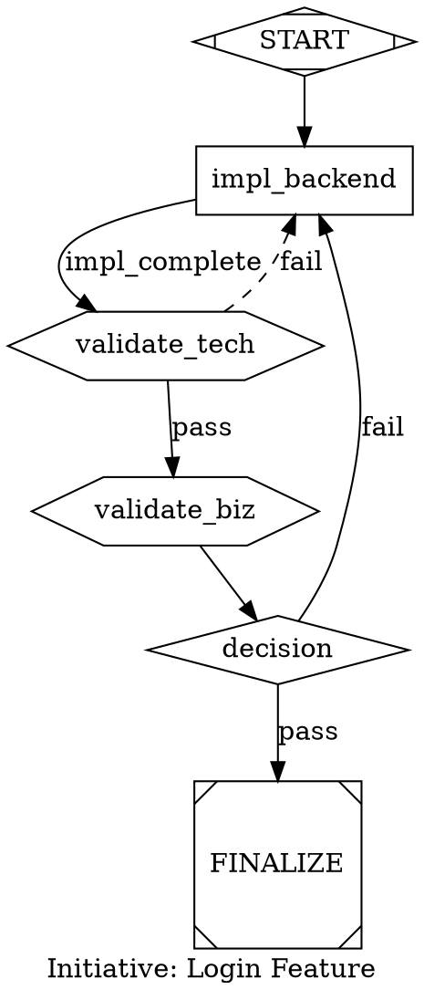

# Abstract Workflow System: MASFactory vs CoBuilder/Attractor Comparison

## Executive Summary

This document compares [MASFactory](https://github.com/BUPT-GAMMA/MASFactory) — an open-source graph-based multi-agent orchestration framework — against our **existing** CoBuilder Engine and Attractor DOT pipeline system. The harness already has a sophisticated graph-based workflow system; the question is what (if anything) MASFactory's patterns could add to it.

**Key finding**: Our system and MASFactory solve similar problems with different approaches. Our DOT-based system is **more mature for LLM agent orchestration** with features MASFactory lacks (signal protocol, checkpoint resume, validation gates). MASFactory's main advantages are **composed graph templates** and **intent-to-graph generation** (VibeGraph).

---

## Part 1: What We Already Have — CoBuilder/Attractor

### Two-System Architecture

The harness contains two complementary DOT pipeline systems:

| System | Location | Purpose | Parser |
|--------|----------|---------|--------|
| **Attractor** | `.claude/scripts/attractor/` | System 3 initiative orchestration | Regex-based, zero dependencies |
| **CoBuilder Engine** | `cobuilder/engine/` | Production workflow engine | Recursive-descent lexer/parser |

Both parse and execute **DOT directed graphs** but serve different complexity tiers.

### DOT Graph as Workflow Definition

Workflows are **already** structured, serializable, and executable. A DOT file encodes the complete topology:



### Node Shape → Handler Mapping

| Shape | Handler | Purpose |
|-------|---------|---------|
| `Mdiamond` | `start` | Pipeline entry point |
| `Msquare` | `exit` | Pipeline exit point |
| `box` | `codergen` | Implementation task → dispatches worker |
| `box` | `tool` | CLI/script execution |
| `hexagon` | `wait.cobuilder` | Automated validation gate |
| `hexagon` | `wait.human` | Human review gate |
| `diamond` | `conditional` | Pass/fail routing |
| `parallelogram` | `parallel` | Fan-out concurrent execution |
| `tripleoctagon` | `fan_in` | Multi-stream convergence |
| `house` | `manager_loop` | Orchestrator loop marker |
| `tab` | `research` | Framework research task |

### State Machine

All nodes follow a defined lifecycle:

```
pending → active → impl_complete → validated → accepted
                 ↘ failed ↙
                     ↓
                   active (retry via fail edge)
```

### Pipeline Runner (Zero LLM Token Execution)

```
System 3 (Opus) → pipeline_runner.py (pure Python) → Workers (AgentSDK)
```

The runner is a **pure Python state machine** with zero LLM intelligence for graph traversal:
- Parses DOT, tracks node states, finds dispatchable nodes
- Launches workers via `claude_code_sdk`
- Watches signal files for completion
- Applies transitions mechanically
- Writes checkpoints for resume

### Worker Dispatch from DOT Nodes

```python
# Pipeline runner reads node attributes from DOT
worker_type = node.attrs["worker_type"]  # e.g., "backend-solutions-engineer"
bead_id = node.attrs["bead_id"]
solution_design = node.attrs.get("solution_design")

# Loads agent definition from .claude/agents/<worker_type>.md
# Spawns worker via AgentSDK
# Worker writes signal file on completion: signals/<node_id>.json
# Runner reads signal, applies transition
```

### Signal Protocol (4-Layer Communication)

```
Guardian ←→ Runner ←→ Orchestrator ←→ Worker

Signals (atomic file writes in signals/):
- NEEDS_REVIEW: runner → guardian
- VALIDATION_PASSED/FAILED: guardian → runner
- DISPATCH_READY: runner → orchestrator
- IMPL_COMPLETE: orchestrator → runner
```

### Existing CLI

```bash
# Parse and validate
attractor validate pipeline.dot --strict

# Query status
attractor status pipeline.dot --json --filter=pending

# State transitions
attractor transition pipeline.dot impl_backend active --dry-run

# Generate from beads
attractor generate --prd PRD-AUTH-001 --output pipeline.dot

# Execute
attractor run pipeline.dot --execute

# Checkpoint save/restore
attractor checkpoint save pipeline.dot
attractor checkpoint restore checkpoint.json
```

### CoBuilder Engine (Production-Grade)

The CoBuilder engine adds:
- **Async execution** with event bus for monitoring
- **Middleware chain**: Logfire → TokenCounting → Retry → Audit → Handler
- **Loop detection** with configurable max node visits
- **Handler registry** mapping shapes to typed handler implementations
- **Checkpoint system** with full state persistence and resume

---

## Part 2: MASFactory Key Concepts

### Graph-Based Workflow Model

MASFactory represents workflows as **directed graphs** in Python:

```python
graph = RootGraph()
graph.add_node(researcher, name="researcher")
graph.add_node(writer, name="writer")
graph.add_edge("researcher", "writer", field_mapping={"research_output": "input"})
workflow = graph.build()
result = workflow.invoke({"query": "..."})
```

### Composed Graph Patterns

MASFactory's standout feature — **pre-built topologies** as reusable classes:

| Pattern | Topology | Our DOT Equivalent |
|---------|----------|-------------------|
| `VerticalGraph` | Sequential A→B→C | Linear DOT chain (START → task → FINALIZE) |
| `HorizontalGraph` | Parallel fan-out/in | `parallelogram` + `tripleoctagon` nodes |
| `BrainstormingGraph` | Multi-agent ideation + synthesis | Parallel `tab` (research) nodes + fan-in |
| `HubGraph` | Central coordinator → spokes | `house` (manager_loop) → `box` (codergen) nodes |
| `PingPongGraph` | Iterative back-and-forth | `diamond` conditional with retry edges |
| `InstructorAssistantGraph` | Guide + execute | System3→Orchestrator relationship (implicit in hierarchy) |
| `VerticalDecisionGraph` | Sequential + conditional | `diamond` nodes with pass/fail edges |
| `Loop` | Iterative refinement | Fail edges creating cycles (already in our schema) |

### VibeGraph (Intent-to-Workflow)

```
User: "Build a code review pipeline"
  → LLM generates graph_design.json
  → User refines in VS Code
  → System compiles and executes
```

### NodeTemplate & Factory

Parameterized agent definitions instantiated with different configs:

```python
template = NodeTemplate(
    model="claude-sonnet-4-6",
    system_prompt="You are a {role}",
    tools=["{tool_set}"]
)
researcher = template.create(role="researcher", tool_set="web_search")
writer = template.create(role="writer", tool_set="file_write")
```

### Serialization

Workflows serialize to `graph_design.json` — topology, agent configs, and edge mappings in one file.

---

## Part 3: Head-to-Head Comparison

### Feature Matrix

| Capability | CoBuilder/Attractor | MASFactory |
|-----------|-------------------|------------|
| **Graph format** | DOT (Graphviz) | Python code / JSON |
| **Serialization** | Native (DOT files ARE the serialization) | `graph_design.json` export |
| **Visual rendering** | Graphviz renders DOT natively | VS Code extension |
| **Node types** | 10 shapes with domain semantics (codergen, validation, etc.) | Generic agent nodes |
| **State machine** | Built-in (pending→active→impl_complete→validated) | No built-in state tracking |
| **Checkpoint/resume** | Full checkpoint system with file persistence | No built-in checkpointing |
| **Signal protocol** | 4-layer async communication (Guardian↔Runner↔Orch↔Worker) | Direct function calls |
| **Validation gates** | First-class hexagon nodes (technical, business, e2e) | No validation concept |
| **Worker dispatch** | DOT attributes → AgentSDK spawn | Python function calls |
| **Zero-LLM traversal** | Yes (pure Python runner) | LLM-driven routing |
| **Beads integration** | `bead_id`, `prd_ref`, `promise_ac` attributes | No issue tracking |
| **CLI** | Full CRUD + validate + generate + run | Python API only |
| **Composed patterns** | Manual DOT construction per initiative | **Pre-built topology classes** |
| **Intent-to-graph** | `attractor generate --prd` (from beads) | **VibeGraph (from natural language)** |
| **Template agents** | `.claude/agents/<type>.md` files | `NodeTemplate` parameterized |
| **Edge semantics** | `condition`, `label`, pass/fail routing | `field_mapping` for data flow |
| **Parallel execution** | `parallelogram` + `tripleoctagon` nodes | `HorizontalGraph` class |
| **Hook system** | SessionStart/Stop/PreCompact lifecycle hooks | `HookManager` with graph/node/edge stages |
| **Middleware** | Logfire→TokenCounting→Retry→Audit chain | No middleware concept |
| **Loop detection** | Configurable max node visits | No loop detection |

### Where MASFactory Wins

1. **Composed Graph Templates**: Pre-built `HubGraph`, `BrainstormingGraph`, `PingPongGraph` etc. as reusable classes. We construct each pipeline manually or generate from beads — no reusable topology library.

2. **VibeGraph (Natural Language → Graph)**: MASFactory can generate a complete workflow from "Build a code review pipeline." Our `generate.py` only works from structured beads data.

3. **Edge Field Mappings**: Explicit data flow between nodes (`field_mapping={"output": "input"}`). Our edges only carry conditions (pass/fail), not data schemas.

4. **Parameterized Templates**: `NodeTemplate` creates agent variants from a base template with parameter substitution. Our agent definitions in `.claude/agents/` are static markdown files.

### Where Our System Wins

1. **Domain-Specific Node Types**: 10 specialized shapes (codergen, validation gates, research, fan-in) vs MASFactory's generic agent nodes. Our shapes encode execution semantics.

2. **State Machine with Audit Trail**: Every transition is logged to `.transitions.jsonl`. MASFactory has no built-in state tracking.

3. **Checkpoint & Resume**: Full pipeline state can be saved and restored. Essential for long-running LLM workflows that may be interrupted.

4. **Zero-LLM Graph Traversal**: Our runner uses zero tokens for graph operations. MASFactory routes via LLM calls.

5. **Validation as First-Class Concept**: Hexagon nodes with technical/business/e2e modes are built into the graph vocabulary. MASFactory would need custom agent logic.

6. **Signal Protocol**: Async 4-layer communication enables parallel workers to operate independently and report via atomic file writes. MASFactory uses synchronous function calls.

7. **Beads/PRD Integration**: Direct link from graph nodes to issue tracker and PRD references.

8. **Structural Validation**: `attractor validate --strict` enforces 10+ rules (single entry/exit, reachability, AT pairing, conditional completeness, etc.).

---

## Part 4: What MASFactory Ideas Could Enhance Our System

### 1. Composed DOT Templates (High Value)

**Gap**: Every pipeline is hand-crafted or generated from beads. No reusable topology patterns.

**Proposal**: Create a library of DOT template patterns in `.pipelines/templates/`:

```
.pipelines/templates/
├── vertical-pipeline.dot.tmpl         # Sequential A→B→C
├── parallel-fanout.dot.tmpl           # Fan-out with convergence
├── hub-spoke.dot.tmpl                 # Orchestrator → parallel workers
├── review-loop.dot.tmpl              # Implement → review → fix cycle
├── tdd-cycle.dot.tmpl                # Test → implement → refactor loop
├── brainstorm-synthesize.dot.tmpl    # Parallel research + synthesis
└── full-initiative.dot.tmpl          # Standard 4-phase with validation
```

Templates would use variable substitution:

```dot
digraph "{{prd_ref}}" {
    graph [label="{{initiative_name}}" prd_ref="{{prd_ref}}" rankdir="TB"];

    START [shape=Mdiamond handler=start];
    
    impl_{{task.id}} [
        shape=box handler=codergen
        bead_id="{{task.bead_id}}"
        worker_type="{{task.worker_type}}"
        acceptance="{{task.acceptance}}"
        status=pending
    ];
    validate_{{task.id}} [shape=hexagon handler="wait.cobuilder" mode=technical];
    
    FINALIZE [shape=Msquare handler=exit];

    START -> impl_{{tasks[0].id}};
    
    impl_{{task.id}} -> validate_{{task.id}};
    
    validate_{{task.id}} -> impl_{{tasks[loop.index].id}} [condition="pass"];
    
    validate_{{task.id}} -> FINALIZE [condition="pass"];
    
    validate_{{task.id}} -> impl_{{task.id}} [condition="fail" style=dashed];
    
}
```

CLI extension:

```bash
attractor create --template hub-spoke \
    --prd PRD-AUTH-001 \
    --tasks '["backend-auth", "frontend-login"]' \
    --output pipeline.dot
```

### 2. Intent-to-DOT Generation (Medium Value)

**Gap**: `generate.py` requires structured beads data. No natural language generation.

**Proposal**: Add a `--from-intent` flag that uses an LLM to generate a DOT pipeline:

```bash
attractor generate --from-intent "TDD-first pipeline with parallel backend and frontend,
    each validated independently before integration testing" \
    --output pipeline.dot
```

This would:
1. Use an LLM to select the closest template and fill parameters
2. Generate a valid DOT file following the Attractor schema
3. Run `attractor validate` on the result
4. Present for human review before execution

### 3. Edge Data Schemas (Low Value)

**Gap**: Our edges carry conditions (pass/fail) but not typed data contracts between nodes.

**Assessment**: Low priority. Our signal protocol already handles data flow via JSON signal files. Adding explicit field mappings to edges would add complexity without clear benefit — the LLM workers already handle context via prompts and solution design documents.

### 4. Parameterized Agent Templates (Low-Medium Value)

**Gap**: Agent definitions in `.claude/agents/` are static markdown. No parameterization.

**Assessment**: Could be useful for creating variants (e.g., a "strict" vs "lenient" backend engineer) but current static definitions work well. Consider if/when we need agent variants for different project types.

---

## Part 5: Summary — What's Actually Missing

| Category | Status | Action Needed |
|----------|--------|---------------|
| Graph-based workflow | **Already have it** (DOT pipelines) | None |
| Serializable workflows | **Already have it** (DOT files) | None |
| State machine | **Already have it** (5-state lifecycle) | None |
| Worker dispatch from graph | **Already have it** (codergen nodes) | None |
| Validation gates | **Already have it** (hexagon nodes) | None |
| Checkpoint/resume | **Already have it** (checkpoint system) | None |
| Signal protocol | **Already have it** (4-layer signals) | None |
| CLI management | **Already have it** (attractor CLI) | None |
| **Reusable topology templates** | **Missing** | Build DOT template library |
| **Natural language → graph** | **Missing** | Add `--from-intent` generation |
| **Quick workflow switching** | **Partially missing** | Different DOT files exist, but no session-level "use this template" |
| **Workflow sharing/export** | **Already have it** (DOT files are portable) | None |

The honest assessment: our system is **more advanced** than MASFactory for LLM agent orchestration. The two concrete gaps worth addressing are **composed DOT templates** and **intent-to-DOT generation**.

---

## Part 6: Corrected MASFactory Concept Mapping

| MASFactory Concept | Our Existing Equivalent | Gap? |
|-------------------|------------------------|------|
| `RootGraph` | DOT `digraph` | No |
| `Node` | DOT nodes with shape→handler mapping | No |
| `Edge` | DOT edges with conditions | Partial (no field mappings) |
| `Agent` | `.claude/agents/<type>.md` | No |
| `NodeTemplate` | Static agent definitions | Minor (no parameterization) |
| `VerticalGraph` | Linear DOT chain | **Yes** (no template library) |
| `HubGraph` | `house` + `box` nodes | **Yes** (no template library) |
| `BrainstormingGraph` | `tab` + `tripleoctagon` pattern | **Yes** (no template library) |
| `PingPongGraph` | `diamond` with retry edges | No (already expressible) |
| `Loop` | Fail edges creating cycles | No |
| `LogicSwitch` | `diamond` (conditional) nodes | No |
| `VibeGraph` | `generate.py --prd` (from beads only) | **Yes** (no NL generation) |
| `graph_design.json` | `.dot` files (richer format) | No |
| `HookManager` | settings.json hooks + middleware chain | No |
| `Factory` | Pipeline runner worker dispatch | No |

---

## Appendix: Capability Comparison Summary

```
                        CoBuilder/Attractor    MASFactory
                        ──────────────────     ──────────
Graph definition        ████████████ DOT       ████████ Python/JSON
Serialization           ████████████ native    ████████ JSON export
Node semantics          ████████████ 10 types  ████ generic
State machine           ████████████ 5-state   ░░░░ none
Checkpointing           ████████████ full      ░░░░ none
Signal protocol         ████████████ 4-layer   ░░░░ none
Validation gates        ████████████ built-in  ░░░░ custom
Zero-LLM traversal      ████████████ pure Py   ░░░░ LLM-driven
Structural validation    ████████████ 10 rules  ████ basic
CLI tooling             ████████████ full      ░░░░ API only
Beads/PRD integration   ████████████ native    ░░░░ none
Composed templates      ░░░░ manual per-init   ████████████ 9 patterns
Intent-to-graph         ████ from beads        ████████████ VibeGraph NL
Edge data schemas       ████ conditions only   ████████ field mappings
Agent parameterization  ████ static defs       ████████ NodeTemplate
Visual editor           ████ Graphviz render   ████████ VS Code ext
```
