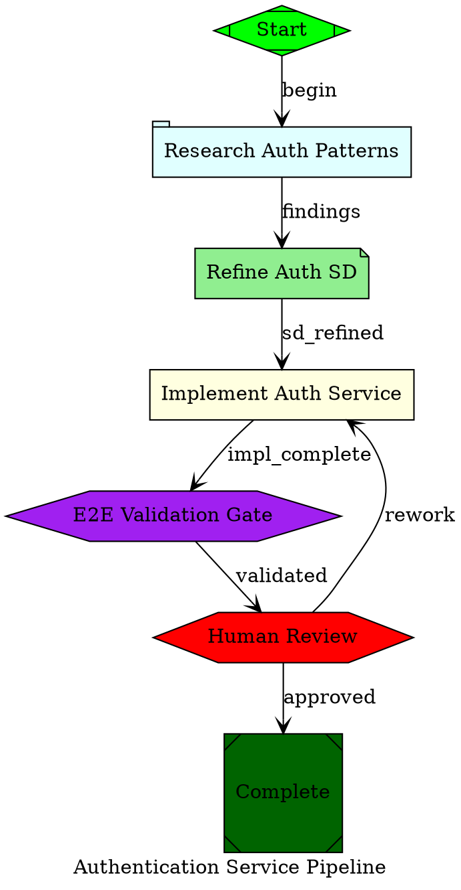

# DOT Pipeline Creation Reference

Comprehensive reference for writing DOT pipeline files that pass the cobuilder validator. All shapes, attributes, edge rules, and topology constraints are derived from the actual validation codebase.

---

## Graph Declaration

```dot
digraph "PRD-AUTH-001" {
    // Graph-level attributes
    graph [
        pipeline_id="auth-pipeline-001"
        prd_ref="PRD-AUTH-001"
        label="Authentication Pipeline"
        retry_target="error_handler"
        default_max_retry=50
    ]

    // Default node styling (cosmetic only — shape MUST be set per node)
    node [style=filled]
    edge [arrowhead=vee]

    // Node definitions...
    // Edge definitions...
}
```



### Graph-Level Attributes

| Attribute | Required | Description |
|-----------|----------|-------------|
| `pipeline_id` | Recommended | Unique pipeline identifier |
| `prd_ref` | Recommended | PRD identifier (e.g., `"PRD-AUTH-001"`) |
| `cobuilder_root` | **Required** | Absolute path to the harness repo root (where `cobuilder/`, `docs/sds/`, skills live). Used for resolving SD paths and harness-local resources. Must be absolute. |
| `target_dir` | **Required** | Absolute path to the target working directory (worktree where workers write code). Must be absolute and point to an existing directory. |
| `label` | Optional | Human-readable pipeline name |
| `retry_target` | Optional | Fallback retry node ID for nodes without explicit retry_target |
| `fallback_retry_target` | Optional | Second-level fallback retry target |
| `default_max_retry` | Optional | Max total executions before loop detection (default: 50) |
| `model_stylesheet` | Optional | CSS-like stylesheet for LLM model routing |

**Important**: `target_repo` is **deprecated** and will be rejected by the validator. Use `target_dir` instead.

---

## Node Types — Shape-to-Handler Mapping

Every node must have a `shape` attribute. The shape determines which handler executes it. **Using wrong shapes is the #1 source of validation errors.**

### Shape Registry

| Shape | Handler | Purpose |
|-------|---------|---------|
| `Mdiamond` | `start` | Pipeline entry point |
| `Msquare` | `exit` | Pipeline exit point |
| `box` | `codergen` | LLM implementation node |
| `tab` | `research` | Research investigation node |
| `note` | `refine` | Solution design refinement |
| `diamond` | `conditional` | Conditional routing |
| `hexagon` | `wait.human` OR `wait.cobuilder` | Gate node (determined by `handler` attr) |
| `component` | `parallel` | Fan-out parallel execution |
| `tripleoctagon` | `fan_in` | Fan-in rendezvous |
| `parallelogram` | `tool` | Shell command execution |
| `house` | `manager_loop` | Recursive sub-pipeline |
| `octagon` | `close` | Programmatic epic closure (push, PR) |

**Common mistakes**: Using `house` for start (wrong — use `Mdiamond`), `octagon` for exit (wrong — use `Msquare`), `doublecircle` for wait.cobuilder (wrong — use `hexagon`), `invtriangle` for tool (wrong — use `parallelogram`).

---

## Node Definitions — Required Attributes Per Handler

### `start` — Pipeline Entry Point (`Mdiamond`)

```dot
start [label="Start Pipeline"
       handler="start"
       shape=Mdiamond
       fillcolor=green
       status=pending]
```

**Required**: `label`, `handler`
**Rules**: Exactly one per pipeline. No incoming edges (Rule 5).

### `exit` — Pipeline Exit Point (`Msquare`)

```dot
pipeline_exit [label="Complete"
               handler="exit"
               shape=Msquare
               fillcolor=darkgreen
               status=pending]
```

**Required**: `label`, `handler`
**Rules**: At least one per pipeline. No outgoing edges (Rule 6). Validates that all `goal_gate=true` nodes completed.

### `codergen` — LLM Implementation Node (`box`)

```dot
implement_auth [label="Implement Auth Service"
                handler="codergen"
                shape=box
                fillcolor=lightyellow
                status=pending
                bead_id="BEAD-AUTH-001"
                worker_type="backend-solutions-engineer"
                sd_path="docs/sds/SD-AUTH-001.md"
                prd_ref="PRD-AUTH-001"
                llm_profile="anthropic-smart"
                prompt="Implement authentication service per SD"]
```

**Required**: `label`, `handler`, `bead_id`, `worker_type`, `sd_path`
**Recommended**: `prd_ref`, `acceptance`
**Optional**: `llm_profile`, `dispatch_strategy`, `max_retries`, `retry_target`, `goal_gate`, `fidelity`, `prompt`

**Validation rules**:
- `worker_type` must be one of: `frontend-dev-expert`, `backend-solutions-engineer`, `tdd-test-engineer`, `solution-architect`, `solution-design-architect`, `validation-test-agent`, `ux-designer` (Rule 15)
- `sd_path` must be non-empty (Rule 14)
- Must have downstream `wait.cobuilder` node (Rule 17 — cluster topology)
- `dispatch_strategy` values: `"tmux"` (default), `"sdk"`, `"inline"`
- `fidelity` values: `"full"`, `"checkpoint"` (default)

### `research` — Research Investigation Node (`tab`)

```dot
research_api [label="Research Auth Patterns"
              handler="research"
              shape=tab
              fillcolor=lightcyan
              status=pending
              solution_design="docs/sds/SD-AUTH-001.md"
              prd_ref="PRD-AUTH-001"
              research_queries="OAuth2 PKCE flow, JWT rotation patterns"
              downstream_node="refine_sd"
              prompt="Investigate auth patterns via Context7 and Perplexity"]
```

**Required**: `label`, `handler`, `solution_design`
**Recommended**: `prd_ref`, `research_queries`, `downstream_node`

### `refine` — Solution Design Refinement (`note`)

```dot
refine_sd [label="Refine Solution Design"
           handler="refine"
           shape=note
           fillcolor=lightgreen
           status=pending
           solution_design="docs/sds/SD-AUTH-001.md"
           evidence_path=".pipelines/pipelines/evidence/research_api/research-findings.json"
           prd_ref="PRD-AUTH-001"
           prompt="Rewrite SD with research findings"]
```

**Required**: `label`, `handler`, `solution_design`, `evidence_path`
**Recommended**: `prd_ref`

**Note**: `evidence_path` should match `*/evidence/{research_node_id}/research-findings.json`.

### `conditional` — Conditional Routing (`diamond`)

```dot
check_result [label="Check Result"
              handler="conditional"
              shape=diamond
              fillcolor=lightyellow
              status=pending]
```

**Required**: `label`, `handler`
**Rules**: Must have exactly 2 outgoing edges with `condition="pass"` and `condition="fail"`.

### `wait.cobuilder` — System 3 Validation Gate (`hexagon`)

```dot
e2e_gate [label="E2E Validation Gate"
          handler="wait.cobuilder"
          shape=hexagon
          fillcolor=purple
          status=pending
          gate_type="e2e"
          summary_ref="docs/sds/SD-AUTH-001.md"
          bead_id="BEAD-AUTH-001"]
```

**Required**: `label`, `handler`, `gate_type`
**Required by Rule 18**: `summary_ref`, `bead_id`
**Values for `gate_type`**: `"unit"`, `"e2e"`, `"contract"`

**Rules**: Must exist downstream of a `codergen` node (Rule 17).

### `wait.human` — Human Approval Gate (`hexagon`)

```dot
human_review [label="Human Review"
              handler="wait.human"
              shape=hexagon
              fillcolor=red
              status=pending
              gate="e2e"
              mode="e2e-review"]
```

**Required**: `label`, `handler`, `gate`, `mode`
**Values for `gate`**: `"technical"`, `"business"`, `"e2e"`, `"manual"`
**Values for `mode`**: `"technical"`, `"business"` (plus `"e2e-review"` used in topology rules)

**Rules**: When `mode="e2e-review"`, must have upstream `wait.cobuilder` or `research` node (Rule 16).

### `parallel` — Fan-Out (`component`)

```dot
fan_out [label="Parallel Dispatch"
         handler="parallel"
         shape=component
         fillcolor=lightyellow
         status=pending
         join_policy="wait_all"]
```

**Required**: `label`, `handler`
**Optional**: `join_policy` (`"wait_all"` default, `"first_success"`)

### `fan_in` — Rendezvous (`tripleoctagon`)

```dot
merge_point [label="Merge Results"
             handler="fan_in"
             shape=tripleoctagon
             fillcolor=lightyellow
             status=pending
             join_policy="wait_all"]
```

**Required**: `label`, `handler`
**Optional**: `join_policy` (`"wait_all"` default, `"first_success"`)

### `tool` — Shell Command Execution (`parallelogram`)

```dot
run_tests [label="Run Tests"
           handler="tool"
           shape=parallelogram
           fillcolor=orange
           status=pending
           command="pytest tests/ -v"
           timeout=300]
```

**Required**: `label`, `handler`, `command`
**Optional**: `timeout`

### `manager_loop` — Recursive Sub-Pipeline (`house`)

```dot
sub_pipeline [label="Child Pipeline"
              handler="manager_loop"
              shape=house
              fillcolor=lightblue
              status=pending
              sub_pipeline=".pipelines/pipelines/child.dot"
              summarizer="true"]
```

**Required**: `label`, `handler`
**Optional**: `mode`, `pipeline_params_file`, `sub_pipeline`, `signals_dir`, `summarizer`

Max recursive depth: 5 (`PIPELINE_MAX_MANAGER_DEPTH`).

### `close` — Epic Closure (`octagon`)

```dot
close_epic [label="Close Epic"
            handler="close"
            shape=octagon
            fillcolor=darkblue
            status=pending
            pr_title="feat: implement auth service"
            base_branch="main"]
```

**Required**: `label`, `handler`
**Optional**: `pr_title`, `pr_body`, `base_branch`, `target_dir`

### `acceptance-test-writer` — Gherkin Test Generation

Not a separate shape — uses `component` shape with `handler="acceptance-test-writer"`.

```dot
write_at [label="Write Acceptance Tests"
          handler="acceptance-test-writer"
          shape=component
          status=pending
          prd_ref="PRD-AUTH-001"]
```

**Required**: `label`, `handler`, `prd_ref`

---

## Edge Rules

### Basic Syntax

```dot
// Simple edge
start -> research [label="begin"]

// Chained edges (attrs apply to last edge only)
start -> research -> refine [label="findings"]

// Conditional edge
check_result -> success_path [condition="pass" label="passed"]
check_result -> retry_path [condition="fail" label="failed"]
```

### Edge Attributes

| Attribute | Values | Notes |
|-----------|--------|-------|
| `condition` | `""` (empty/always), `"pass"`, `"fail"`, `"partial"`, `$`-prefixed expressions | Rule 7 validates syntax |
| `label` | Any string | Human-readable label |
| `weight` | Numeric | Tie-breaking for multiple candidates |
| `loop_restart` | `"true"`/`"false"` | Clears pipeline context on traversal |

### Diamond Node Edge Rules

Diamond (conditional) nodes must have **exactly 2 outgoing edges**: one with `condition="pass"` and one with `condition="fail"`.

```dot
// CORRECT
check -> success [condition="pass"]
check -> failure [condition="fail"]

// WRONG — missing conditions or wrong count
check -> success [label="yes"]
check -> failure [label="no"]
check -> maybe [label="partial"]
```

---

## Cluster Topology (Rule 17 — MANDATORY)

Every `codergen` node must have a downstream validation chain:

```
codergen → wait.cobuilder → wait.human(mode="e2e-review")
```

This ensures every implementation node goes through System 3 validation and then human review.

### Correct Topology

```dot
implement_auth -> e2e_gate [label="impl_complete"]
e2e_gate -> human_review [label="validated"]
human_review -> pipeline_exit [condition="pass"]
human_review -> implement_auth [condition="fail"]
```

### With Research Upstream (Recommended)

```dot
// Full chain: acceptance-test-writer → research → refine → codergen → wait.cobuilder → wait.human
write_at -> research_api [label="tests_created"]
research_api -> refine_sd [label="findings"]
refine_sd -> implement_auth [label="sd_refined"]
implement_auth -> e2e_gate [label="impl_complete"]
e2e_gate -> human_review [label="validated"]
human_review -> pipeline_exit [condition="pass"]
```

### Warning: Codergen Without Upstream Acceptance Tests (Rule 19)

Codergen nodes without an upstream `acceptance-test-writer` node trigger a warning. Not blocking, but recommended.

---

## Status Lifecycle

All nodes have a `status` attribute that tracks execution state:

```
pending → active → impl_complete → validated → accepted
                \→ failed
```

Valid values: `pending`, `active`, `impl_complete`, `validated`, `accepted`, `failed`.

Set initial status to `pending` for all nodes in the DOT file. The runner manages transitions.

---

## Validation Rules Summary

### ERROR-Level (Block Execution) — 20 Rules

| # | Rule | What It Checks |
|---|------|----------------|
| 1 | `SingleStartNode` | Exactly one `Mdiamond` node |
| 2 | `AtLeastOneExit` | At least one `Msquare` node |
| 3 | `AllNodesReachable` | All nodes reachable from start via BFS |
| 4 | `EdgeTargetsExist` | Every edge source/target node ID exists |
| 5 | `StartNoIncoming` | Start node has no incoming edges |
| 6 | `ExitNoOutgoing` | Exit nodes have no outgoing edges |
| 7 | `ConditionSyntaxValid` | Edge `condition=` values parse correctly |
| 8 | `StylesheetSyntaxValid` | `model_stylesheet` values parse correctly |
| 9 | `RetryTargetsExist` | `retry_target` and `fallback_retry_target` node IDs exist |
| 14 | `SdPathOnCodergen` | Codergen nodes have non-empty `sd_path` |
| 15 | `WorkerTypeRegistry` | `worker_type` is from the valid set |
| 16 | `WaitHumanAfterWaitCobuilder` | `wait.human(mode=e2e-review)` has upstream `wait.cobuilder` or `research` |
| 17 | `FullClusterTopology` | Codergen → wait.cobuilder → wait.human(mode=e2e-review) chain exists |
| 18 | `WaitCobuilderRequirements` | wait.cobuilder has `gate_type`, `summary_ref`, `bead_id` |

### WARNING-Level (Advisory) — 6 Rules

| # | Rule | What It Checks |
|---|------|----------------|
| 10 | `NodeTypesKnown` | Node shapes are in the registered set |
| 11 | `FidelityValuesValid` | `fidelity` is `"full"` or `"checkpoint"` |
| 12 | `GoalGatesHaveRetry` | `goal_gate=true` nodes have `retry_target` |
| 13 | `LlmNodesHavePrompts` | LLM nodes (`box`, `tab`) have `prompt` or `label` |
| 19 | `CodergenWithoutUpstreamAT` | Codergen should have upstream acceptance-test-writer |
| 20 | `MissingSkillReference` | Skills in `skills_required` exist on disk |

### Running Validation

```bash
python3 cobuilder/engine/cli.py validate <pipeline.dot>
```

---

## LLM Profiles (providers.yaml)

Nodes reference named profiles via `llm_profile="..."` instead of raw model names.

| Profile | Model | Cost |
|---------|-------|------|
| `anthropic-fast` | `claude-haiku-4-5-20251001` | Low |
| `anthropic-smart` | `claude-sonnet-4-5-20250514` | Medium |
| `anthropic-sonnet46` | `claude-sonnet-4-6` | Medium |
| `anthropic-opus` | `claude-opus-4-6` | High |
| `alibaba-glm5` | `glm-5` | Near-$0 (default) |
| `alibaba-qwen3` | `qwen3-coder-plus` | Near-$0 |

---

## Complete Valid Example

This pipeline passes all 20 validation rules:



---

## Parallel Execution Pattern

```dot
// Fan-out → parallel workers → fan-in
fan_out [label="Dispatch Workers"
         handler="parallel"
         shape=component
         status=pending]

impl_frontend [label="Frontend"
               handler="codergen"
               shape=box
               status=pending
               bead_id="BEAD-FE-001"
               worker_type="frontend-dev-expert"
               sd_path="docs/sds/SD-FE-001.md"]

impl_backend [label="Backend"
              handler="codergen"
              shape=box
              status=pending
              bead_id="BEAD-BE-001"
              worker_type="backend-solutions-engineer"
              sd_path="docs/sds/SD-BE-001.md"]

merge [label="Merge"
       handler="fan_in"
       shape=tripleoctagon
       status=pending]

fan_out -> impl_frontend
fan_out -> impl_backend
impl_frontend -> gate_fe -> review_fe -> merge
impl_backend -> gate_be -> review_be -> merge
```

Each parallel codergen still needs its own downstream `wait.cobuilder → wait.human` chain.

---

## Common Validation Errors and Fixes

| Error | Cause | Fix |
|-------|-------|-----|
| `SingleStartNode: Expected 1, found 0` | No `Mdiamond` node | Add a node with `shape=Mdiamond` |
| `AtLeastOneExit: No exit node found` | No `Msquare` node | Add a node with `shape=Msquare` |
| `SdPathOnCodergen: missing sd_path` | Codergen node lacks `sd_path` | Add `sd_path="docs/sds/SD-XXX.md"` |
| `WorkerTypeRegistry: invalid worker_type` | Typo or invalid worker name | Use exact name from valid set |
| `FullClusterTopology: no downstream wait.cobuilder` | Codergen without validation chain | Add `wait.cobuilder → wait.human` downstream |
| `WaitCobuilderRequirements: missing gate_type` | wait.cobuilder lacks required attrs | Add `gate_type`, `summary_ref`, `bead_id` |
| `StartNoIncoming: start has incoming edges` | Edge pointing to start node | Remove incoming edges to start |
| `ExitNoOutgoing: exit has outgoing edges` | Edge from exit node | Remove outgoing edges from exit |
| `NodeTypesKnown: unknown shape "doublecircle"` | Wrong shape for handler | Use shapes from the registry table |

---

**Reference Version**: 2.0.0
**Parent Skill**: cobuilder-guardian
**Validation source**: `cobuilder/engine/validation/rules.py`, `advanced_rules.py`, `schema.py`
