# S3 Guardian — Independent Validation Pattern

The guardian angel pattern provides independent, blind validation of System 3 meta-orchestrator work. A guardian session creates acceptance tests from PRDs, stores them outside the implementation repo where meta-orchestrators cannot see them, dispatches orchestrators via headless CLI (`claude -p`) or SDK pipelines, and independently validates claims against a gradient confidence rubric.

```
Guardian (this session, config repo)
    |
    |-- Designs PRDs with CoBuilder RepoMap context (Phase 0)
    |-- Challenges own designs via parallel-solutioning + research-first (Phase 0)
    |-- Creates blind Gherkin acceptance tests (stored here, NOT in impl repo)
    |-- Generates executable browser test scripts for UX prototypes
    |-- Dispatches via DOT pipeline (two modes):
    |       |
    |       +-- SDK mode: guardian.py → runner.py → dispatch_worker.py → claude -p (all headless via SDK)
    |       +-- Headless mode: Workers run via `claude -p` CLI (structured JSON output, no SDK)
    |       +-- tmux mode: Spawns Orchestrators in tmux (one per epic/DOT node) [interactive, lower API cost]
    |       |
    |       +-- Research nodes run BEFORE codergen (validate SD via Context7/Perplexity)
    |       +-- Refine nodes run AFTER research (rewrite SD with findings as first-class content)
    |       +-- Research-only pipelines (no codergen) are valid — guardian completes after refine
    |       +-- Workers (native Agent Teams, spawned by orchestrator)
    |
    |-- Monitors orchestrator progress (SDK: poll DOT state; headless: JSON output; tmux: capture-pane)
    |-- Independently validates claims against rubric
    |-- Delivers verdict with gradient confidence scores
```

**Key Innovation**: Acceptance tests live in `claude-harness-setup/acceptance-tests/PRD-{ID}/`, NOT in the implementation repository. Meta-orchestrators and their workers never see the rubric. This enables truly independent validation — the guardian reads actual code and scores it against criteria the implementers did not have access to.

---

## Guardian Disposition: Skeptical Curiosity

The guardian operates with a specific mindset that distinguishes it from passive monitoring.

### Be Skeptical

- **Never trust self-reported success.** Meta-orchestrators and orchestrators naturally over-report progress. Read the actual code, run the actual tests, check the actual logs.
- **Question surface-level explanations.** When a meta-orchestrator says "X is blocked by Y," independently verify that Y is truly the blocker — and that Y cannot be resolved.
- **Assume incompleteness until proven otherwise.** A task marked "done" is "claimed done" until the guardian scores it against the blind rubric.
- **Watch for rationalization patterns.** "It's a pre-existing issue" may be true, but ask: Is it solvable? Would solving it advance the goal? If yes, push for resolution.

### Be Curious

- **Investigate root causes, not symptoms.** When a Docker container crashes, don't stop at the error message — trace the import chain, read the Dockerfile, understand WHY it fails.
- **Ask "what else?"** When one fix lands, ask what it unlocked. When a test passes, ask what it doesn't cover. When a feature works, ask about edge cases.
- **Cross-reference independently.** Read the PRD, then read the code, then read the tests. Do they tell the same story? Gaps between these three are where bugs live.
- **Follow your intuition.** If something feels incomplete or too easy, it probably is. Dig deeper.

### Push for Completion

- **Reject premature fallbacks.** When a meta-orchestrator says "let's skip the E2E test and merge as-is," challenge that. Is the E2E blocker actually hard to fix? Often a 1-line Dockerfile fix unblocks the entire test.
- **Advocate for the user's actual goal.** The user didn't ask for "most of the pipeline" — they asked for the pipeline. Push meta-orchestrators toward full completion.
- **Guide, don't just observe.** When the guardian identifies a root cause (e.g., missing COPY in Dockerfile), send that finding to the meta-orchestrator as actionable guidance rather than noting it passively.
- **Set higher bars progressively.** As the team demonstrates capability, raise expectations. Don't accept the same quality level that was acceptable in sprint 1.

### Injecting Disposition Into Meta-Orchestrators

When spawning or guiding S3 meta-orchestrators, include disposition guidance in prompts:

```
Be curious about failures — trace root causes, don't accept surface explanations.
When something is "blocked," investigate whether the blocker is solvable.
Push for complete solutions over workarounds. The user wants the real thing.
```

This disposition transfers from guardian to meta-orchestrator to orchestrator to worker, creating a culture of thoroughness throughout the agent hierarchy.

---

## Instruction Precedence: Skills > Memories

**When Hindsight memories conflict with explicit skill or output-style instructions, the explicit instructions ALWAYS take precedence.**

Hindsight stores patterns from prior sessions. These patterns are valuable context but they reflect PAST workflows that may have been updated. Skills and output styles represent the CURRENT intended workflow.

### Common Conflict Example

| Hindsight says | Skill/Output style says | Resolution |
|---------------|------------------------|------------|
| "Spawn orchestrator in worktree via tmux" | "Create DOT pipeline, then spawn orchestrator" | Follow the skill — create pipeline first |
| "Use bd create for tasks" | "Use cli.py node add with AT pairing" | Follow the skill — use pipeline nodes |
| "Mark impl_complete and notify S3" | "Transition node to impl_complete in pipeline" | Follow the skill — use pipeline transitions |

### Mandatory Rule

After recalling from Hindsight at session start, mentally audit each recalled pattern:
- Does it contradict any loaded skill instruction? → Discard the memory pattern
- Does it add detail not covered by skills? → Use as supplementary context
- Is it about a domain unrelated to current skills? → Use freely

### DOT Pipeline + Beads Are Both Mandatory

For ANY initiative with 2+ tasks, the guardian MUST:
1. Create beads for each task (`bd create` or sync from Task Master)
2. Create a pipeline DOT file with real bead IDs mapped to nodes:
   - **Preferred**: `cobuilder pipeline create --sd <sd-path> --repo <repo-name> --prd PRD-{ID}` — auto-initializes RepoMap, enriches from SD, cross-references beads
   - **Manual**: `cobuilder pipeline node-add --set bead_id=<real-id>` per node
   - **Retrofit**: `cobuilder pipeline node-modify <node> --set bead_id=<real-id>` for existing nodes
3. Track execution progress through pipeline transitions (not just beads status)
4. Save checkpoints after each transition

Skipping pipeline creation because "it worked without one before" is an anti-pattern caused by cognitive momentum. Using synthetic bead_ids ("CLEANUP-T1") instead of real beads is also an anti-pattern — always create real beads first.

For new initiatives, pipeline creation is part of Phase 0 (Step 0.2). For initiatives where a pipeline already exists, verify it with `cli.py validate` before Phase 1.

**How bead-to-node mapping works**: The `generate.py` pipeline generator uses `filter_beads_for_prd()` which matches beads to a PRD by: (a) finding epic beads whose title contains the PRD reference, (b) finding task beads that are children of those epics via `parent-child` dependency type, (c) finding task beads whose title or description contains the PRD reference. This is heuristic matching — it requires beads to include the PRD identifier in their metadata. When creating beads, always include the PRD ID in the title (e.g., `bd create --title="PRD-CLEANUP-001: Fix deprecated imports"`).

---

## Prerequisites: PATH Setup (MANDATORY — Run Once Per Session)

The `cs-promise` and `cs-verify` CLIs live in `.claude/scripts/completion-state/`. Add them to PATH before any other commands:

```bash
export PATH="${CLAUDE_PROJECT_DIR:-.}/.claude/scripts/completion-state:$PATH"
```

> **Why this fails without PATH**: `cs-promise` is a script at `.claude/scripts/completion-state/cs-promise`, not a system-wide command. Without this export, all `cs-promise` / `cs-verify` calls return `command not found: cs-promise`.

---

## Step 0: Promise Creation (MANDATORY — Do This First)

Before ANY other work, identify the user's goal and create a completion promise.

### Identifying the Promise

| Work Type | Promise Title Pattern | Example ACs |
|-----------|----------------------|-------------|
| **Guardian validation** (standard) | "Guardian: Validate PRD-{ID} implementation" | See Session Promise Integration below |
| **Research / Investigation** | "Research: {topic}" | "Research report delivered", "Findings retained to Hindsight", "Recommendation documented" |
| **PRD & Solution Design** | "Design: {initiative name}" | "PRD written with business goals + epics", "SD created per epic", "Pipeline DOT created", "Design challenge passed" |
| **Implementation (direct)** | "Implement: {feature/fix}" | "Code changes committed", "Tests passing", "Validation agent confirms" |
| **Codebase quality / maintenance** | "Maintain: {scope}" | "Issues identified and cataloged", "Fixes applied", "No regressions" |
| **Multi-initiative orchestration** | "Orchestrate: {N} initiatives" | One AC per initiative completion |

### Creating the Promise

```bash
cs-promise --create "<goal title>" \
    --ac "<deliverable 1>" \
    --ac "<deliverable 2>" \
    --ac "<deliverable 3>"
cs-promise --start <promise-id>
```

**Rules**:
- Every session MUST have at least one promise
- ACs should be **verifiable** — "code committed" not "code written"
- 3-5 ACs is ideal; more than 6 suggests the goal should be split
- Store the promise ID — you will `--meet` each AC as work progresses

> **Note**: The "Session Promise Integration" section below provides a pre-built template for the standard guardian validation pattern. For all other work types, craft ACs from the examples above.

---

## Guardian Workflow Phases

| Phase | Purpose | Reference |
|-------|---------|-----------|
| **Phase 0** | PRD authoring with CoBuilder RepoMap context injection, DOT pipeline creation (with research→refine→codergen chain validation), Task Master parsing, design challenge. **2 user checkpoints**: Checkpoint A (after pipeline creation) and Checkpoint B (after design challenge) | [references/phase0-prd-design.md](references/phase0-prd-design.md) |
| **Phase 1** | Generate per-epic Gherkin tests, journey tests, and executable browser test scripts | [references/gherkin-test-patterns.md](references/gherkin-test-patterns.md) |
| **Phase 2** | Orchestrator spawning via `spawn_orchestrator.py`, headless/SDK/tmux dispatch, DOT-driven dispatch | [references/guardian-workflow.md](references/guardian-workflow.md) |
| **Phase 3** | Monitoring cadence, pause-and-check pattern, intervention triggers, AskUserQuestion handling | [references/monitoring-patterns.md](references/monitoring-patterns.md) |
| **Phase 4** | Independent validation, evidence gathering, DOT pipeline integration, regression detection | [references/validation-scoring.md](references/validation-scoring.md) |

**Load the relevant reference when entering each phase. Do not load all references at once.**

---

## Session Promise Integration (Guardian Validation Template)

> This template is for the **standard guardian validation pattern** (Phases 0-4). For other work types (research, PRD design, implementation), see Step 0 above for work-type-specific AC patterns.

The guardian session itself tracks completion via the `cs-promise` CLI.

> **DISAMBIGUATION**: `cs-promise` creates/manages promises. `cs-verify` verifies them.
> **CORRECT**: `cs-verify --promise <id>` | **WRONG**: `cs-promise --verify <id>` (flag doesn't exist)

### At Guardian Session Start

```bash
# Initialize completion state
cs-init

# Create guardian promise
cs-promise --create "Guardian: Validate PRD-{ID} implementation" \
    --ac "PRD designed, pipeline created, and design challenge passed (Phase 0)" \
    --ac "Acceptance tests and executable browser tests created in config repo" \
    --ac "Orchestrator(s) spawned and verified running" \
    --ac "Orchestrator progress monitored through completion" \
    --ac "Independent validation scored against rubric" \
    --ac "Final verdict delivered with evidence"
```

### During Monitoring

```bash
# Meet criteria as work progresses
cs-promise --meet <id> --ac-id AC-1 --evidence "acceptance-tests/PRD-{ID}/ created with N scenarios + executable browser tests" --type manual
cs-promise --meet <id> --ac-id AC-2 --evidence "headless worker process running for orch-{initiative}, output style verified" --type manual
```

### At Validation Complete

```bash
# Meet remaining criteria
cs-promise --meet <id> --ac-id AC-3 --evidence "Monitored for 2h15m, 3 interventions" --type manual
cs-promise --meet <id> --ac-id AC-4 --evidence "Weighted score: 0.73 (ACCEPT threshold: 0.60)" --type manual
cs-promise --meet <id> --ac-id AC-5 --evidence "ACCEPT verdict, report stored to Hindsight" --type manual

# Verify all criteria met
cs-verify --check --verbose
```

---

## Hindsight Validation Checklist (MANDATORY)

**This checklist is non-negotiable.** Every guardian validation session MUST complete these Hindsight integration steps before closing.

### Phase 4 Completion: Storing Results

After scoring validation and determining verdict (ACCEPT, INVESTIGATE, or REJECT), execute both steps:

#### Step 1: Store to Private Bank (Guardian Learnings)

```python
mcp__hindsight__retain(
    content=f"""## Guardian Validation: PRD-{prd_id}

### Decision
- Verdict: {verdict}  # ACCEPT|INVESTIGATE|REJECT
- Overall Score: {score:.2f}
- Date: {timestamp}
- Duration: {duration}

### Feature Breakdown
{feature_table}

### Gaps Identified
{gaps_list}

### Lessons Learned
- {lesson_1}
- {lesson_2}
""",
    context="s3-guardian-validations",
    bank_id="system3-orchestrator"
)
```

**When**: After Phase 4 validation scoring completes.
**Why**: Captures patterns for future guardian sessions to reference.
**Required fields**: `context="s3-guardian-validations"`, `bank_id="system3-orchestrator"` (always).

#### Step 2: Store to Project Bank (Team Context)

```python
# Get project bank from environment (set by ccsystem3/ccorch)
import os
PROJECT_BANK = os.environ.get("CLAUDE_PROJECT_BANK", "default-project")

mcp__hindsight__retain(
    content=f"PRD-{prd_id}: {verdict} (score: {score:.2f}) | {gap_summary}",
    context="project-validations",
    bank_id=PROJECT_BANK
)
```

**When**: Immediately after Step 1.
**Why**: Other sessions in this project can quickly understand validation outcomes.
**Required fields**: `context="project-validations"`, `bank_id=PROJECT_BANK` (auto-derived).

### PRD Contract Generation and Validation (New in v0.6.0)

With the addition of PRD Contract artifacts, Phase 0 now includes Step 0.2.5 for contract generation and validation gates now check contract compliance.

#### Step 0.2.5: PRD Contract Generation
During Phase 0, a `prd-contract.md` is automatically generated at `docs/prds/{initiative}/prd-contract.md`. This contract contains:
- Domain invariants that must hold regardless of implementation approach
- Scope freeze boundaries (what is in/out of scope)
- Compliance flags that mandate specific requirements

#### Contract Validation in Gates
When a `wait.system3` node has `contract_ref` attribute, the validation includes:
- Reading the PRD Contract specified by contract_ref
- Verifying each domain invariant holds in the current codebase
- Checking that no files outside the frozen scope were modified
- Verifying each compliance flag's condition is met
- Calculating contract compliance percentage (0.0-1.0) for the gate summary

### Completion Verification

Before marking promise AC as complete:

```bash
# Verify both Hindsight operations succeeded
echo "✓ Private bank (system3-orchestrator) retains guardian validation"
echo "✓ Project bank ($CLAUDE_PROJECT_BANK) retains project context"
echo "✓ Both mcp__hindsight__retain() calls executed without error"
echo "✓ PRD Contract generated and validated if required"

# Then meet the promise AC
cs-promise --meet <promise-id> --ac-id AC-5 \
    --evidence "ACCEPT verdict + Hindsight stored to both banks + Contract validated" \
    --type manual
```

### Common Mistakes to Avoid

| Mistake | Fix |
|---------|-----|
| Storing only to private bank (forget project bank) | Execute BOTH steps above |
| Using wrong `bank_id` value | Private = `"system3-orchestrator"`, Project = environment `$CLAUDE_PROJECT_BANK` |
| Forgetting `context=` parameter | Must include: `context="s3-guardian-validations"` for private, `context="project-validations"` for project |
| Storing BEFORE validation completes | Store ONLY after Phase 4 verdict determined |
| Storing results but not meeting promise AC | Meeting the AC is how System 3 knows validation is complete |

---

## Recursive Guardian Pattern

The guardian pattern is recursive. A guardian can watch:
- An S3 meta-orchestrator who spawns orchestrators who spawn workers (standard)
- Another guardian who is watching an S3 meta-orchestrator (meta-guardian)
- Multiple S3 meta-orchestrators in parallel (multi-initiative guardian)

Each level adds independent verification. The key constraint: each guardian stores its acceptance tests where the entity being watched cannot access them.

---

## Quick Reference

| Phase | Key Action | Reference |
|-------|------------|-----------|
| 0. PRD Design | Write PRD, ZeroRepo analysis, pipeline, design challenge | [references/phase0-prd-design.md](references/phase0-prd-design.md) |
| 1. Acceptance Tests | Gherkin rubrics + executable browser tests (Step 3) | [gherkin-test-patterns.md](references/gherkin-test-patterns.md) |
| 2. Orchestrator Spawn | DOT dispatch, headless CLI / SDK / tmux patterns, wisdom inject | [guardian-workflow.md](references/guardian-workflow.md) |
| 3. Monitoring | JSON output parsing (headless), DOT polling (SDK), signal-file monitoring, progress monitoring | [monitoring-patterns.md](references/monitoring-patterns.md) |
| 3.5 Pipeline Progress | Haiku sub-agent monitoring with stall/failure detection | [monitoring-patterns.md](references/monitoring-patterns.md) |
| 4. Validation | Score scenarios, run executable tests, weighted total | [validation-scoring.md](references/validation-scoring.md) |
| 4.5 Regression | ZeroRepo diff before journey tests | [references/validation-scoring.md](references/validation-scoring.md) |

### Pipeline Progress Monitor Pattern

System 3 spawns a lightweight Haiku 4.5 sub-agent to monitor pipeline progress after launching a pipeline. This monitor sub-agent completes (waking System 3) only when attention is needed.

**Spawning Template**:
```python
Task(
    subagent_type="monitor",
    model="haiku",
    run_in_background=True,
    prompt=f"""Monitor pipeline progress for {pipeline_id}.

    Signal directory: {signal_dir}
    DOT file: {dot_file}
    Poll interval: 30 seconds
    Stall threshold: 5 minutes

    Check signal files for new completions or failures.
    Check DOT file mtime for state transitions.
    COMPLETE immediately with a status report when:
    - A node fails (report which node and error)
    - No state change for >5 minutes (report last known state)
    - All nodes reach terminal state (report completion)
    - Any anomaly detected (unexpected state, missing signal files)

    Do NOT attempt to fix issues. Just report what you observe.
    """
)
```

**Monitor Output Statuses**:
- `MONITOR_COMPLETE`: All nodes validated → Run final E2E, close initiative
- `MONITOR_ERROR`: Node failed → Investigate root cause, requeue or escalate
- `MONITOR_STALL`: No progress for >threshold → Check if worker hung, restart if needed
- `MONITOR_ANOMALY`: Unexpected state → Investigate, may need manual DOT edit

**Monitoring Mechanism**:
- **Signal directory polling**: Monitor `.claude/attractor/signals/` for new/modified `.json` files with status changes
- **DOT file monitoring**: Track `.claude/attractor/pipelines/*.dot` mtime for state transitions
- **Stall detection**: If no state change for >stall_threshold (default 5 minutes), report stall

### Creating a New Pipeline (Quick Start)

Use the cobuilder CLI to create a new DOT pipeline:

**Minimal DOT Example** (full cluster topology):

```dot
digraph "PRD-EXAMPLE-001" {
    graph [
        label="Example Pipeline"
        labelloc="t"
        fontsize=16
        rankdir="LR"
        prd_ref="PRD-EXAMPLE-001"
        target_dir="/path/to/repo"
    ];

    node [fontname="Helvetica" fontsize=11];
    edge [fontname="Helvetica" fontsize=9];

    start [shape=Mdiamond label="START" handler="start" status="validated" style="filled" fillcolor="lightgreen"];

    impl_e1 [
        shape=box
        label="E1: Implement feature"
        handler="codergen"
        worker_type="backend-solutions-engineer"
        sd_path="docs/sds/example/SD-EXAMPLE-001-E1.md"
        acceptance="Feature X works per SD section 2. All tests pass."
        prd_ref="PRD-EXAMPLE-001"
        epic_id="E1"
        bead_id="E1-IMPL"
        status="pending"
    ];

    e1_gate [
        shape=hexagon
        label="E1 E2E Validation"
        handler="wait.system3"
        gate_type="e2e"
        summary_ref=".claude/summaries/E1-gate-summary.md"
        epic_id="E1"
        bead_id="E1-GATE"
        status="pending"
    ];

    e1_review [
        shape=octagon
        label="E1 Human Review"
        handler="wait.human"
        mode="technical"
        summary_ref=".claude/summaries/E1-gate-summary.md"
        epic_id="E1"
        bead_id="E1-REVIEW"
        status="pending"
    ];

    finalize [shape=Msquare label="FINALIZE" handler="exit" status="pending"];

    start -> impl_e1 [label="begin"];
    impl_e1 -> e1_gate [label="impl_complete"];
    e1_gate -> e1_review [label="validated"];
    e1_review -> finalize [label="validated"];
}
```


Validate with: `python3 .claude/scripts/attractor/cli.py validate <file.dot>`

**Handler Type Mapping**:

| Handler | Purpose | Worker Type | LLM? |
|---------|---------|-------------|------|
| `start` | Pipeline entry point | N/A | No |
| `codergen` | Code implementation | Agent from `worker_type` | Yes |
| `research` | Framework/API investigation | Haiku (cheap) | Yes |
| `refine` | Rewrite SD with research findings | Sonnet | Yes |
| `tool` | Run shell command | N/A (subprocess) | No |
| `wait.system3` | Automated E2E gate | Python runner | No |
| `wait.human` | Human review gate | N/A (GChat) | No |
| `exit` | Pipeline termination | N/A | No |

**Required vs Optional Node Attributes**:
- Required for all: `handler`, `label`, `status`
- Required for `codergen`: `sd_path`, `bead_id`, `acceptance`, `prd_ref`
- Required for `wait.human`: `mode`, `bead_id`
- Optional: `worker_type`, `epic_id`, `contract_ref`, `summary_ref`, `gate_type`
- Full reference: [references/dot-pipeline-creation.md](references/dot-pipeline-creation.md)

For full reference, see [references/dot-pipeline-creation.md](references/dot-pipeline-creation.md).

### SDK Mode Entry Points

For automated (headless) pipeline execution, use SDK mode. For interactive sessions with human oversight, use tmux mode.

**Headless mode entry point** — single-shot `claude -p` with signal-file monitoring:
```bash
python3 .claude/scripts/attractor/spawn_orchestrator.py \
    --node "epic-name" \
    --prd "PRD-ID" \
    --mode headless \
    --repo-root /path/to/impl-repo \
    --prompt "Read /tmp/wisdom.md, then Skill(\"orchestrator-multiagent\")"
```

**tmux mode entry point** — interactive Max-plan session with manual observation:
```bash
python3 .claude/scripts/attractor/spawn_orchestrator.py \
    --node "epic-name" \
    --prd "PRD-ID" \
    --mode tmux \
    --repo-root /path/to/impl-repo \
    --prompt "Read /tmp/wisdom.md, then Skill(\"orchestrator-multiagent\")"
```

With wisdom file written first:
```bash
cat > /tmp/wisdom-epic-name.md << 'EOF'
You are an orchestrator for: epic-name

## FIRST ACTIONS (Mandatory — before any investigation or implementation)
1. Skill("orchestrator-multiagent")   ← loads delegation patterns
2. Teammate(operation="spawnTeam", team_name="epic-name-workers", …)

## Mission
[Epic description and goals]

## Solution Design
[Path to SD file]

## On Completion
bd update [BEAD_ID] --status=impl_complete
EOF
```

**Primary entry point (SDK mode)** — launches the full 4-layer chain:
```bash
python3 .claude/scripts/attractor/launch_guardian.py \
    --dot .claude/attractor/pipelines/PRD-{ID}.dot \
    --pipeline-id PRD-{ID} \
    --project-root /path/to/impl-repo
```

| Script | Layer | Key Flags | Purpose |
|--------|-------|-----------|---------|
| `guardian.py` | 0+1 | `--dot`, `--multi`, `--dry-run` | Consolidated guardian entry point (composes launch_guardian + guardian_agent) |
| `runner.py` | 2 | `--spawn`, `--node`, `--prd`, `--dot-file` | Consolidated runner entry point (spawn mode + direct execution) |
| `dispatch_worker.py` | 3 (Worker) | (library) | Headless worker dispatch (`_build_headless_worker_cmd`, `run_headless_worker`) |
| `spawn_orchestrator.py` | 2 (Runner) | `--node`, `--prd`, `--mode {headless\|tmux}` | Tmux mode + backward-compat re-exports from dispatch_worker |

> **When to use each mode**:
> - **Headless** (`--mode headless`): Uses `claude -p` CLI with structured JSON output. Three-Layer Context: ROLE (--system-prompt), TASK (-p), IDENTITY (env vars). Best when: automated pipelines, CI/CD, signal-file monitoring, no tmux available.
> - **SDK** (`launch_guardian.py`): Full `claude_code_sdk` integration with multi-turn conversation. Best when: long-running pipelines, complex multi-turn orchestration.
> - **tmux** (`--mode tmux`): Spawns an interactive Claude Code session via tmux. Best when: Max plan sessions (no per-token API cost), human observation/intervention needed.

### Key Files

| File | Purpose |
|------|---------|
| `acceptance-tests/PRD-{ID}/manifest.yaml` | Feature weights, thresholds, metadata |
| `acceptance-tests/PRD-{ID}/*.feature` | Gherkin scenarios with scoring guides |
| `acceptance-tests/PRD-{ID}/executable-tests/` | Browser automation test scripts (UX PRDs) |
| `acceptance-tests/PRD-{ID}/design-challenge.md` | Phase 0 design challenge results |
| `scripts/generate-manifest.sh` | Template generator for new initiatives |

### Anti-Patterns

| Anti-Pattern | Why It Fails | Correct Approach |
|--------------|-------------|------------------|
| Storing tests in impl repo | Meta-orchestrators can read and game the rubric | Store in config repo only |
| Boolean pass/fail scoring | Misses partial implementations | Use 0.0-1.0 gradient scoring |
| Trusting orchestrator reports | Self-reported status is biased | Read code independently |
| Skipping monitoring | AskUserQuestion blocks go undetected | Monitor continuously |
| Completing promise before validation | Premature closure | Meet AC-4 and AC-5 last |
| Equal feature weights | Distorts overall score | Weight by business criticality |
| Skipping design challenge (Phase 0) | Flawed PRDs propagate through entire pipeline | Always run Step 0.4 |
| Ignoring AMEND verdict | Sunk cost fallacy — beads already exist | Re-parse is cheap, bad design is expensive |
| Only writing scoring rubrics for UX PRDs | Cannot automatically verify browser behavior | Write executable-tests/ alongside scenarios.feature |
| Scoring UX at 0.9 from code reading alone | Code may compile but render incorrectly | Executable browser tests cap/floor confidence scores |
| Ad-hoc Bash spawn (plain `claude` in tmux or raw subprocess) | Missing output style, session ID, agent teams, model — orchestrator is crippled | Always use `spawn_orchestrator.py --mode tmux` (interactive), `--mode headless`, or `--mode sdk` for pipelines |
| Skipping `/output-style orchestrator` step | Orchestrator has no delegation rules, tries to implement directly | Script handles this automatically |
| Wisdom without `Skill("orchestrator-multiagent")` | Orchestrator cannot create teams or delegate to workers | Include in `--prompt` or wisdom file |
| Codergen node without preceding research node | Orchestrator implements with potentially outdated API patterns | Add `handler="research"` node before each codergen |
| Research without refine node downstream | SD retains inline annotations (`// Validated via...`) that confuse codergen | Add `handler="refine"` node between research and codergen |
| Research validates docs but not local install | SD may reference v1.63 API while local env has v1.58 | Pin versions in SD or add local version check to research prompt |
| Calling `run_research.py` per-node for pipeline execution | Bypasses guardian state machine — no DOT transitions, no checkpoints, exit code 2 | Always use `launch_guardian.py --dot-file` to drive ANY pipeline (research-only or mixed). See [guardian-workflow.md § Research-Only Pipeline Dispatch](references/guardian-workflow.md) |

---

**Version**: 0.5.1
**Dependencies**: cs-promise CLI (requires PATH setup — see Prerequisites section), claude CLI (headless mode), claude_code_sdk (SDK mode), tmux (tmux mode — interactive, lower API cost), Hindsight MCP, ccsystem3 shell function, Task Master MCP, ZeroRepo
**Integration**: system3-orchestrator skill, completion-promise skill, acceptance-test-writer skill, parallel-solutioning skill, research-first skill
**Theory**: Independent verification eliminates self-reporting bias in agentic systems

**Changelog**:
- v0.5.1: Rebalanced mode descriptions — tmux is equal peer to headless, not deprecated/legacy. Removed "Default for workers" label from headless. Added explicit tmux spawn command example in Quick Reference with wisdom file template. Updated system3-meta-orchestrator.md to remove "legacy tmux" and "for debugging only" language. Root cause: recent tmux-as-legacy language in docs caused orchestrator prompts to drop mandatory `Skill("orchestrator-multiagent")` invocation, resulting in direct implementation instead of delegation to workers.
- v0.6.0: 3-layer attractor consolidation. Created `guardian.py` (composes launch_guardian + guardian_agent), `runner.py` (composes spawn_runner + runner_agent with `--spawn` mode), `dispatch_worker.py` (extracted headless functions from spawn_orchestrator.py). Guardian system prompt now references `runner.py --spawn` instead of `spawn_runner.py`. Old files untouched — backward-compatible re-exports from spawn_orchestrator.py. Zero test breakage (987 tests pass).
- v0.5.0: Added headless CLI worker mode (Epic 6). Workers run via `claude -p` with Three-Layer Context: ROLE (--system-prompt from .claude/agents/), TASK (-p prompt), IDENTITY (env vars). New functions: `_build_headless_worker_cmd()` and `run_headless_worker()` in dispatch_worker.py (re-exported from spawn_orchestrator.py). `--mode headless` added to runner.py, spawn_orchestrator.py, and guardian_agent.py system prompt. tmux mode deprecated in favor of headless. JSON output parsing replaces tmux capture-pane monitoring.
- v0.4.4: Broadened Step 0 promise creation with work-type-aware decision table (research, PRD design, implementation, maintenance, multi-initiative — not just guardian validation). Added SDK Mode Entry Points section to Quick Reference with 4-layer CLI table and SDK-vs-tmux guidance. Qualified Session Promise Integration heading to clarify it's the guardian validation template. Root cause: non-standard sessions (research, PRD writing) had no promise template guidance, and SDK CLI parameters were undiscoverable without running `--help`.
- v0.4.3: Documented research-only pipeline dispatch. Added "Research-Only Pipeline Dispatch" section to guardian-workflow.md with dispatch hierarchy diagram, example DOT file, exact CLI command, and internal behavior walkthrough. Added anti-pattern for calling `run_research.py` per-node instead of using `launch_guardian.py`. Updated SKILL.md architecture diagram to acknowledge research-only as a valid pipeline topology. Root cause: colleague tried to run 4 research nodes via parallel `run_research.py` calls (exit code 2) instead of launching the guardian runner.
- v0.4.2: Added mandatory research→refine→codergen chain validation to Step 0.2 (bare codergen nodes now fail validation). Added two AskUserQuestion checkpoints to Phase 0 — Checkpoint A (after pipeline creation + chain validation) presents PRD/SD/pipeline summary; Checkpoint B (after design challenge) presents architect verdict. Both offer contextual next-step options. Prevents silent misalignment during long autonomous Phase 0 runs.
- v0.4.1: Added refine node pattern (`handler="refine"`, `shape=note`) — runs AFTER research to rewrite SD with findings as first-class content, removing inline annotations. Uses Sonnet with mandatory Hindsight reflection before editing. Pipeline flow: `research (Haiku) → refine (Sonnet) → codergen`. Added `run_refine.py` with restricted tools (Read/Edit/Write/Hindsight only). Added anti-pattern for research-without-refine. Updated guardian-workflow.md with Refine Nodes section, pre-flight checklist, and updated DOT examples.
- v0.4.0: Added research node pattern (`handler="research"`, `shape=tab`) — mandatory pre-implementation gates that validate framework patterns via Context7/Perplexity and update Solution Design documents. Added SDK-mode dispatch (4-layer: launch_guardian → guardian → runner → orchestrator, all headless via claude_code_sdk). Added 2 new anti-patterns (missing research node, docs-vs-local version mismatch). Updated architecture diagram and guardian-workflow reference. Validated E2E: PydanticAI web search agent pipeline completed all 5 nodes via SDK mode.
- v0.3.0: Progressive disclosure refactor — moved Phase 0-4 content to `references/` directory. SKILL.md now acts as a routing table (~400 lines) that points to detailed reference docs loaded on demand. Reduces cold-start context by ~8,000 words.
- v0.2.1: Replaced inline Bash spawn sequence with mandatory `spawn_orchestrator.py` usage. Added "Mandatory 3-Step Boot Sequence" section. Added "Anti-Pattern: Ad-Hoc Bash Spawn" with real-world example showing 5 violations. Added 3 new anti-patterns to table. Root cause: inline Bash in Phase 2 invited copy-paste adaptation that dropped ccorch, /output-style, and Skill("orchestrator-multiagent").
- v0.2.0: Added Phase 0 (PRD Design & Challenge) with ZeroRepo analysis, Task Master parsing, beads sync, and mandatory design challenge via parallel-solutioning + research-first. Added executable browser test scripts (Phase 1, Step 3) for UX PRDs with claude-in-chrome MCP tool mapping. Updated promise template with AC-0. Added 4 new anti-patterns. Lesson learned: PRD-P1.1-UNIFIED-FORM-001 had 17 Gherkin scoring rubrics but zero executable tests — the guardian could not automatically verify browser behavior.
- v0.1.0: Initial release — blind Gherkin acceptance tests, tmux monitoring, gradient confidence scoring, DOT pipeline integration, SDK mode.
