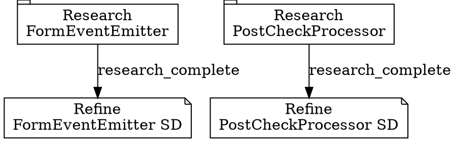

# Guardian Workflow — End-to-End Reference

Complete workflow for the S3 Guardian pattern, from pre-flight checks through post-validation actions.

---

## 1. Pre-Flight Checks

Before beginning a guardian session, verify all prerequisites are met.

### 1.1 Environment Verification

```bash
# Verify config repo (where acceptance tests will live)
ls -la acceptance-tests/ 2>/dev/null || echo "Directory will be created"

# Verify implementation repo is accessible
ls -la /path/to/impl-repo/.taskmaster/docs/ 2>/dev/null || echo "ERROR: impl repo not found"

# Verify claude CLI is available (required for headless mode)
claude --version

# Add cs-* scripts to PATH (REQUIRED — they are not system-wide commands)
export PATH="${CLAUDE_PROJECT_DIR:-.}/.claude/scripts/completion-state:$PATH"

# Verify cs-promise CLI is available
cs-status 2>/dev/null || echo "ERROR: completion-state scripts not found"

# Verify ccsystem3 function is available
which ccsystem3 2>/dev/null || type ccsystem3 2>/dev/null
```

### 1.2 PRD Verification

```bash
# Check PRD exists
cat /path/to/impl-repo/.taskmaster/docs/PRD-{ID}.md | head -50

# Extract PRD metadata
grep -E "^#|^##|acceptance|criteria|epic|feature" /path/to/impl-repo/.taskmaster/docs/PRD-{ID}.md
```

### 1.3 Conflict Checks

```bash
# No existing headless worker process or signal files for same initiative
ls .claude/attractor/signals/*-s3-{initiative}-*.json 2>/dev/null && echo "WARNING: active signals exist" || echo "OK: no conflict"

# No existing acceptance tests (or confirm overwrite intent)
ls acceptance-tests/PRD-{ID}/ 2>/dev/null && echo "WARNING: tests exist, will be overwritten" || echo "OK: fresh"

# No stale completion state
cs-status 2>/dev/null | grep -i "pending\|in_progress"
```

### 1.4 Hindsight Context Gathering

Before creating acceptance tests, gather institutional knowledge about the initiative:

```python
# Check for previous guardian sessions on this PRD
previous = mcp__hindsight__reflect(
    f"Previous guardian validations for PRD-{prd_id} or similar initiatives",
    budget="mid",
    bank_id="system3-orchestrator"
)

# Check for known patterns in the implementation domain
domain_patterns = mcp__hindsight__reflect(
    f"Development patterns and anti-patterns for {domain}",
    budget="mid",
    bank_id="claude-code-{project}"
)
```

Use findings to calibrate acceptance test expectations and thresholds.

---

## 2. Acceptance Test Generation

### 2.1 Read and Analyze PRD

Read the entire PRD document. Extract a structured feature list:

```
Feature Extraction Template:
---
PRD: PRD-{ID}
Title: {PRD title}
Epics: {number of epics}

Features:
  - F1: {name} — {description} — Weight: {0.XX}
  - F2: {name} — {description} — Weight: {0.XX}
  ...

Total Weight Check: {sum} (must equal 1.00)
```

### 2.2 Determine Feature Weights

Weight assignment follows business criticality, not implementation complexity:

**Weight Calibration Process**:

1. Rank all features by "what breaks if this is missing?"
2. Assign the top feature 0.25-0.35 weight
3. Distribute remaining weight proportionally
4. Verify sum equals 1.00
5. Sanity check: would a product owner agree with this ranking?

**Common Mistakes**:
- Giving infrastructure features (logging, config) high weight — these rarely fail business validation
- Equal weights across all features — this dilutes the signal from core features
- Forgetting to account for cross-cutting concerns (error handling touches many features)

### 2.3 Write Gherkin Scenarios

For each feature, write 1-3 Gherkin scenarios. The number of scenarios depends on feature complexity:

| Feature Complexity | Scenarios |
|-------------------|-----------|
| Simple (single behavior) | 1 scenario |
| Medium (2-3 behaviors) | 2 scenarios |
| Complex (multiple states/paths) | 3 scenarios |

Each scenario follows this template:

```gherkin
  Scenario: {Descriptive name}
    Given {precondition — what must exist before testing}
    When {action — what the implementation should do}
    Then {outcome — what should be verifiable}

    # Confidence Scoring Guide:
    # 0.0 — {what total absence looks like}
    # 0.3 — {what partial/broken implementation looks like}
    # 0.5 — {what basic but incomplete implementation looks like}
    # 0.7 — {what solid implementation with minor gaps looks like}
    # 1.0 — {what complete, production-quality implementation looks like}
    #
    # Evidence to Check:
    #   - {specific file or function to examine}
    #   - {specific test to look for}
    #   - {specific behavior to verify}
    #
    # Red Flags:
    #   - {indicator of false or inflated claims}
    #   - {common shortcut that appears complete but isn't}
```

### 2.4 Create Manifest

Generate the manifest using the template script:

```bash
.claude/skills/s3-guardian/scripts/generate-manifest.sh PRD-{ID} "PRD Title"
```

Then populate the generated `manifest.yaml` with:
- Feature names, descriptions, and weights
- Scoring thresholds (ACCEPT, INVESTIGATE, REJECT)
- Validation protocol (which evidence sources to use)
- Implementation repo path

### 2.5 Verification of Test Quality

Before proceeding to meta-orchestrator spawning, verify acceptance test quality:

1. **Coverage check**: Every PRD feature has at least one scenario
2. **Weight sum**: Exactly 1.00
3. **Scoring guides**: Every scenario has a 0.0-1.0 calibration guide
4. **Evidence specificity**: Each scenario references concrete files or behaviors, not vague descriptions
5. **Red flag inclusion**: Every scenario has at least one red flag indicator

---

## 3. Meta-Orchestrator Spawning Sequence

### 3.1 Create Guardian Session Promise

Before spawning the meta-orchestrator, create the guardian's own session promise:

```bash
cs-init

cs-promise --create "Guardian: Validate PRD-{ID} implementation" \
    --ac "Acceptance tests created and stored in config repo" \
    --ac "S3 meta-orchestrator spawned and verified running" \
    --ac "Meta-orchestrator progress monitored through completion" \
    --ac "Independent validation scored against rubric" \
    --ac "Final verdict delivered with evidence"

cs-promise --start <promise-id>
```

### 3.2 Spawn Meta-Orchestrator

**DEFAULT**: Use `pipeline_runner.py --dot-file` to launch workers via AgentSDK (see system3-meta-orchestrator output style → DOT Graph Navigation for full pattern).

For interactive sessions where human observation matters, use `spawn_orchestrator.py --mode tmux`:

### 3.2.1 Spawn Meta-Orchestrator (tmux Mode — Interactive)

Use `spawn_orchestrator.py --mode tmux` for interactive sessions where human observation and intervention matter. The tmux mode runs an orchestrator in a named tmux session on a Max plan (no per-token API billing).

```bash
# Spawn via tmux mode (interactive, Max-plan cost model)
python3 "${IMPL_REPO}/.claude/scripts/attractor/spawn_orchestrator.py" \
    --node "s3-${INITIATIVE}" \
    --prd "${PRD_ID}" \
    --repo-root "${IMPL_REPO}" \
    --mode tmux \
    --prompt "You are the System 3 meta-orchestrator. Invoke Skill('s3-guardian') first. Then read PRD-${PRD_ID} at .taskmaster/docs/PRD-${PRD_ID}.md. Parse tasks with Task Master. Spawn orchestrators as needed. Report when all epics are complete."

# The orchestrator runs in a tmux session: tmux new-session -d -s "s3-${INITIATIVE}" ...
# Monitor via: tmux capture-pane -t "s3-${INITIATIVE}" -p
# Send messages via: tmux send-keys -t "s3-${INITIATIVE}" "<message>" Enter
```

**What tmux mode does internally**:
1. Creates a tmux session named `s3-${INITIATIVE}`
2. Launches Claude Code in the session with `/output-style orchestrator` loaded
3. Sends initial prompt via tmux keystroke sequence (Three-Layer Context: ROLE → output-style, TASK → prompt)
4. Guardian monitors via `tmux capture-pane` (screen scraping, no structured output)
5. Guardian can intervene by sending messages via `tmux send-keys` (manual guidance injection)

**When to use tmux mode**:
- Long-running orchestrators where human observation is valuable
- Cost-conscious work (Max plan sessions are cheaper than API-billed headless)
- Need for manual intervention (guidance injection, pause-and-check loops)

### 3.3 Send Initial Instructions

**Headless mode**: The initial instructions are passed via the `--prompt` flag at spawn time (see above). There is no separate "send instructions" step — the prompt IS the instructions.

**tmux mode**: The initial instructions are sent via tmux keystroke sequence after the session is created. The 3-step boot sequence is handled automatically by `spawn_orchestrator.py`.

**SDK mode**: Instructions are part of the `launch_guardian.py` pipeline configuration (see SDK Mode Dispatch section below).

### 3.4 Meet Spawn Acceptance Criteria

```bash
cs-promise --meet <id> --ac-id AC-2 --evidence "headless worker process launched for s3-${INITIATIVE}, output style injected via --system-prompt" --type manual
```

---

## 4. Monitoring Loop

### 4.1 Enter Monitoring State

Once the meta-orchestrator is confirmed running, enter the monitoring loop:

```
MONITORING LOOP:
  |
  +-- Check signal files / process status
  |
  +-- Scan for signals
  |     |
  |     +-- Error pattern → Assess
  |     +-- Completion claim → Validate (Phase 4)
  |     +-- Normal work → Continue
  |
  +-- Check context percentage (if tmux legacy mode)
  |     |
  |     +-- Above 80% → Expect auto-compact
  |     +-- Above 90% → Consider intervention
  |
  +-- Sleep (cadence-dependent)
  |
  +-- [REPEAT]
```

### 4.2 Cadence Adaptation

Adjust monitoring frequency based on signal file content:

```bash
# Check signal files for the initiative (headless mode — DEFAULT)
SIGNAL_DIR=".claude/attractor/signals"
LATEST_SIGNAL=$(ls -t "${SIGNAL_DIR}"/*-s3-${INITIATIVE}-*.json 2>/dev/null | head -1)

if [ -n "$LATEST_SIGNAL" ]; then
    STATUS=$(python3 -c "import json; print(json.load(open('$LATEST_SIGNAL')).get('signal_type',''))")
    case "$STATUS" in
        NEEDS_REVIEW|NODE_COMPLETE) CADENCE=10 ;;   # Completion — check quickly
        ORCHESTRATOR_STUCK)         CADENCE=15 ;;   # Problem — investigate
        *)                          CADENCE=60 ;;   # Normal — default
    esac
else
    CADENCE=60  # No signals yet — default
fi

sleep $CADENCE
```

### 4.3 Intervention Protocol

When intervention is needed, follow this decision tree:

1. **Repeated Errors** (detected via signal files or process exit codes):
   - Count occurrences of the same error pattern
   - After 3 occurrences: send corrective guidance (re-launch with updated prompt)
   - After 5 occurrences: consider restarting the headless process with a different approach

2. **Scope Creep** (detected via git diff against expected file scope):
   - Compare current work against PRD scope
   - If meta-orchestrator is working on unrelated features: re-launch with scoped prompt
   - If meta-orchestrator is over-engineering: remind of scope boundaries in re-launch

3. **Time Limits**:
   - Typical initiative: 1-3 hours for implementation
   - At 2 hours: check progress percentage via signal files
   - At 3 hours: seriously consider partial completion + validation

**Note**: In headless mode, there is no interactive session to send keystrokes to. Interventions are done by re-launching the process with an updated prompt or by writing guidance signal files. For legacy tmux mode intervention patterns, see [monitoring-patterns.md](monitoring-patterns.md) Legacy section.

### 4.4 Meet Monitoring Acceptance Criteria

When the meta-orchestrator signals completion (or time limit is reached):

```bash
cs-promise --meet <id> --ac-id AC-3 --evidence "Monitored s3-{initiative} for {duration}, {intervention_count} interventions performed" --type manual
```

---

## 5. Validation Cycle

### 5.1 Load Acceptance Rubric

```bash
# Read manifest
cat acceptance-tests/PRD-{ID}/manifest.yaml

# Read all feature files
cat acceptance-tests/PRD-{ID}/*.feature
```

### 5.2 Independent Evidence Gathering

For each feature in the manifest, gather evidence independently:

```bash
# Git history for the implementation period
git -C /path/to/impl-repo log --oneline --since="3 hours ago"
git -C /path/to/impl-repo show --stat HEAD~15..HEAD

# Specific file examination
cat /path/to/impl-repo/src/{file_referenced_in_scenario}

# Test results (if test suite exists)
cd /path/to/impl-repo && python -m pytest --tb=short -q 2>&1

# Import/dependency verification
grep -r "import\|from\|require" /path/to/impl-repo/src/ | grep "{expected_dependency}"
```

### 5.3 Score Each Scenario

For each Gherkin scenario, assign a confidence score using the scenario's scoring guide:

```
Scoring Worksheet:
---
Feature: F1 — {name} (weight: 0.30, validation_method: browser-required)
  Scenario 1: {name}
    Evidence found: {what was actually observed}
    Red flags detected: {any red flags from the guide}
    Score: 0.X
    Rationale: {why this score, not higher/lower}

  Scenario 2: {name}
    Evidence found: {what was actually observed}
    Red flags detected: {any red flags from the guide}
    Score: 0.X
    Rationale: {why this score, not higher/lower}

  Feature Score: average(scenario scores) = 0.XX
  Weighted Contribution: 0.XX * 0.30 = 0.XXX

Feature: F2 — {name} (weight: 0.20, validation_method: api-required)
  ...

TOTAL WEIGHTED SCORE: sum(weighted contributions) = 0.XXX
```

### 5.3b Evidence Gate Check

After scoring all features but BEFORE computing the weighted total, apply the evidence gate for features with `validation_method` = `browser-required` or `api-required`:

```
Evidence Gate:
---
Feature: F1 — {name} (validation_method: browser-required)
  Evidence keywords found: ["screenshot", "navigate", "localhost:3000"]
  Minimum required: 2
  Keywords found: 3
  Gate result: PASS (score unchanged)

Feature: F3 — {name} (validation_method: browser-required)
  Evidence keywords found: ["Read file", "grep"]
  Minimum required: 2
  Browser keywords found: 0
  Gate result: FAIL — Score overridden from 0.80 to 0.00
  Reason: EVIDENCE GATE: browser-required feature scored without browser evidence

Feature: F2 — {name} (validation_method: api-required)
  Evidence keywords found: ["curl", "HTTP 200", "localhost:8000"]
  Minimum required: 2
  Keywords found: 3
  Gate result: PASS (score unchanged)
```

See [validation-scoring.md](validation-scoring.md) Section 10 for the complete keyword reference.

### 5.4a Autonomous Gap Closure (In-Flight Pipeline Modification)

**Trigger**: Gaps have been identified in Sections 5.3-5.3b, but BEFORE making the final decision in 5.4.

**Purpose**: System 3 autonomously creates codergen fix-it nodes for gaps that can be fixed without architectural or UX decisions, modifies the DOT pipeline in-place, and re-validates affected scenarios. This ensures only gaps requiring user input (architectural/design decisions) are escalated to `wait.human`.

#### Decision Tree for Each Gap

For each gap identified in Sections 5.3-5.3b:

1. **Is gap in PRD scope?** (Check against PRD Section 8 epics)
   - NO → Mark as informational, do not create fix-it
   - YES → Continue

2. **Is gap fixable without architectural or UX decisions?**
   - NO (requires design change, API contract rework, etc.) → Escalate
   - YES → Continue

3. **Is this a regression?** (Compare against ZeroRepo baseline at `.zerorepo/baseline.json`)
   - YES (feature worked before, now broken) → P0 priority fix-it
   - NO → Continue

4. **Low-risk and fixable in <15 minutes?** (imports, test mocks, CSS, validation logic)
   - YES → Create autonomous fix-it codergen node
   - NO → Escalate to `wait.human`

**Full decision tree with detailed examples**: See [gap-decision-tree.md](gap-decision-tree.md).

#### Creating and Deploying Fix-It Nodes

For each gap decided for autonomous closure:

1. **Create minimal Solution Design** (3-4 paragraphs, specific fix only)
   - Path: `docs/sds/fix-gap-{gap_id}.md`
   - Acceptance: "Gherkin scenario {scenario_name} passes; no regressions introduced"
   - Example: Missing import, test mock configuration, CSS class, validation check

2. **Create Beads issue** for tracking
   ```bash
   bd create --title="FIX-{gap_id}: {gap_title} — gap from Phase 4 validation" \
             --type=task --priority=1 \
             --description="Gap identified during Phase 4 validation: {gap_description}. Closes scenario {scenario}."
   BEAD_ID=$(bd list --title="FIX-{gap_id}" --json | jq -r '.[0].id')
   ```

3. **Add fix-it node to DOT pipeline** (in-flight modification)
   ```dot
   fix_gap_x1 [
       shape=box
       label="FIX: {gap_title}"
       handler="codergen"
       worker_type="backend-solutions-engineer|frontend-dev-expert|tdd-test-engineer"
       sd_path="docs/sds/fix-gap-{gap_id}.md"
       bead_id="{BEAD_ID}"
       acceptance="Scenario {scenario_name} passes, no regressions"
       status="pending"
   ];

   e1_gate -> fix_gap_x1 [label="gaps_detected"];
   fix_gap_x1 -> revalidate_gap_x1 [label="impl_complete"];
   revalidate_gap_x1 [
       shape=hexagon
       label="Re-validate Gap X1"
       handler="wait.system3"
       gate_type="gap-closure"
       status="pending"
   ];
   revalidate_gap_x1 -> e1_review [label="validated"];
   ```

4. **Dispatch fix-it via runner**
   ```bash
   python3 .claude/scripts/attractor/runner.py --spawn \
       --node fix_gap_x1 \
       --prd PRD-{ID} \
       --dot-file .claude/attractor/pipelines/PRD-{ID}.dot
   ```

5. **Re-validate after fix completes**
   ```bash
   # Run exact scenario that failed
   behave acceptance-tests/PRD-{ID}/{scenario_name}.feature:S{scenario_num}

   # If passes:
   python3 .claude/scripts/attractor/cli.py node-modify \
       --dot-file .claude/attractor/pipelines/PRD-{ID}.dot \
       --node-id revalidate_gap_x1 \
       --set status=validated

   bd close $BEAD_ID

   # If fails, requeue with corrected guidance
   ```

#### Cascade Control

Track iteration count to prevent infinite fix-it loops:

```python
cascade_depth = 0
max_iterations = 3

for gap in gaps_found:
    cascade_depth += 1

    if cascade_depth > max_iterations:
        # Stop autonomous closure, escalate remaining gaps to wait.human
        escalate_remaining_gaps()
        break

    if is_autonomous_fixable(gap):
        create_and_dispatch_fix_it(gap)
        revalidate(gap)
    else:
        escalate_to_wait_human(gap)
```

After 3 iterations of fix-it nodes, escalate remaining gaps with summary: "Cascade detected: 3 iterations revealed additional gaps. Escalating for user decision on approach."

#### Completion

Phase 4.5 (Autonomous Gap Closure) is complete when:
- All in-scope, autonomously-fixable gaps have been fixed and re-validated
- All fix-it codergen nodes have completed successfully
- No gaps remain that don't require architectural or UX decisions
- Pipeline is ready for the final decision in Section 5.4

**Detailed protocol**: See [gap-closure-protocol.md](gap-closure-protocol.md) for complete patterns, common fix-it types, and escalation criteria.

### 5.4 Make Decision

Compare the total weighted score against manifest thresholds:

```
Score: 0.XXX
ACCEPT threshold: 0.60
INVESTIGATE range: 0.40-0.59
REJECT threshold: < 0.40

DECISION: {ACCEPT | INVESTIGATE | REJECT}
```

### 5.5 Report Generation

Generate a structured validation report:

```markdown
# Guardian Validation Report: PRD-{ID}

## Summary
- **Decision**: {ACCEPT | INVESTIGATE | REJECT}
- **Weighted Score**: {0.XX} / 1.00
- **Implementation Duration**: {time}
- **Interventions**: {count}

## Feature Scores

| Feature | Weight | Score | Weighted | Notes |
|---------|--------|-------|----------|-------|
| F1: {name} | 0.30 | 0.80 | 0.240 | {brief note} |
| F2: {name} | 0.20 | 0.65 | 0.130 | {brief note} |
| ... | ... | ... | ... | ... |
| **Total** | **1.00** | - | **0.XXX** | |

## Gaps Identified
1. {gap description with affected feature}
2. {gap description with affected feature}

## Red Flags Detected
1. {red flag and its implications}

## Recommendations
- {next steps based on decision}
```

---

## 5.5 In-Flight Pipeline Modification: Phase 4.5 Gap Closure

When Phase 4 validation identifies gaps and the decision is made to autonomously close **closable** gaps (see validation-scoring.md § Phase 4.5), you must add fix-it nodes to the running pipeline atomically. This section documents the mechanics of adding nodes to a live pipeline without interrupting orchestrator execution.

### When In-Flight Modification is Triggered

In-flight pipeline modification happens when:
1. **Phase 4 validation completes** with gaps identified
2. **Gap analysis confirms closable gaps** exist (see gap-decision-tree.md)
3. **Decision is made to continue** (escalation gates not reached)
4. **Orchestrator is still active** (pipeline runner still executing)

Modification does NOT happen if:
- Orchestrator has already reached `wait.human` or final state
- All gaps are non-closable (escalate directly without modification)
- Modification depth exceeds 3 iterations (escalate to user)

### Safe Atomic Modification Pattern

Pipeline modification must be atomic — a failing operation should not leave the DOT file in an inconsistent state. Use this pattern:

```bash
#!/bin/bash
# Safe in-flight pipeline modification

PIPELINE_PATH="path/to/simple-pipeline.dot"
BACKUP_PATH="${PIPELINE_PATH}.backup-$(date +%s)"

# Step 1: Validate current state
cobuilder cli validate --dot-file "${PIPELINE_PATH}" \
    || { echo "ERROR: Pipeline invalid before modification"; exit 1; }

# Step 2: Create backup (recovery point)
cp "${PIPELINE_PATH}" "${BACKUP_PATH}"

# Step 3: Add fix-it node (atomic operation)
cobuilder cli node-add \
    --dot-file "${PIPELINE_PATH}" \
    --node-id "fix_gap_1" \
    --label "FIX: Missing import" \
    --handler "codergen" \
    --attributes "worker_type=backend-solutions-engineer,sd_path=docs/sds/fix-g1.md,priority=P0"

# Step 4: Wire node into pipeline (add edges)
cobuilder cli edge-add \
    --dot-file "${PIPELINE_PATH}" \
    --from "validate_phase_4" \
    --to "fix_gap_1"

cobuilder cli edge-add \
    --dot-file "${PIPELINE_PATH}" \
    --from "fix_gap_1" \
    --to "re_validate_gaps"

# Step 5: Validate new pipeline
cobuilder cli validate --dot-file "${PIPELINE_PATH}" \
    || {
        echo "ERROR: Pipeline validation failed after modification"
        echo "Rolling back to backup: ${BACKUP_PATH}"
        mv "${BACKUP_PATH}" "${PIPELINE_PATH}"
        exit 1
    }

# Step 6: Checkpoint (save validated state)
cobuilder cli checkpoint \
    --dot-file "${PIPELINE_PATH}" \
    --label "Phase 4.5 modification: added fix_gap_1"

# Step 7: Clean up backup (success)
rm -f "${BACKUP_PATH}"

echo "SUCCESS: Pipeline modified atomically with fix-it node"
```

### CLI Commands for Pipeline Modification

**Create a fix-it node:**
```bash
cobuilder cli node-add \
    --dot-file "simple-pipeline.dot" \
    --node-id "fix_gap_1" \
    --label "FIX: Missing validation check" \
    --handler "codergen" \
    --attributes "worker_type=backend-solutions-engineer,sd_path=docs/sds/FIX-G1.md,priority=P0,status=pending"
```

**Add edge from validation gate to fix-it node:**
```bash
cobuilder cli edge-add \
    --dot-file "simple-pipeline.dot" \
    --from "validate_phase_4" \
    --to "fix_gap_1"
```

**Add edge from fix-it node to re-validation:**
```bash
cobuilder cli edge-add \
    --dot-file "simple-pipeline.dot" \
    --from "fix_gap_1" \
    --to "re_validate_after_fix"
```

**Validate modified pipeline:**
```bash
cobuilder cli validate --dot-file "simple-pipeline.dot"
```

**Checkpoint current state (for history):**
```bash
cobuilder cli checkpoint \
    --dot-file "simple-pipeline.dot" \
    --label "Added fix-it node for gap G1"
```

### Pipeline Topology During Gap Closure

Typical pipeline structure during Phase 4.5:

```dot
validate_phase_4 [handler="wait.system3" ...];

fix_gap_1 [handler="codergen" ...];
fix_gap_2 [handler="codergen" ...];
fix_gap_3 [handler="codergen" ...];

re_validate_gaps [handler="wait.system3" ...];

validate_phase_4 -> fix_gap_1;
validate_phase_4 -> fix_gap_2;
validate_phase_4 -> fix_gap_3;

fix_gap_1 -> re_validate_gaps;
fix_gap_2 -> re_validate_gaps;
fix_gap_3 -> re_validate_gaps;

re_validate_gaps -> [await results, analyze new gaps];
```

**Modification Steps:**
1. After `validate_phase_4` identifies gaps, create fix-it nodes
2. Wire them all to exit from the validation gate
3. Wire all fixes to converge on re-validation node
4. Allow orchestrator to execute fixes and re-validate
5. If new gaps emerge, repeat (tracking iteration count)

### Cascading Gap Management

When re-validation reveals new gaps, track iteration depth to prevent infinite loops:

```python
iteration = 0
max_iterations = 3

while iteration < max_iterations:
    iteration += 1

    # Run validation
    gaps = validate_against_rubric()

    if not gaps:
        print("SUCCESS: All gaps closed")
        return

    # Classify gaps
    closable_gaps = [g for g in gaps if is_closable(g)]
    escalate_gaps = [g for g in gaps if not is_closable(g)]

    if escalate_gaps and not closable_gaps:
        print(f"ESCALATE: {len(escalate_gaps)} non-closable gaps")
        return escalate_to_wait_human(escalate_gaps)

    if not closable_gaps:
        print("NO WORK: All gaps are non-closable")
        return escalate_to_wait_human(gaps)

    # Create fix-it nodes for closable gaps
    for gap in closable_gaps:
        create_fix_it_node(gap)

    # Add nodes to pipeline and continue
    modify_pipeline_in_flight(closable_gaps)

    # Orchestrator will execute new nodes automatically

if iteration >= max_iterations:
    print(f"ESCALATE: Max iterations {max_iterations} reached")
    print(f"Remaining closable gaps suggest architecture issue")
    return escalate_to_wait_human_with_cascade_evidence(gaps)
```

**Cascade escalation trigger**: If you reach 3 iterations (9 potential fix-it nodes) and still have closable gaps, escalate the entire set to wait.human with evidence of cascading failures. This indicates a deeper architectural issue that requires human insight.

### Beads Synchronization During Modification

When adding fix-it nodes in-flight, keep Beads synchronized:

```bash
# For each fix-it node created:
bd create \
    --title="FIX-G1: Missing email validation" \
    --type=task \
    --priority=0 \
    --description="Phase 4.5 autonomous gap closure: Add validation to email field" \
    --epic-id="FIX-G1"

# Link the Beads issue to the orchestrator epic
bd dep add "FIX-G1" "PRD-{ID}-epic"

# When the fix-it node completes:
bd update "FIX-G1" --status=done --notes="Fix-it node completed by worker, re-validation pending"

# After re-validation confirms closure:
bd update "FIX-G1" --notes="Gap confirmed closed in re-validation, signature: {validation_score}"
```

### Solution Design Requirements for Fix-It Nodes

Each fix-it node requires a minimal Solution Design document:

```markdown
---
title: "FIX-G1: Missing Email Validation"
---

# Gap Closure Solution Design

## Gap Reference
- Gap ID: G1
- Identified in Phase 4 validation
- Acceptance criterion violated: Feature 2, Scenario 1

## In-Scope Changes
- **File**: `frontend/forms/UserForm.tsx`
- **Change**: Add email validation schema
- **Lines**: ~150-160
- **Dependencies**: Uses existing `z.string()` from zod library (already imported)

## Acceptance for Closure
1. Form validation fails when email format is invalid
2. Test `test_email_validation_invalid` passes
3. No regression in other form tests (verify with `npm test -- forms`)
4. User can still submit valid email addresses

## Risk Assessment
- **Complexity**: Low (single schema validation line)
- **Cascade risk**: None (isolated to form validation)
- **Performance impact**: Negligible (runs on client-side form input)
- **API impact**: None (API validation unchanged)

## Verification Steps
1. Manual test: Submit form with invalid email → should fail
2. Automated test: Run `npm test -- UserForm.test.tsx`
3. Full suite: Run `npm test` to detect regressions
4. QA checklist: Form still submits on valid email

---
```

The SD is minimal because it's closing a specific gap, not designing a feature. Focus on **what changed**, **how to verify**, and **what could break**.

### Timeline for In-Flight Modification

Typical Phase 4.5 timeline:

| Step | Duration | Activity |
|------|----------|----------|
| Validate & identify gaps | 10 min | Phase 4 validation completes, gaps extracted |
| Gap analysis & classification | 5 min | Use gap-decision-tree.md to classify |
| Create fix-it SDs | 10 min | Write minimal solution designs |
| Modify pipeline | 2 min | Add nodes, wire edges, checkpoint |
| Orchestrator executes | 10-30 min | Workers run fix-it nodes |
| Re-validate | 10 min | Run Phase 4 validation on fixed code |
| **Total** | **47-67 min** | |

If > 60 minutes total, escalate remaining gaps to wait.human rather than continuing.

### Common Gotchas in In-Flight Modification

**Gotcha 1: Modifying pipeline without backup**
- WRONG: `cobuilder cli node-add` directly on active pipeline
- RIGHT: Create backup first, validate after modification, checkpoint on success

**Gotcha 2: Not wiring edges correctly**
- WRONG: Add node but forget to connect it to validation gate
- RIGHT: `edge-add` from validation node to fix-it, fix-it to re-validation

**Gotcha 3: Using node-add without checkpoint**
- WRONG: Modify 5 nodes in sequence without checkpoints
- RIGHT: Checkpoint after each safe modification step

**Gotcha 4: Infinite cascade loops**
- WRONG: Keep fixing gaps indefinitely
- RIGHT: Stop after 3 iterations and escalate to wait.human

**Gotcha 5: Not updating Beads alongside pipeline**
- WRONG: Pipeline has fix-it nodes but Beads has no corresponding issues
- RIGHT: `bd create` for each fix-it, track progress, link to epic

---

## 6. Post-Validation Actions

### 6.1 ACCEPT Path

```bash
# Meet validation acceptance criteria
cs-promise --meet <id> --ac-id AC-4 --evidence "Weighted score: 0.XX, above ACCEPT threshold 0.60" --type manual
cs-promise --meet <id> --ac-id AC-5 --evidence "ACCEPT verdict delivered, report stored" --type manual

# Store to Hindsight
# (see SKILL.md "Storing Validation Results" section)

# Verify guardian promise is complete
cs-verify --check --verbose
```

### 6.2 INVESTIGATE Path

```bash
# Identify specific gaps that need attention
# Create a targeted follow-up plan
# Optionally spawn a new meta-orchestrator session focused on gaps

# Do NOT meet AC-4 yet — investigation is not acceptance
# Log the gaps for tracking
cs-verify --log --action "INVESTIGATE verdict for PRD-{ID}" --outcome "partial" \
    --learning "Gaps found in: {feature_list}"
```

### 6.3 REJECT Path

```bash
# Document specific failures
# Store anti-patterns to Hindsight
# Plan full reimplementation cycle

cs-verify --log --action "REJECT verdict for PRD-{ID}" --outcome "failed" \
    --learning "Critical failures in: {feature_list}. Score: {0.XX}"
```

### 6.4 Meta-Orchestrator Cleanup

After validation is complete (regardless of verdict):

```bash
# Check if headless worker process is still running (DEFAULT)
SIGNAL_DIR=".claude/attractor/signals"
ls "${SIGNAL_DIR}"/*-s3-${INITIATIVE}-*.json 2>/dev/null && echo "Active signals exist" || echo "Process likely complete"

# Clean up signal files after validation
mkdir -p "${SIGNAL_DIR}/processed"
mv "${SIGNAL_DIR}"/*-s3-${INITIATIVE}-*.json "${SIGNAL_DIR}/processed/" 2>/dev/null

# For legacy tmux mode — check and clean up tmux session:
# tmux has-session -t "s3-{initiative}" 2>/dev/null
# tmux send-keys -t "s3-{initiative}" "All work validated. You may finalize and exit."
# sleep 2
# tmux send-keys -t "s3-{initiative}" Enter
```

---

## 7. Timeline Reference

Typical guardian session timeline for a medium-complexity PRD:

| Phase | Duration | Activities |
|-------|----------|------------|
| Pre-flight | 5 min | Environment checks, Hindsight queries |
| Acceptance test creation | 15-30 min | PRD analysis, Gherkin writing, manifest creation |
| Meta-orchestrator spawning | 2-5 min | Headless dispatch via spawn_orchestrator.py, verification |
| Monitoring | 1-3 hours | Continuous oversight, periodic interventions |
| Independent validation | 15-30 min | Evidence gathering, scoring, report generation |
| Post-validation | 5-10 min | Hindsight storage, cleanup, promise completion |
| **Total** | **1.5-4 hours** | |

---

## Guardian Phase 2: Orchestrator Spawning (Full Reference)

> Extracted from s3-guardian SKILL.md — complete orchestrator spawning procedure including DOT dispatch, tmux patterns, SDK mode, and wisdom injection.

### Overview

Two dispatch modes are available. Choose based on the use case:

| Mode | When to Use | How It Works |
|------|-------------|--------------|
| **Headless mode** | Default for workers, focused tasks | Workers run via `claude -p` CLI with JSON output — no SDK or tmux needed |
| **SDK mode** | Automated pipelines, E2E tests, CI/CD | `guardian.py` (or `launch_guardian.py`) drives the full chain via `claude_code_sdk` — no tmux |
| **tmux mode** | Interactive sessions, lower API cost | Guardian spawns orchestrators in tmux sessions for manual monitoring; orchestrators run on Max plan (no per-token API billing) |

**SDK mode architecture** (validated E2E 2026-03-02):
```
guardian.py ──SDK──► guardian_agent.py ──SDK──► runner.py ──dispatch──► dispatch_worker.py → claude -p
                                                          (or legacy spawn_runner.py)
```
All 4 layers run headless via `claude_code_sdk`. No tmux sessions, no interactive prompts. The guardian reads the DOT pipeline, dispatches research nodes (synchronous, Haiku), then refine nodes (synchronous, Sonnet), then spawns runners for codergen nodes. Each runner spawns an orchestrator that implements the work.

**Headless mode architecture** (recommended for workers):
```
Guardian (this session) ──spawns──► dispatch_worker.py (via runner.py / spawn_orchestrator.py)
                                       └── claude -p "<task>" --system-prompt <role> --output-format stream-json --verbose
                                       └── Three-Layer Context:
                                            Layer 1 (ROLE): --system-prompt from .claude/agents/{worker_type}.md
                                            Layer 2 (TASK): -p argument (task prompt)
                                            Layer 3 (IDENTITY): env vars (WORKER_NODE_ID, PIPELINE_ID, etc.)
```
Workers run as single-shot `claude -p` processes. No tmux, no SDK. JSON output is captured and parsed.
Monitoring is via process exit code and stdout JSON — no capture-pane polling needed.

**tmux mode architecture** (interactive, lower API cost):
```
Guardian (this session) ──spawns──► Orchestrator A (orch-epic1) ──delegates──► Workers
                        ──spawns──► Orchestrator B (orch-epic2) ──delegates──► Workers
```

### Research Nodes (Mandatory Before Implementation)

Every codergen node SHOULD have a preceding research node that validates framework patterns against current documentation before implementation begins.

**Research node DOT attributes:**
```dot
research_impl_auth [
    shape=tab
    label="Research\nAuth Patterns"
    handler="research"
    downstream_node="impl_auth"
    solution_design="docs/sds/SD-AUTH-001-login.md"
    research_queries="fastapi,pydantic,supabase"
    prd_ref="PRD-AUTH-001"
    status="pending"
];

research_impl_auth -> impl_auth [label="research_complete"];
```

**What research nodes do:**
1. Read the Solution Design document
2. Validate framework patterns via Context7 (docs) and Perplexity (cross-validation)
3. **Update the SD directly** with corrected patterns — no side-channel injection needed
4. Write evidence to `.claude/evidence/{node_id}/research-findings.json`
5. Persist learnings to Hindsight (LLM-driven reflect + retain)

**Key design insight**: The SD is the single source of truth. Research nodes correct the SD itself, so downstream orchestrators get current patterns automatically by reading the SD they already reference.

Research runs synchronously before codergen dispatch (~15-30s, Haiku model, ~$0.02). The guardian handles dispatch and state transitions internally.

**Known limitation**: Research validates against *latest published docs* but does not check the *locally installed version*. If the local environment has an older version (e.g., pydantic-ai 1.58.0 vs documented 1.63.0), API attribute names may differ. Mitigation: pin dependency versions in the SD or add a local version check to the research prompt.

### Refine Nodes (SD Cleanup After Research)

Refine nodes (`handler="refine"`, `shape=note`) sit between research and codergen. They rewrite the Solution Design with research findings as first-class content, removing annotation artifacts.

**DOT attributes:**

| Attribute | Required | Description |
|-----------|----------|-------------|
| `handler` | Yes | Must be `"refine"` |
| `shape` | Yes | Must be `"note"` |
| `solution_design` | Yes | Path to the SD file to rewrite |
| `evidence_path` | Yes | Path to upstream research evidence (`research-findings.json`) |
| `prd_ref` | Recommended | PRD identifier for traceability |

**What refine nodes do:**
1. Read the upstream research evidence file (`research-findings.json`)
2. Call `mcp__hindsight__reflect` to surface prior SD rewrite patterns
3. Rewrite the SD — integrating validated patterns as native content, removing annotation artifacts
4. Write `refine-findings.json` to `.claude/evidence/{node_id}/`

**Key design**: Refine agents have restricted tools — only Read, Edit, Write, and Hindsight. No internet access, no Bash. This ensures the refine step is purely a rewrite operation, not additional research.

**Annotation patterns removed:**
- `// Validated via Context7/Perplexity: ...`
- `// Note: research confirmed ...`
- `// Context7: ...`
- `> Note: Based on research findings ...`

**Timing**: ~30-60s per node, Sonnet model (needs editorial judgment for SD rewriting).

**Pipeline flow**: `research (Haiku, ~15s) → refine (Sonnet, ~30-60s) → codergen`

### SDK Mode Dispatch

For automated pipelines, use `launch_guardian.py`:

```bash
python3 .claude/scripts/attractor/launch_guardian.py \
    --dot-file .claude/attractor/pipelines/${INITIATIVE}.dot \
    --target-dir /path/to/target \
    --model claude-sonnet-4-6 \
    --max-turns 200
```

The guardian automatically:
1. Validates the DOT pipeline
2. Dispatches research nodes (synchronous, before codergen)
3. Dispatches refine nodes (synchronous, after research)
4. Transitions nodes through the state machine (pending → active → validated)
5. Spawns runners for codergen nodes via SDK
6. Handles validation gates
7. Exits when all nodes reach `validated` or a node fails

### Research-Only Pipeline Dispatch

Pipelines that contain **only research and refine nodes** (no codergen) are a valid and common use case — for example, batch-validating Solution Designs against current framework documentation before starting implementation.

**The entry point is the same**: `launch_guardian.py` (or `guardian_agent.py` directly). The guardian detects that no codergen nodes exist and completes after all research/refine chains validate. Do NOT call `run_research.py` per-node — that is a Layer 2 internal tool invoked by the guardian, not a user-facing pipeline driver.

**Dispatch hierarchy** (applies to ALL pipeline types, including research-only):

```
┌──────────────────────────────────────────────────────────────────┐
│  Layer 0: System 3 (you)                                         │
│    Calls: launch_guardian.py --dot-file <pipeline.dot>           │
│                                                                  │
│  Layer 1: guardian_agent.py (Sonnet, pipeline coordinator)       │
│    Reads DOT → dispatches nodes by handler type:                 │
│    - handler="research" → calls run_research.py (Layer 2)       │
│    - handler="refine"   → calls run_refine.py (Layer 2)         │
│    - handler="codergen" → calls runner.py --spawn (Layer 2)     │
│                                                                  │
│  Layer 2: run_research.py / run_refine.py / runner.py           │
│    Single-node executors. NEVER call these directly for          │
│    pipeline execution — the guardian handles dispatch, state     │
│    transitions, and completion detection.                        │
└──────────────────────────────────────────────────────────────────┘
```

**Example: Research-only DOT file**



**Launch command** (identical to mixed pipelines):

```bash
python3 .claude/scripts/attractor/launch_guardian.py \
    --dot-file .claude/attractor/pipelines/verify-check-002-research-batch.dot \
    --target-dir /path/to/impl-repo \
    --model claude-sonnet-4-6 \
    --max-turns 100
```

**What happens internally**:
1. Guardian validates the DOT — finds research and refine nodes, no codergen
2. Phase 2a: Dispatches all research nodes in parallel (Haiku, ~15s each, ~$0.02)
3. Phase 2a.5: Dispatches refine nodes as their upstream research validates (Sonnet, ~30-60s)
4. Phase 2b: Finds no codergen nodes — skips
5. Phase 4: All nodes validated → signals `PIPELINE_COMPLETE`
6. Guardian exits cleanly

**Common mistake**: Calling `run_research.py` per-node in parallel Bash jobs. This bypasses the guardian's state machine (no DOT transitions, no checkpoints, no completion detection) and the scripts fail with exit code 2 when required pipeline context is missing.

### Pre-flight Checks

Before spawning orchestrators (any mode), verify:
- [ ] Implementation repo exists and is accessible
- [ ] PRD exists in `.taskmaster/docs/PRD-{ID}.md` (business artifact)
- [ ] SD exists per epic in `.taskmaster/docs/SD-{ID}.md` (technical spec; Task Master input)
- [ ] Acceptance tests have been created from SD (Phase 1 complete)
- [ ] DOT pipeline exists AND validates: `cobuilder pipeline validate <pipeline.dot>` exits 0. If missing, STOP and run Step 0.2 first — do NOT proceed to spawn without a pipeline.
- [ ] DOT codergen nodes have `solution_design` attribute pointing to their SD file
- [ ] Research nodes precede codergen nodes with correct `downstream_node` edges
- [ ] No existing process/session with the same node name
- [ ] Hindsight wisdom gathered from project bank

### Gather Wisdom from Hindsight

Before spawning each orchestrator, query the project Hindsight bank:

```python
PROJECT_BANK = os.environ.get("CLAUDE_PROJECT_BANK", "claude-harness-setup")
wisdom = mcp__hindsight__reflect(
    query=f"What patterns apply to {epic_name}? Any anti-patterns or lessons for this domain?",
    budget="mid",
    bank_id=PROJECT_BANK
)
# Include the wisdom output in the orchestrator's initialization prompt
```

### DOT Pipeline-Driven Dispatch

When a DOT pipeline exists, identify dispatchable nodes before spawning:

```bash
PIPELINE="/path/to/impl-repo/.claude/attractor/pipelines/${INITIATIVE}.dot"
CLI="python3 /path/to/impl-repo/.claude/scripts/attractor/cli.py"

# Find nodes with all upstream deps validated
$CLI status "$PIPELINE" --filter=pending --deps-met --json

# Transition node to active before dispatch (one per orchestrator)
$CLI transition "$PIPELINE" <node_id> active
$CLI checkpoint save "$PIPELINE"
```

Each orchestrator targets one pipeline node. Include the node's `acceptance`, `worker_type`, `file_path/folder_path`, and `bead_id` attributes in the initialization prompt.

### Headless Dispatch Patterns

**These patterns apply to headless mode (DEFAULT). For legacy tmux patterns, see the Legacy section below.**

**Pattern 1 — Always use `spawn_orchestrator.py --mode headless`** (never raw `claude -p`):
```bash
# WRONG — missing Three-Layer Context, no signal file management
claude -p "Do the work"

# CORRECT — canonical spawn with full context injection
python3 "${IMPL_REPO}/.claude/scripts/attractor/spawn_orchestrator.py" \
    --node "${EPIC_NAME}" \
    --prd "${PRD_ID}" \
    --repo-root "${IMPL_REPO}" \
    --mode headless \
    --prompt "Your task: ${TASK_DESCRIPTION}"
```

**Pattern 2 — Three-Layer Context** (how headless workers receive their instructions):
```
Layer 1 (ROLE):     --system-prompt from .claude/agents/{worker_type}.md
Layer 2 (TASK):     -p argument (the task prompt)
Layer 3 (IDENTITY): env vars (WORKER_NODE_ID, PIPELINE_ID, etc.)
```

**Pattern 3 — Monitor via signal files, not process polling**:
```bash
# Check for completion/error signals
SIGNAL_DIR=".claude/attractor/signals"
cat "${SIGNAL_DIR}"/*-${NODE_ID}-*.json 2>/dev/null | python3 -c "import json,sys; print(json.load(sys.stdin).get('signal_type',''))"
```

**Pattern 4 — JSON output capture** (headless mode returns structured results):
```bash
# spawn_orchestrator.py streams JSONL from `claude -p --output-format stream-json --verbose`
# Parse result events for completion status, errors, and evidence
```

### The Boot Sequence (Headless vs Legacy)

**Headless mode (DEFAULT)**: `spawn_orchestrator.py --mode headless` handles all context injection in a single command:
```
--system-prompt  → Sets the orchestrator role (replaces Step 1 + Step 2 of tmux boot)
-p prompt        → Delivers the task with Skill invocation instruction (replaces Step 3)
--permission-mode bypassPermissions → No interactive dialogs
--output-format stream-json --verbose → JSONL streaming for real-time monitoring
```

**tmux mode** (3-Step Boot Sequence — interactive, lower API cost):
```
Step 1: ccorch          → Sets 9 env vars (output style, session ID, agent teams, etc.)
Step 2: /output-style   → Loads orchestrator persona and delegation rules
Step 3: Skill prompt    → Orchestrator invokes Skill("orchestrator-multiagent") before any work
```

Skipping ANY step in tmux mode produces a crippled orchestrator. In headless mode, these steps are handled automatically by the spawn script.

### Spawn Sequence: Use `spawn_orchestrator.py` (MANDATORY)

**Always use the canonical spawn script.** Never write ad-hoc Bash for spawning (whether tmux or raw `claude -p` subprocesses).

The script at `.claude/scripts/attractor/spawn_orchestrator.py` handles:
- tmux session creation with `exec zsh` and correct dimensions
- `unset CLAUDECODE && ccorch --worktree <node_id>` (Step 1)
- `/output-style orchestrator` (Step 2)
- Prompt delivery (Step 3)
- Pattern 1 (Enter as separate send-keys call)
- Respawn logic if session dies

**CRITICAL: `IMPL_REPO` must point to the directory that contains `.claude/`** — this is the Claude Code project root. For monorepo layouts like `zenagent2/zenagent/agencheck/`, the project root is at `agencheck/` (where `.claude/output-styles/`, `.claude/settings.json`, etc. live), NOT at a subdirectory like `agencheck-support-agent/` or `agencheck-support-frontend/`. Spawning at the wrong level means the orchestrator boots without output styles, hooks, or skills.

```bash
EPIC_NAME="epic1"
# ✅ CORRECT: points to directory containing .claude/
IMPL_REPO="/path/to/impl-repo/agencheck"
# ❌ WRONG: git root — .claude/ is in agencheck/, not here
# IMPL_REPO="/path/to/impl-repo/zenagent"  # DON'T use the git/monorepo root!
# ❌ WRONG: subdirectory — no .claude/ here, orchestrator boots broken
# IMPL_REPO="/path/to/impl-repo/agencheck/agencheck-support-agent"  # DON'T use subdirectories!
PRD_ID="PRD-XXX-001"

# 1. Write the wisdom/prompt to a temp file FIRST
#    SD_PATH is the solution_design attribute from the DOT node
#    e.g., SD_PATH=".taskmaster/docs/SD-AUTH-001-login.md"
cat > "/tmp/wisdom-${EPIC_NAME}.md" << 'WISDOMEOF'
You are an orchestrator for initiative: ${EPIC_NAME}

> Your output style was set to "orchestrator" by the guardian during spawn.

## FIRST ACTIONS (Mandatory — do these BEFORE any investigation or implementation)
1. Skill("orchestrator-multiagent")   ← This loads your delegation patterns
2. Teammate(operation="spawnTeam", team_name="${EPIC_NAME}-workers", description="Workers for ${EPIC_NAME}")

## Your Mission
${EPIC_DESCRIPTION}

## Solution Design (Primary Technical Reference)
Your full technical specification is in: ${SD_PATH}
Read it before delegating to workers. Key sections:
- Section 2: Technical Architecture (data models, API contracts, component design)
- Section 4: Functional Decomposition (features with explicit dependencies)
- Section 6: Acceptance Criteria per Feature (definition of done for each worker task)
- Section 8: File Scope (which files workers are allowed to touch)

## DOT Node Scope (pipeline-driven)
- Node ID: ${NODE_ID}
- Acceptance: "${ACCEPTANCE_CRITERIA}"
- File Scope: ${FILE_PATHS} (see SD Section 8 for full scoping)
- Bead ID: ${BEAD_ID}

## Patterns from Hindsight
${WISDOM_FROM_HINDSIGHT}

## On Completion
Update bead to impl_complete: bd update ${BEAD_ID} --status=impl_complete
WISDOMEOF

# 2. Spawn via canonical script (handles Steps 1-3 of the boot sequence)
python3 "${IMPL_REPO}/.claude/scripts/attractor/spawn_orchestrator.py" \
    --node "${EPIC_NAME}" \
    --prd "${PRD_ID}" \
    --repo-root "${IMPL_REPO}" \
    --prompt "Read the file at /tmp/wisdom-${EPIC_NAME}.md and follow those instructions. Your FIRST ACTION must be: Skill(\"orchestrator-multiagent\")"

# 3. Verify spawn succeeded (script outputs JSON)
# {"status": "ok", "session": "orch-epic1", ...}
```

**What `spawn_orchestrator.py` does internally** (you should NOT replicate this manually):

**Headless mode** (`--mode headless`, DEFAULT):
1. Constructs `claude -p <prompt> --system-prompt <role> --permission-mode bypassPermissions --output-format stream-json --verbose`
2. Sets env vars: `WORKER_NODE_ID`, `PIPELINE_ID`, `CLAUDE_SESSION_ID`, etc.
3. Streams JSONL events line-by-line from subprocess stdout
4. Writes signal file on completion/error (includes full event stream)

**tmux mode** (interactive, lower API cost):
1. Creates tmux session with `exec zsh` in `--repo-root` directory
2. Sends `unset CLAUDECODE && ccorch --worktree <node>` (8s pause) — **Step 1**
3. Sends `/output-style orchestrator` (3s pause) — **Step 2**
4. Sends the `--prompt` text (2s pause) — **Step 3**
5. All sends use Pattern 1 (Enter as separate call)

### Anti-Pattern: Ad-Hoc Bash Spawn (NEVER DO THIS)

The following examples show ad-hoc spawning patterns (both tmux and raw subprocess) that produce **broken orchestrators** lacking output style, delegation patterns, session tracking, and agent team support.

**Headless anti-pattern** (raw `claude -p` without spawn script):
```bash
# WRONG — no Three-Layer Context, no signal management, no env vars
claude -p "Implement the auth feature" --output-format stream-json --verbose
```

**Legacy tmux anti-pattern** (found in a real session):

```bash
# ❌ WRONG — 5 critical violations that produce a crippled orchestrator
tmux new-session -d -s "orch-v2-ux" -c "$WORK_DIR"
sleep 1
tmux send-keys -t "orch-v2-ux" "exec zsh" Enter           # ❌ Pattern 1: Enter appended
sleep 2
tmux send-keys -t "orch-v2-ux" "unset CLAUDECODE && cd $WORK_DIR && claude --dangerously-skip-permissions" Enter
#                                                  ^^^^^^^^^^^^^^^^^^^^^^^^^^^^^^^^^^^^^^
#                                    ❌ Uses plain `claude` instead of `ccorch`
#                                    ❌ Missing: output style, session ID, agent teams,
#                                       task list, project bank, model, chrome flag
sleep 10
tmux send-keys -t "orch-v2-ux" "$WISDOM"                   # ❌ No /output-style step
sleep 2                                                      # ❌ No Skill("orchestrator-multiagent")
tmux send-keys -t "orch-v2-ux" "" Enter
```

**Why each violation matters:**

| Violation | Consequence |
|-----------|-------------|
| `claude` instead of `ccorch` | No `CLAUDE_OUTPUT_STYLE`, no `CLAUDE_SESSION_ID`, no `CLAUDE_CODE_EXPERIMENTAL_AGENT_TEAMS`, no `--model claude-opus-4-6`, no `--chrome`. Orchestrator boots as a generic Claude session. |
| No `/output-style orchestrator` | Orchestrator has no delegation rules — will try to implement code directly instead of spawning workers. |
| No `Skill("orchestrator-multiagent")` in prompt | Orchestrator doesn't know HOW to create teams, delegate tasks, or coordinate workers. |
| `Enter` appended to command | tmux may silently drop the Enter key, causing commands to not execute. |
| Direct paste instead of file reference | Large wisdom text can overflow tmux paste buffer, causing truncation. |
| `IMPL_REPO` points to git/monorepo root instead of `.claude/` root | Worktree created at wrong level; orchestrator can't find output styles, hooks, or skills. e.g., using `zenagent/` instead of `zenagent/agencheck/`. |
| `IMPL_REPO` points to subdirectory instead of `.claude/` root | Orchestrator boots without output styles, hooks, or skills. e.g., using `agencheck-support-agent/` instead of `agencheck/`. |

**The fix is always the same:** Use `spawn_orchestrator.py` with `--repo-root` pointing to the directory that contains `.claude/`.

### Parallel Spawning (Multiple Epics)

When multiple DOT nodes have no dependency relationship, spawn orchestrators in parallel:

```bash
# Check edges to confirm independence before parallel dispatch
cobuilder pipeline edge-list "${PIPELINE}" --output json

# Spawn each independent node as a separate orchestrator
for NODE_ID in node1 node2 node3; do
    EPIC_NAME="${NODE_ID}"
    # ... run spawn sequence above for each ...
done
```

### After Spawn: Communication Hierarchy

The guardian monitors orchestrators via signal files (headless) or session output (legacy tmux):

```
Guardian ──monitors──► Orchestrator ──delegates──► Workers (native teams)
   │                       ▲
   └── signal files / ─────┘
       re-launch with
       updated prompt
```

| Action | Headless Mode (Default) | Legacy tmux Mode |
|--------|------------------------|-----------------|
| Monitor output | Signal files (`.claude/attractor/signals/`) | `tmux capture-pane` |
| Send guidance | Re-launch with updated prompt | `tmux send-keys` |
| Detect completion | Process exit + JSON stdout | `tmux capture-pane` + grep |

Proceed to **Phase 3: Monitoring** after all orchestrators are spawned and running.

### CoBuilder Boot Sequence for Orchestrators

Every orchestrator session needs a functional RepoMap baseline before work begins.
Since `.repomap/` is committed to git and worktrees are full git checkouts, the
baseline is already present. The orchestrator only needs to verify it and know
the refresh commands for post-node-validation use.

Include these commands in the initial prompt sent to every orchestrator (via `--prompt` in headless mode, or pasted in legacy tmux mode):

```
## CoBuilder Commands Available in This Session

# Verify baseline exists and is recent
cobuilder repomap status --name ${REPO_NAME}

# After completing your work (automatic via post-validated hook, manual fallback):
cobuilder repomap refresh --name ${REPO_NAME} --scope <file1> --scope <file2>

# Full resync if you added many new files:
cobuilder repomap sync --name ${REPO_NAME}
```

Set these environment variables in the orchestrator session (automatically handled by `spawn_orchestrator.py` in headless mode; manually set in legacy tmux mode alongside CLAUDE_SESSION_ID):

```bash
export COBUILDER_REPO_NAME="${REPO_NAME}"
export COBUILDER_PIPELINE_DOT="${PIPELINE_DOT_PATH}"
export COBUILDER_ENFORCE_FRESHNESS=1
```

The post-validation hook in `transition.py` handles per-node refresh automatically.
Manual refresh is only needed if the hook missed files (nodes without `file_path`
attributes) or if the hook logged an error.

After the orchestrator completes, invoke cleanup explicitly:

```bash
python cobuilder/orchestration/spawn_orchestrator.py \
    --node ${NODE_ID} \
    --prd ${PRD_REF} \
    --repo-root ${REPO_ROOT} \
    --on-cleanup \
    --repo-name ${REPO_NAME}
```

---

## Pipeline Finalize

When ALL codergen nodes reach `validated` or `failed`:

```bash
# Save final checkpoint
cobuilder pipeline checkpoint-save \
    .claude/attractor/pipelines/${INITIATIVE}.dot \
    --output=.claude/attractor/checkpoints/${PRD_ID}-final.json

# Verify the completion promise
cs-verify --promise ${PROMISE_ID} --type e2e \
    --proof "Pipeline complete. Checkpoint: .claude/attractor/checkpoints/${PRD_ID}-final.json"
```

Then retain the outcome to Hindsight and report to user.

---

**Reference Version**: 0.1.0
**Parent Skill**: s3-guardian
