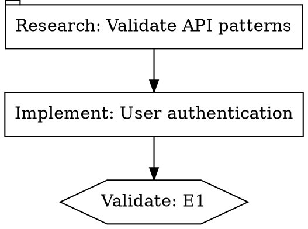

# CoBuilder

**Define your process. Let AI build, test, and validate.**

CoBuilder is a pipeline execution engine for Claude Code that turns product requirements into working software through autonomous multi-agent workflows. You define the process as a graph, CoBuilder runs it — dispatching research agents, coding agents, and validation agents, each with carefully scoped context and tools.

```
You (ideate, architect, refine)
 │
 ▼
CoBuilder Pipeline (pure Python, $0 graph traversal)
 │
 ├─→ Research agents    validate framework patterns before coding
 ├─→ Coding agents      implement features with scoped context
 ├─→ Validation agents  independently verify the work
 └─→ Guardian           runs blind acceptance tests you never showed the builders
```

The pipeline runner has zero LLM intelligence. It reads a DOT graph, dispatches workers via Claude's AgentSDK, watches for signal files, and transitions node states mechanically. All the smarts are in the agents it spawns — and in the process you design.

## Why CoBuilder?

Traditional AI coding assistants work one prompt at a time. CoBuilder gives you:

- **Process enforcement** — Define a pipeline (research → refine → build → validate) and the runner follows it programmatically. No skipping steps.
- **Context isolation** — Each agent knows just enough about its surroundings. A coding agent gets the technical spec for its epic, not the entire codebase. A validation agent gets acceptance criteria, not implementation details.
- **Independent verification** — A process separate from all other agents independently verifies if the build output meets the original goals. Acceptance tests are written *before* implementation and stored where builders can't see them.
- **Any process you want** — The DOT graph format lets you define whatever workflow your team needs. Sequential, parallel fan-out, human approval gates, recursive sub-pipelines.
- **Near-zero orchestration cost** — The pipeline runner is pure Python. Only agent dispatches cost tokens. Research nodes run on Haiku (~$0.02 each). You can route any node to DashScope models (GLM-5, Qwen3) at near-zero cost.

## Quick Start

### Prerequisites

- Python 3.11+
- Claude Code CLI with AgentSDK (`pip install claude-code-sdk`)
- An Anthropic API key (or DashScope key for cost-effective execution)

### Installation

```bash
git clone https://github.com/bjornslib/claude-code-harness.git ~/cobuilder-harness
cd ~/cobuilder-harness

# Install the CoBuilder package
pip install -e ".[dev]"

# Configure LLM credentials
cp cobuilder/engine/.env.example cobuilder/engine/.env
# Edit .env with your API keys
```

> To use CoBuilder in an actual project, see [Installing in a Project](#installing-in-a-project) below.

### Run Your First Pipeline

1. **Start with a template** — CoBuilder ships with reusable pipeline topologies:

```bash
python3 cobuilder/templates/instantiator.py sequential-validated \
  --param initiative_id=my-feature \
  --param epic_count=3 \
  --output .pipelines/pipelines/my-feature.dot
```

2. **Edit the DOT file** — Add your prompts, spec paths, and worker types to each node.

3. **Run it:**

```bash
python3 cobuilder/engine/pipeline_runner.py --dot-file .pipelines/pipelines/my-feature.dot
```

4. **Resume after interruption:**

```bash
python3 cobuilder/engine/pipeline_runner.py --dot-file .pipelines/pipelines/my-feature.dot --resume
```

The runner dispatches agents, watches for their signal files, auto-dispatches validation agents at completion, and transitions the pipeline forward. You can monitor progress with:

```bash
python3 cobuilder/engine/cli.py status .pipelines/pipelines/my-feature.dot
```

## How It Works

### The Pipeline

A CoBuilder pipeline is a DOT graph where each node is an agent task:



**Node types** define what each agent does:

| Shape | Handler | What It Does |
|-------|---------|-------------|
| `tab` | `research` | Validates framework patterns via Context7/Perplexity, updates the technical spec |
| `note` | `refine` | Rewrites the spec with research findings as first-class content |
| `box` | `codergen` | Implements features — the coding agent, dispatched with scoped context |
| `hexagon` | `wait.cobuilder` | Validation gate — auto-dispatches an independent validation agent |
| `octagon` | `wait.human` | Human approval gate — pauses pipeline until you respond |
| `house` | `manager_loop` | Recursive sub-pipeline — spawns a child pipeline runner |

### The Status Chain

Every node progresses through a deterministic status chain:

```
pending → active → impl_complete → validated → accepted
                 \→ failed
```

The runner applies transitions mechanically based on signal files. No LLM reasoning involved in graph traversal.

### Signal-Based Communication

Agents communicate with the runner exclusively via JSON signal files:

```json
// Worker completion
{"status": "success", "files_changed": ["src/auth.py"], "message": "Implemented JWT validation"}

// Validation result
{"result": "pass", "reason": "All 12 acceptance criteria met"}

// Requeue (send work back for revision)
{"result": "requeue", "requeue_target": "codergen_e1", "reason": "Missing error handling for expired tokens"}
```

Signal files use atomic writes (temp file → rename) to prevent corruption if a process crashes mid-write.

### Per-Node LLM Configuration

Mix models and providers within a single pipeline via `cobuilder/engine/providers.yaml`:

| Profile | Model | Cost | Best For |
|---------|-------|------|----------|
| `alibaba-glm5` | GLM-5 | ~$0 | Default; near-zero cost via DashScope |
| `alibaba-qwen3` | Qwen3-coder-plus | ~$0 | Alternative DashScope model |
| `anthropic-fast` | Haiku 4.5 | $ | Research, summarization |
| `anthropic-smart` | Sonnet 4.5 | $$ | Implementation, code generation |
| `anthropic-opus` | Opus 4.6 | $$$ | Complex reasoning, architecture |

Each node specifies `llm_profile="..."` to control which model runs it. Research on Haiku, implementation on Sonnet, validation on Haiku — optimise cost per task.

## Pipeline Templates

Reusable topologies in `.cobuilder/templates/`:

| Template | Pattern | Use When |
|----------|---------|----------|
| `sequential-validated` | Linear: research → refine → build → validate per epic | Standard feature development |
| `hub-spoke` | Fan-out: central coordinator dispatches N parallel workers | Parallel implementation across epics |
| `cobuilder-lifecycle` | Full cycle: research → design → human gate → build → validate → close | End-to-end initiative management |

Templates are Jinja2 DOT files with parametrised variables. Each ships with a `manifest.yaml` defining parameters, constraints, and default LLM profiles.

```bash
# Instantiate a lifecycle pipeline
python3 cobuilder/templates/instantiator.py cobuilder-lifecycle \
  --param initiative_id=auth-v2 \
  --param business_spec_path=docs/specs/auth-v2.md \
  --output .pipelines/pipelines/auth-v2.dot
```

## The 3-Layer Architecture

```
┌──────────────────────────────────────────────────────────┐
│  LAYER 0: GUARDIAN (Your Terminal)                        │
│  Strategic planning, blind acceptance tests, final verdict│
│  Skill: cobuilder-guardian                                │
├──────────────────────────────────────────────────────────┤
│  LAYER 1: PIPELINE RUNNER (Python, $0)                    │
│  DOT parsing, AgentSDK dispatch, signal monitoring        │
│  Entry: pipeline_runner.py --dot-file <path>              │
├──────────────────────────────────────────────────────────┤
│  LAYER 2: WORKERS (AgentSDK)                              │
│  research · refine · codergen · validation                │
│  Each = isolated claude_code_sdk.query() call             │
└──────────────────────────────────────────────────────────┘
```

**Layer 0 (Guardian)** is the strategic layer. It writes acceptance tests before implementation begins, creates the pipeline, launches the runner, and after all nodes complete, runs blind Gherkin E2E tests against a rubric the builders never saw.

**Layer 1 (Runner)** is the mechanical layer. Pure Python, zero LLM cost. It parses the DOT graph, dispatches AgentSDK workers, monitors signal files via watchdog, and transitions node states. It also auto-dispatches validation agents when coding nodes complete.

**Layer 2 (Workers)** are the execution layer. Each worker is a standalone `claude_code_sdk.query()` call with handler-specific tools and scoped context. Workers never validate their own work — that's always a separate peer agent.

## The Claude Code Harness

CoBuilder is part of a broader Claude Code configuration framework. The harness provides:

### Skills (20+)

Explicitly invoked capabilities that give agents specialised knowledge:

| Category | Skills |
|----------|--------|
| Orchestration | `cobuilder-guardian`, `orchestrator-multiagent`, `completion-promise` |
| Research | `research-first`, `explore-first-navigation` |
| Validation | `acceptance-test-writer`, `acceptance-test-runner`, `codebase-quality` |
| Frontend | `frontend-design`, `design-to-code`, `react-best-practices` |
| Infrastructure | `railway-*` (10 skills for Railway deployment) |
| MCP Wrappers | `mcp-skills/*` (GitHub, Playwright, shadcn, Logfire, etc.) |

### Output Styles

Automatically loaded behaviour definitions that shape how agents operate:

- **`cobuilder-guardian`** — Layer 0: strategic planning, blind validation, sceptical curiosity
- **`orchestrator`** — Layer 2 coordinator: investigation allowed, implementation delegated

### Hooks

Lifecycle automation that enforces process compliance:

| Hook | When | What |
|------|------|------|
| Session Start | Claude boots | Detect agent role, load MCP skills |
| User Prompt | Before each prompt | Remind orchestrators of delegation rules |
| Stop Gate | Before session ends | Validate completion promises, check open work |
| Pre-Compact | Before context compression | Flush memory to Hindsight |
| Notification | On alerts | Forward to webhooks (GChat, etc.) |

### MCP Integration

Progressive disclosure wrappers for 9+ MCP servers — Context7 (framework docs), Perplexity (web research), Serena (semantic code navigation), Hindsight (institutional memory), and more. Wrappers reduce context usage by 90%+ compared to native MCP loading.

## Installing in a Project

CoBuilder is a Claude Code plugin. Install it once and all your Claude Code sessions in that project get the skills, hooks, output styles, and pipeline engine automatically.

```bash
# 1. Clone the harness (once, anywhere on your machine)
git clone https://github.com/bjornslib/claude-code-harness.git ~/cobuilder-harness

# 2. Install the CoBuilder Python package (editable, so updates pull through)
pip install -e ~/cobuilder-harness

# 3. Register the plugin in your target project
cd /path/to/your-project
claude plugin install --scope project --plugin-dir ~/cobuilder-harness/.claude

# 4. Copy the MCP config template and fill in your API keys
cp ~/cobuilder-harness/.mcp.json.example .mcp.json
# Edit .mcp.json with your ANTHROPIC_API_KEY, PERPLEXITY_API_KEY, etc.

# 5. Configure LLM profiles for the pipeline engine
cp ~/cobuilder-harness/cobuilder/engine/.env.example ~/cobuilder-harness/cobuilder/engine/.env
# Edit .env with your API keys (DASHSCOPE_API_KEY for near-zero cost execution)

# 6. Create runtime directories (gitignored)
mkdir -p .pipelines/pipelines/signals .pipelines/pipelines/evidence
```

Update the harness with `git pull` — all projects pick up the changes automatically.

## Directory Structure

```
cobuilder/                        # Pipeline execution engine
├── engine/                       # Core: runner, handlers, dispatch, signals
│   ├── pipeline_runner.py        # Main state machine ($0 graph traversal)
│   ├── handlers/                 # Node handlers (codergen, research, refine, wait.*, etc.)
│   ├── providers.py + .yaml      # LLM profile resolution
│   ├── signal_protocol.py        # Atomic JSON signal I/O
│   ├── checkpoint.py             # Pipeline state persistence
│   └── cli.py                    # CLI: status, validate, transition, dashboard
├── templates/                    # Template instantiation (Jinja2)
└── repomap/                      # Codebase intelligence for context injection

.claude/                          # Claude Code configuration
├── output-styles/                # Auto-loaded agent behaviours
├── skills/                       # 20+ invocable capabilities
├── hooks/                        # Lifecycle event handlers
├── scripts/                      # CLI utilities
└── settings.json                 # Core configuration

.cobuilder/templates/             # Pipeline template library (Jinja2 DOT)
.pipelines/                       # Runtime state (gitignored)
```

## Testing

```bash
# Run all tests
pytest tests/ -v

# Run with coverage
pytest tests/ -v --cov=cobuilder --cov-report=term-missing

# Run hook tests
pytest .claude/tests/hooks/ -v
```

## Validated In Production

CoBuilder has been validated through real feature delivery:

| Initiative | Nodes | Files Changed | Cost | Duration |
|-----------|-------|---------------|------|----------|
| Zustand store rewrite | 22 | 12 files, +764 lines | $9.00 | ~20 min |
| PydanticAI web search agent | 5 | 3 files | ~$0.10 | ~2 min |
| CoBuilder self-upgrade (E0-E7) | 40+ | 190 files | ~$15 | ~4 hours |

## Contributing

Contributions welcome. See [ARCHITECTURE.md](ARCHITECTURE.md) for the full technical reference.

Key areas where help is needed:
- Pipeline templates for common workflows
- Handler implementations for new node types
- Test coverage improvement (target: 50%+)
- Documentation and examples

## License

MIT License - Copyright (c) 2026 FAIE Group

See [LICENSE](LICENSE) for full text.
