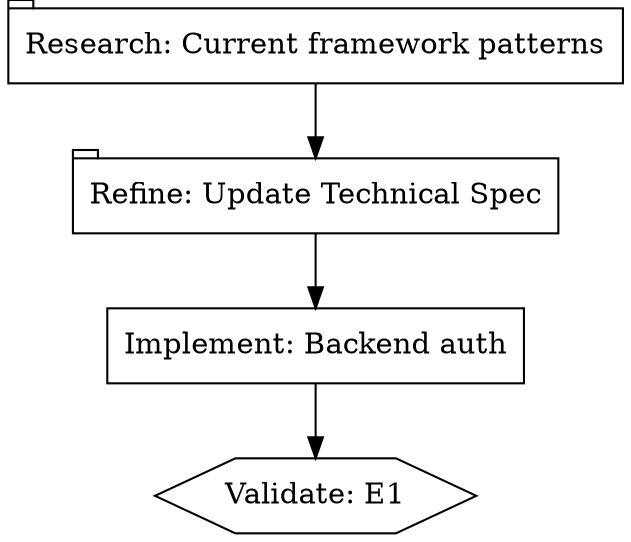

# Claude Code Harness Setup

A complete configuration framework for multi-agent AI orchestration using Claude Code. This repository provides the CoBuilder pipeline engine, skills, hooks, and orchestration tools for building sophisticated AI-powered development workflows.

## Getting Started

### Prerequisites

- Python 3.11+
- Node.js 18+ (for MCP servers)
- Git
- Anthropic API key

### Quick Setup

1. **Clone the repository**
   ```bash
   git clone https://github.com/faie-group/claude-harness-setup.git
   cd claude-harness-setup
   ```

2. **Install Python dependencies**
   ```bash
   pip install -e ".[dev]"
   ```

3. **Configure environment variables**
   ```bash
   cp .mcp.json.example .mcp.json
   # Edit .mcp.json and add your API keys
   ```

4. **Configure CoBuilder engine credentials**
   ```bash
   cp cobuilder/engine/.env.example cobuilder/engine/.env
   # Edit .env with your LLM provider credentials (DashScope or Anthropic)
   ```

5. **Run tests to verify setup**
   ```bash
   pytest tests/ -v
   ```

### MCP Server Setup

This harness uses several MCP (Model Context Protocol) servers:

| Server | Purpose | Required Env Var |
|--------|---------|------------------|
| `sequential-thinking` | Multi-step reasoning | None |
| `context7` | Framework documentation | None |
| `perplexity` | Web research | `PERPLEXITY_API_KEY` |
| `brave-search` | Web search | `BRAVE_API_KEY` |
| `serena` | IDE assistant patterns | None |
| `hindsight` | Long-term memory | None (local HTTP) |
| `logfire-mcp` | Observability queries | `LOGFIRE_READ_TOKEN` |

### External Dependencies

The harness relies on several external tools. Install them before first use:

#### Required (Core Pipeline Functionality)

| Dependency | Install Command | Purpose |
|-----------|----------------|---------|
| Claude Code SDK | `pip install claude-code-sdk` | AgentSDK worker dispatch (pipeline_runner.py uses this) |
| Pydantic Logfire | `pip install logfire` | Pipeline observability — span tracing for all worker dispatches |
| Logfire MCP | `uvx logfire-mcp@latest` | Query Logfire traces from Claude Code sessions |

#### Required MCP Servers (configured in `.mcp.json`)

| Server | Install | Required Key | Purpose |
|--------|---------|-------------|---------|
| Context7 | `npx -y @upstash/context7-mcp@latest` | None | Framework documentation lookup (used by research nodes) |
| Hindsight | Local HTTP server on `localhost:8888` | None | Long-term institutional memory across sessions |
| Serena | `uvx --from git+https://github.com/oraios/serena serena-mcp-server` | None | Semantic code navigation (find_symbol, references) |
| Perplexity | `npx -y @perplexity-ai/mcp-server` | `PERPLEXITY_API_KEY` | Web research for research nodes |
| Brave Search | `npx -y @modelcontextprotocol/server-brave-search` | `BRAVE_API_KEY` | Web search fallback |
| Sequential Thinking | `npx -y @modelcontextprotocol/server-sequential-thinking` | None | Multi-step reasoning chains |
| Task Master | `npx -y --package=task-master-ai task-master-ai` | None | Task decomposition and tracking |
| Beads | `uv run` (from beads-mcp directory) | None | Git-backed issue tracking |

#### Optional

| Dependency | Install | Purpose |
|-----------|---------|---------|
| Stitch MCP | `npx -y stitch-mcp` | Cross-service integration |
| Google Chat Bridge | Custom MCP server in `mcp-servers/google-chat-bridge/` | GChat notifications for AskUserQuestion |

> **Note**: MCP servers are configured in `.mcp.json`. Copy from `.mcp.json.example` and add your API keys.

## Architecture

### 3-Level Agent Hierarchy

```
┌─────────────────────────────────────────────────────────────────────┐
│  LEVEL 1: META-ORCHESTRATOR (System 3)                              │
│  Role: Strategic planning, OKR tracking, business validation        │
│  Launch: ccsystem3                                                  │
├─────────────────────────────────────────────────────────────────────┤
│  LEVEL 2: PIPELINE ENGINE (Python, $0 cost)                         │
│  Role: DOT graph traversal, worker dispatch, signal monitoring      │
│  Launch: python3 cobuilder/engine/pipeline_runner.py --dot-file ... │
├─────────────────────────────────────────────────────────────────────┤
│  LEVEL 3: WORKERS (AgentSDK dispatch)                               │
│  Types: research, refine, codergen, validation-test-agent           │
│  Role: Implementation, testing, focused execution                   │
└─────────────────────────────────────────────────────────────────────┘
```

**Key Principle**: Higher levels coordinate; lower levels implement. The pipeline engine has zero LLM intelligence — it only parses DOT graphs, dispatches AgentSDK workers, and applies mechanical signal transitions.

### CoBuilder Pipeline Engine

The primary capability of this harness. Pipelines are defined as DOT graphs and executed by a pure Python state machine that dispatches LLM workers via AgentSDK.

**Execute a pipeline:**
```bash
python3 cobuilder/engine/pipeline_runner.py --dot-file .pipelines/pipelines/my-pipeline.dot
```

**Resume from checkpoint after interruption:**
```bash
python3 cobuilder/engine/pipeline_runner.py --dot-file .pipelines/pipelines/my-pipeline.dot --resume
```

**Instantiate a pipeline from a template:**
```bash
python3 cobuilder/templates/instantiator.py sequential-validated \
  --param initiative_id=my-feature \
  --param epic_count=3
```

#### Pipeline Workflow

A typical pipeline follows the research → refine → codergen → validate pattern:



#### Signal-Based Worker Communication

Workers and validation agents communicate with the runner exclusively via signal files in `.pipelines/signals/`. The runner never calls LLMs for graph traversal — it reads signal results and applies transitions mechanically:

| Signal Result | Transition Applied |
|--------------|-------------------|
| `success` | `active` → `impl_complete` |
| `pass` | `impl_complete` → `validated` |
| `fail` | any → `failed` |
| `requeue` | predecessor back to `pending` |

#### Status Chain

```
pending → active → impl_complete → validated → accepted
                 \→ failed
```

### Template System

Reusable pipeline topologies defined as Jinja2 templates. Templates provide structural patterns; initiative-specific content (prompts, spec paths) is authored per-initiative after instantiation.

**Available templates** (in `.cobuilder/templates/`):

| Template | Description | Use When |
|----------|-------------|----------|
| `sequential-validated` | Linear pipeline with research→refine→codergen chains | Standard feature development |
| `hub-spoke` | Central coordinator with N parallel spoke workers | Parallel implementation work |
| `s3-lifecycle` | System 3 meta-orchestration lifecycle | Strategic oversight pipelines |
| `cobuilder-lifecycle` | Guardian lifecycle with loop-back edges | Full CoBuilder self-driving cycle |

**Instantiate a template:**
```bash
python3 cobuilder/templates/instantiator.py cobuilder-lifecycle \
  --param initiative_id=my-initiative \
  --output .pipelines/pipelines/my-initiative.dot
```

Each template ships with a `manifest.yaml` defining parameters, constraints (topology, path, loop bounds, nesting depth), and default LLM profiles per handler type.

### Per-Node LLM Configuration

DOT nodes reference named profiles from `providers.yaml`. Mix providers and models within a single pipeline:

```yaml
# providers.yaml — available LLM profiles
default_profile: alibaba-glm5

profiles:
  anthropic-fast:
    model: claude-haiku-4-5-20251001
    api_key: $ANTHROPIC_API_KEY
    base_url: https://api.anthropic.com

  anthropic-smart:
    model: claude-sonnet-4-5-20250514
    api_key: $ANTHROPIC_API_KEY
    base_url: https://api.anthropic.com

  anthropic-opus:
    model: claude-opus-4-6
    api_key: $ANTHROPIC_API_KEY
    base_url: https://api.anthropic.com

  alibaba-glm5:
    model: glm-5
    api_key: $DASHSCOPE_API_KEY
    base_url: https://coding-intl.dashscope.aliyuncs.com/apps/anthropic

  alibaba-qwen3:
    model: qwen3-coder-plus
    api_key: $DASHSCOPE_API_KEY
    base_url: https://coding-intl.dashscope.aliyuncs.com/apps/anthropic
```

| Profile | Model | Cost | Best For |
|---------|-------|------|----------|
| `alibaba-glm5` | GLM-5 | ~$0 | Default for all nodes; near-zero cost via DashScope |
| `alibaba-qwen3` | Qwen3-coder-plus | ~$0 | Alternative DashScope model |
| `anthropic-fast` | Haiku 4.5 | $ | Research, summarization, lightweight tasks |
| `anthropic-smart` | Sonnet 4.5 | $$ | Implementation, code generation |
| `anthropic-opus` | Opus 4.6 | $$$ | Complex reasoning, architecture decisions |

Profile resolution order (first non-null wins): node attr → handler defaults → manifest defaults → env vars → runner defaults.

### Directory Structure

```
.claude/
├── CLAUDE.md                     # Configuration directory documentation
├── settings.json                 # Core settings (hooks, permissions)
├── output-styles/                # Automatically loaded agent behaviors
├── skills/                       # Explicitly invoked agent skills
├── hooks/                        # Lifecycle event handlers
├── scripts/                      # CLI utilities
├── commands/                     # Slash commands
└── documentation/                # Architecture decisions and guides

cobuilder/
├── engine/                       # Pipeline runner, handlers, state machine
│   ├── pipeline_runner.py        # Main entry point (zero LLM cost)
│   ├── handlers/                 # research, refine, codergen, wait.*, close
│   ├── state_machine.py          # Node state transitions
│   ├── middleware/               # ConstraintMiddleware, event bus
│   ├── providers.py              # LLM profile resolution (5-layer)
│   └── signal_protocol.py        # Signal file I/O
├── templates/                    # Template instantiator + constraints
└── worktrees/                    # WorktreeManager (idempotent lifecycle)

.cobuilder/
└── templates/                    # Jinja2 pipeline templates
    ├── sequential-validated/
    ├── cobuilder-lifecycle/
    ├── hub-spoke/
    └── s3-lifecycle/

.pipelines/                       # Runtime state (gitignored)
├── pipelines/                    # Active DOT pipeline files
├── signals/                      # Worker signal files
└── checkpoints/                  # Pipeline state snapshots
```

## Key Features

- **3-level agent hierarchy** — Meta-Orchestrator (LLM) → Pipeline Engine (Python, $0) → Workers (AgentSDK)
- **Pipeline-as-code via DOT graph definitions** — topology, handler types, constraints, and LLM profiles all declared in one file
- **4 worker handler types** — `research`, `refine`, `codergen`, `validation` (dispatched as AgentSDK agents)
- **DashScope/Alibaba Cloud integration** — cost-effective pipeline execution via `qwen3-coder-plus` and compatible models
- **Signal-based worker communication** — workers write JSON signal files; runner applies transitions mechanically without LLM reasoning
- **Automatic validation gates** — `wait.cobuilder` nodes trigger validation-test-agent dispatch automatically
- **Human review gates** — `wait.human` nodes emit GChat notifications and wait for manual signal file response
- **Pipeline templates** — Jinja2 parametrization for reusable topologies with constraint enforcement
- **Per-node LLM profiles** — mix Haiku (research) and Sonnet (codergen) within one pipeline via `providers.yaml`
- **Logfire observability** — full span tracing with service naming (`worker_dispatch_start`, `worker_first_message`, `worker_tool`)
- **Blind acceptance testing** — Gherkin rubrics stored outside implementation repo for unbiased E2E validation
- **Completion promise tracking** — verifiable session goals with acceptance criteria
- **Hindsight memory** — long-term institutional memory across sessions via local HTTP server
- **Git worktree isolation** — `WorktreeManager.get_or_create()` for idempotent parallel development
- **Doc-gardener linting** — automated documentation quality enforcement with frontmatter and cross-link validation

## Testing

### Run All Tests
```bash
pytest tests/ -v
```

### Run with Coverage
```bash
pytest tests/ -v --cov=cobuilder --cov-report=term-missing
```

### Coverage Requirements
- Minimum coverage: **90%**
- CI enforces this on all PRs

## Contributing

See [CONTRIBUTING.md](CONTRIBUTING.md) for:
- Architecture overview
- Setup steps
- Testing guidelines
- Code style requirements
- Template creation

## License

MIT License - Copyright (c) 2026 FAIE Group

See [LICENSE](LICENSE) for full text.
