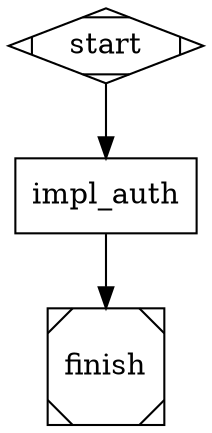

# CLAUDE.md — CoBuilder Package

This file provides guidance for Claude Code sessions working within the `cobuilder/` directory.

## Package Purpose

CoBuilder is the **pipeline execution engine** for multi-agent orchestration. It runs DOT-defined directed acyclic graph pipelines where each node dispatches an AgentSDK worker. The runner itself has zero LLM cost — all intelligence lives in the workers it dispatches.

**3-layer hierarchy:**
```
System 3 (Opus LLM)           — strategic planning, Gherkin E2E validation
    |
    pipeline_runner.py         — Python state machine, $0, <1s graph ops
        |
        Workers                — AgentSDK: codergen, research, refine, validation
```

## Module Map

### engine/ — Core Execution

| Module | Purpose |
|--------|---------|
| `pipeline_runner.py` | Main DOT pipeline state machine. Parses DOT, dispatches AgentSDK workers, watches signal files via watchdog, writes checkpoints, transitions node states. Zero LLM intelligence. |
| `guardian.py` | Layers 0/1 bridge. Launches Pilot agent processes via `ClaudeSDKClient` (`--dot` single or `--multi` parallel). Key components: `_GUARDIAN_TOOLS` (Bash/Read/Glob/Grep/Serena/Hindsight — no Write/Edit), `_create_guardian_stop_hook()` (blocks Pilot exit when non-terminal nodes remain, safety valve at 3 blocks), `build_options()` (sets `permission_mode="bypassPermissions"`, strips CLAUDECODE/CLAUDE_SESSION_ID/CLAUDE_OUTPUT_STYLE from env, sets PIPELINE_SIGNAL_DIR/PROJECT_TARGET_DIR), `_run_agent()` (ClaudeSDKClient.connect + query + receive_response pattern). |
| `session_runner.py` | Layer 2 monitoring runner. Monitors an orchestrator tmux session and communicates status via signal files. Supports both `--spawn` (fire-and-forget) and direct monitoring modes. |
| `cli.py` | Attractor CLI with full subcommand interface: `parse`, `validate`, `status`, `transition`, `checkpoint`, `generate`, `annotate`, `dashboard`, `node`, `edge`, `run`, `guardian`, `agents`, `merge-queue`. |
| `generate.py` | Generates Attractor-compatible `pipeline.dot` from beads task data. Reads `bd list --json` or a `--beads-json` file. |
| `dispatch_worker.py` | Shared utilities for AgentSDK worker dispatch: `compute_sd_hash()`, `load_engine_env()`, `create_signal_evidence()`, `load_agent_definition()`. |
| `dispatch_parser.py` | DOT file parsing utilities used by `pipeline_runner.py`. |
| `dispatch_checkpoint.py` | Saves pipeline checkpoints after each node transition. |
| `checkpoint.py` | Pydantic-based `EngineCheckpoint` and `CheckpointManager`. Atomic write-then-rename semantics. |
| `signal_protocol.py` | Atomic JSON signal file I/O. `write_signal()`, `read_signal()`, `list_signals()`, `wait_for_signal()`, `move_to_processed()`. |
| `providers.py` | LLM profile resolution. Reads `providers.yaml` and resolves 5-layer precedence to `ClaudeCodeOptions` at dispatch time. |
| `run_research.py` | Research node agent. Uses Context7 + Perplexity via Haiku SDK to validate implementation approaches against current docs. Updates the Solution Design file in-place. |
| `run_refine.py` | Refine node agent. Uses Sonnet to read research evidence JSON and rewrite SD sections with production-quality content. |
| `state_machine.py` | `RunnerStateMachine` — 7-mode state machine (INIT, RUNNER, MONITOR, WAIT_GUARDIAN, VALIDATE, COMPLETE, FAILED) used when `--dot-file` flag is active. |
| `transition.py` | Node status transition logic. Enforces `VALID_TRANSITIONS` and applies `apply_transition()`. |
| `spawn_orchestrator.py` | Spawns an orchestrator in a tmux session or via AgentSDK. Used by `CodergenHandler`. |
| `validator.py` | Pipeline topology and schema validator. |
| `parser.py` | Low-level DOT grammar parser. |
| `graph.py` | Graph traversal and dependency resolution. |
| `node_ops.py` | CRUD operations on DOT nodes. |
| `edge_ops.py` | CRUD operations on DOT edges. |
| `outcome.py` | `Outcome` and `OutcomeStatus` models (success, failed, partial_success). |
| `exceptions.py` | Domain exceptions: `HandlerError`, `CheckpointVersionError`, `CheckpointGraphMismatchError`. |
| `_env.py` | `_get_env()` helper with ATTRACTOR_ → PIPELINE_ deprecation warnings. |
| `.env` | LLM credentials. Loaded at runtime. Supports `$VAR` expansion. |

### engine/handlers/ — Node Handlers

Each handler receives a `HandlerRequest` (node definition + context) and returns an `Outcome`.

| Module | Shape | Handler | Purpose |
|--------|-------|---------|---------|
| `codergen.py` | `box` | `codergen` | LLM/orchestrator node. Dispatches via tmux (`spawn_orchestrator`) or AgentSDK (`sdk` strategy). Polls signal files for completion. Default timeout 3600s. |
| `manager_loop.py` | `house` | `manager_loop` | Recursive sub-pipeline management. `spawn_pipeline` mode spawns child `pipeline_runner.py` subprocess and monitors it. Detects `GATE_WAIT_COBUILDER` and `GATE_WAIT_HUMAN` signals from child. Bounded by `PIPELINE_MAX_MANAGER_DEPTH` (default 5). |
| `wait_human.py` | `diamond` | `wait.human` | Human gate. Writes `GATE_WAIT_HUMAN` signal and blocks until `GATE_RESPONSE` from parent. |
| `base.py` | — | — | `Handler` ABC and `HandlerRequest` dataclass. |
| `close.py` | — | `close` | Pipeline completion node. |
| `conditional.py` | — | `conditional` | Conditional branching node. |
| `exit.py` | — | `exit` | Early exit node. |
| `fan_in.py` | — | `fan_in` | Merge parallel branches. |
| `parallel.py` | — | `parallel` | Fan-out parallel dispatch. |
| `start.py` | — | `start` | Pipeline entry node. |
| `tool.py` | — | `tool` | Generic tool execution node. |
| `registry.py` | — | — | Handler registry — maps node shapes/handler attributes to handler classes. |

### templates/ — Template System

| Module | Purpose |
|--------|---------|
| `instantiator.py` | Jinja2 DOT template renderer. Loads `template.dot.j2` + `manifest.yaml` from a template directory, validates parameters, renders, optionally runs constraint validation. Default templates dir: `.cobuilder/templates`. |
| `constraints.py` | Static constraint validation on rendered DOT output. |
| `manifest.py` | `Manifest` model and `load_manifest()` for `manifest.yaml` files. |

### repomap/ — Codebase Intelligence

Provides context injection for workers by building a semantic map of the codebase. Includes CLI, codegen, context filtering, evaluation, graph construction, LLM integration, ontology, RPG enrichment, sandbox, selection, Serena integration, spec parsing, and vector database modules.

## Key Patterns

### 1. Workers Communicate via Signal Files Only

Workers NEVER modify the DOT file. Only `pipeline_runner.py` writes to the DOT file.

Worker result format (written to `.pipelines/pipelines/signals/{pipeline_id}/{node_id}.json`):
```json
{
  "status": "success" | "failed",
  "files_changed": ["path/to/file"],
  "message": "Human-readable summary"
}
```

Validation result format:
```json
{
  "result": "pass" | "fail" | "requeue",
  "reason": "Explanation",
  "requeue_target": "node_id_to_reset"
}
```

On `requeue`: runner sets `requeue_target` back to `pending` mechanically.

### 2. Status Chain

```
pending -> active -> impl_complete -> validated -> accepted
                  \-> failed
```

- `impl_complete`: worker AgentSDK call returned
- `validated`: validation agent confirmed technical correctness
- `accepted`: System 3 blind Gherkin E2E passed

### 3. LLM Profile Resolution (5-layer, first non-null wins)

1. Node's `llm_profile` attribute → look up in `providers.yaml`
2. `defaults.handler_defaults.{handler_type}.llm_profile` from pipeline manifest
3. `defaults.llm_profile` from pipeline manifest
4. Environment variables (`ANTHROPIC_MODEL`, `ANTHROPIC_API_KEY`, `ANTHROPIC_BASE_URL`)
5. Runner defaults (hardcoded: `claude-sonnet-4-5-20250514`, Anthropic API)

### 4. Environment / Credentials

`cobuilder/engine/.env` is loaded at runtime by `load_engine_env()`. It uses `export` syntax and supports `$VAR` expansion:

```bash
export ANTHROPIC_BASE_URL="https://coding-intl.dashscope.aliyuncs.com/apps/anthropic"
export DASHSCOPE_API_KEY=sk-...
export ANTHROPIC_API_KEY=$DASHSCOPE_API_KEY   # routes Anthropic calls through DashScope
export ANTHROPIC_MODEL="glm-5"
export PIPELINE_RATE_LIMIT_RETRIES=3
export PIPELINE_RATE_LIMIT_BACKOFF=65
```

The default LLM profile is `alibaba-glm5` (near-zero cost). Override per-node with `llm_profile="anthropic-smart"` etc.

### 5. Checkpoint / Resume

The runner writes a checkpoint JSON to `.pipelines/pipelines/` after each node transition. To resume a crashed run:

```bash
python3 cobuilder/engine/pipeline_runner.py --dot-file <path.dot> --resume
```

`CheckpointManager.load_or_create()` raises `CheckpointGraphMismatchError` if the DOT file has changed since the checkpoint.

### 6. Gate Handling

`wait.cobuilder` and `wait.human` nodes pause pipeline execution until a parent signal is received.

- `wait.cobuilder`: child writes `GATE_WAIT_COBUILDER` signal; parent (System 3 or `manager_loop`) runs validation agent and writes `GATE_RESPONSE`
- `wait.human`: child writes `GATE_WAIT_HUMAN` signal; parent calls `AskUserQuestion` and writes `GATE_RESPONSE`

Gate signals use `source="child"`, `target="parent"` naming convention.

## Common Commands

```bash
# Run a pipeline
python3 cobuilder/engine/pipeline_runner.py --dot-file .pipelines/pipelines/my-pipeline.dot

# Resume after crash
python3 cobuilder/engine/pipeline_runner.py --dot-file .pipelines/pipelines/my-pipeline.dot --resume

# Show node statuses
python3 cobuilder/engine/cli.py status .pipelines/pipelines/my-pipeline.dot

# Validate pipeline topology
python3 cobuilder/engine/cli.py validate .pipelines/pipelines/my-pipeline.dot

# Manual status transition (recovery)
python3 cobuilder/engine/cli.py transition .pipelines/pipelines/my-pipeline.dot <node_id> pending

# Save checkpoint manually
python3 cobuilder/engine/cli.py checkpoint save .pipelines/pipelines/my-pipeline.dot

# Dashboard view (stage, progress, nodes)
python3 cobuilder/engine/cli.py dashboard .pipelines/pipelines/my-pipeline.dot

# Generate pipeline from beads tasks
python3 cobuilder/engine/cli.py generate --prd PRD-MY-001 --output pipeline.dot

# Launch a guardian for a pipeline
python3 cobuilder/engine/guardian.py --dot .pipelines/pipelines/my-pipeline.dot --pipeline-id my-pipeline
```

## Testing

```bash
# CoBuilder engine unit tests
pytest tests/engine/ -v

# Attractor integration tests (signal protocol, guardian, runner, state machine)
pytest tests/attractor/ -v

# Run a specific test file
pytest tests/engine/test_manager_loop.py -v
pytest tests/attractor/test_signal_protocol.py -v

# All tests
pytest tests/ -v
```

Test directories:
- `tests/engine/` — Unit tests for engine modules (`test_close.py`, `test_logfire_spans.py`, `test_manager_loop.py`, `test_providers.py`, `test_state_machine.py`, `validation/`)
- `tests/attractor/` — Integration tests for the full attractor stack (guardian, runner, signal protocol, channel bridge, etc.)

## DOT Pipeline Format

Minimal working pipeline example:



Node attributes:
- `shape` — determines handler (`box`=codergen, `tab`=research, `note`=refine, `house`=manager_loop, `diamond`=wait gate, `Mdiamond`=start, `Msquare`=finish)
- `handler` — explicit handler override
- `status` — current status (default: `pending`)
- `llm_profile` — named profile from `providers.yaml`
- `worker_type` — AgentSDK subagent type to dispatch
- `prompt` — instruction for the worker
- `solution_design` — path to SD file (inlined into worker prompt)
- `bead_id` — associated beads issue ID

## Logfire Observability

Traces are emitted under these service names:
- `cobuilder-pipeline-runner` — pipeline runner spans (node dispatch, transitions, checkpoints)
- `cobuilder-guardian` — Pilot agent spans
- `cobuilder-session-runner` — session runner spans

Use `mcp__logfire-mcp__arbitrary_query` with `service.name = 'cobuilder-pipeline-runner'` to filter traces.
