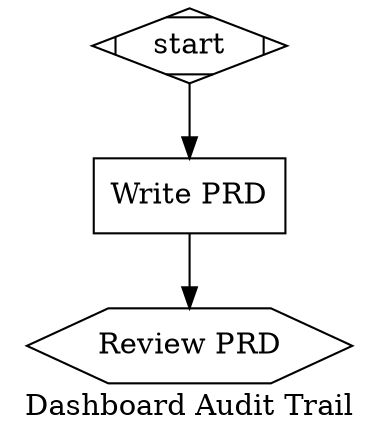

# PRD-COBUILDER-WEB-001: CoBuilder Web Interface — Initiative Control Tower

## 1. Executive Summary

CoBuilder initiatives currently require manual tmux management, filesystem navigation to locate PRDs/SDs, no real-time pipeline visibility, and GChat-only `wait.human` gates. Managing a single initiative demands expertise in 6+ CLI tools, 4 file conventions, and the mental model of a 3-level agent hierarchy. This friction prevents humans from supervising multiple concurrent initiatives.

This PRD delivers a localhost web interface that serves as the **control tower** for CoBuilder initiatives. The key architectural innovation: **the DOT pipeline graph IS the initiative state machine.** A single DOT file per initiative models the entire lifecycle — from PRD drafting through validation — not just the implementation phase. The graph starts small (3 nodes: start, write_prd, review_prd) and grows as the initiative progresses through stages: the web server extends the graph at each `wait.human` boundary based on what the preceding phase produced.

The web server owns the workflow. LLMs are invoked at each node for what they're good at (content creation, oversight, judgment) but do not own state, file paths, or process lifecycle.

---

## 2. Problem Statement

### P1: No Central Control Plane

Managing initiatives requires switching between tmux sessions, terminal commands (`bd list`, `cobuilder pipeline status`, `cat docs/prds/*/PRD-*.md`), and GChat. There is no single view that answers: "What initiatives exist, what phase are they in, and what do they need from me?"

### P2: Guardian Carries Too Much Responsibility

The S3 Guardian currently drives the entire workflow: PRD creation, SD creation, pipeline creation, runner dispatch, monitoring, validation. This means:
- **State is opaque** — the Guardian "knows" where it is, but the web server must infer from file system artifacts
- **File paths are unreliable** — LLMs hallucinate or construct incorrect paths
- **One-pipeline-per-PRD is unenforceable** — relies on LLM discipline, not code enforcement
- **Crash recovery is fragile** — if the Guardian process dies, reconstructing state from context is lossy

### P3: No Programmatic Worktree Management

Pipeline workers currently run in the main repository checkout or require manual worktree creation. Multiple concurrent initiatives can clobber each other's working trees. There is no deterministic, PRD-scoped worktree lifecycle.

### P4: wait.human Gates Are Invisible

`wait.human` gates produce GChat notifications, but there is no web-based review queue. Humans must context-switch to GChat, read threaded messages, and respond in a chat interface that lacks structured Approve/Reject actions or contextual links to the pipeline graph.

---

## 3. Goals & Success Criteria

| ID | Goal | Success Metric |
|----|------|----------------|
| G1 | Single-pane initiative visibility | Web UI shows all initiatives with phase, pipeline progress, and pending reviews in one screen |
| G2 | DOT graph as universal state machine | One DOT file per initiative models the complete lifecycle; no separate `state.json` |
| G3 | Web server owns workflow state | Phase transitions are deterministic code, not LLM decisions; crash recovery by re-reading DOT file |
| G4 | Stable worktrees per PRD | `PRD-X` always maps to `worktree-prd-x/`; idempotent creation; same across retries |
| G5 | Scoped Guardian role | Guardian writes acceptance tests + validates; does NOT create PRDs, SDs, pipelines, or launch runners |
| G6 | Live pipeline visibility | SSE event stream from pipeline events renders node status changes in <2s |
| G7 | Web-based wait.human reviews | Pending reviews shown in-browser with Approve/Reject actions |

---

## 4. User Stories

### US-1: Starting a New Initiative

As a human operator, I want to click "New Initiative" in the web UI, enter a brief description and PRD ID, and have the system create a skeleton DOT graph and begin PRD drafting via an AgentSDK worker — so that I don't need to manually create files, worktrees, or tmux sessions.

### US-2: Monitoring Initiative Progress

As a human operator, I want to see a single card per initiative showing its current phase (PRD drafting, SD review, pipeline running, etc.) derived from the DOT graph node statuses — so that I know what every initiative needs from me at a glance.

### US-3: Reviewing PRD/SD Artifacts

As a human operator, when a `wait.human` gate activates for PRD review or SD review, I want to see the content inline (or via deep-link to the file) with Approve/Reject buttons that write a signal file to advance the pipeline — so that I don't need to find files manually or use GChat.

### US-4: Watching Pipeline Execution Live

As a human operator, I want to see the DOT graph with nodes coloured by status (pending/active/validated/failed), updating in real-time via SSE, with click-to-inspect showing Logfire deep-links — so that I have the same visibility as reading tmux output but structured and always available.

### US-5: Responding to wait.human Gates

As a human operator, when a `wait.human` gate fires during pipeline execution (e.g., E2E review), I want a notification badge in the web UI and a review card with context (validation score, gaps identified, links to relevant files) — so that I can make an informed decision without leaving the browser.

### US-6: Resuming After Crash

As a human operator, when the web server or pipeline runner crashes, I want to restart the server and have it reconstruct all initiative states by re-reading DOT files from `.claude/attractor/pipelines/` — so that no work is lost and I don't need to remember where things were.

---

## 5. Architecture

### 5.1 The DOT Graph as Universal State Machine

Each initiative is represented by a single DOT file that spans the ENTIRE lifecycle. The graph starts small and grows at stage boundaries.

**At initiative creation (3 nodes):**



**After PRD approved — web server extends graph with SD writing + review:**

```dot
    // ... existing nodes now validated ...

    write_sd_backend [
        shape=box handler="codergen"
        worker_type="solution-design-architect"
        label="Write SD: Backend"
        prd_ref="docs/prds/.../PRD-DASHBOARD-AUDIT-001.md"
        output_path="docs/sds/dashboard-audit-trail/SD-DASHBOARD-AUDIT-001.md"
        epic="E1"
        status="pending"
    ];
    write_sd_frontend [
        shape=box handler="codergen"
        worker_type="solution-design-architect"
        label="Write SD: Frontend"
        output_path="docs/sds/dashboard-audit-trail/SD-DASHBOARD-AUDIT-FRONTEND-001.md"
        epic="E2"
        status="pending"
    ];
    review_sds [shape=hexagon handler="wait.human" label="Review SDs" status="pending"];

    review_prd -> write_sd_backend;
    review_prd -> write_sd_frontend;
    write_sd_backend -> review_sds;
    write_sd_frontend -> review_sds;
```

**After SDs approved — web server extends graph with mandatory research→refine for each SD, then acceptance tests + implementation:**

The `research→refine` chain validates and enriches each SD with current framework documentation (via Context7/Perplexity) BEFORE implementation begins. This is mandatory for ALL SDs — it catches stale patterns and version mismatches that would otherwise surface as worker failures.

```dot
    // research→refine chain per SD (mandatory post-approval)
    research_sd_be [shape=tab handler="research" label="Research: Backend SD" status="pending"];
    refine_sd_be [shape=note handler="refine" label="Refine: Backend SD" status="pending"];
    research_sd_fe [shape=tab handler="research" label="Research: Frontend SD" status="pending"];
    refine_sd_fe [shape=note handler="refine" label="Refine: Frontend SD" status="pending"];

    // Blind acceptance tests (Guardian's domain — written from PRD, not SDs)
    write_tests [
        shape=box handler="codergen"
        worker_type="acceptance-test-writer"
        label="Write Blind Acceptance Tests"
        status="pending"
    ];

    // Implementation nodes (generated by cobuilder pipeline create from refined SDs)
    impl_backend [
        shape=box handler="codergen"
        worker_type="backend-solutions-engineer"
        label="Implement: Backend"
        sd_path="docs/sds/.../SD-DASHBOARD-AUDIT-001.md"
        status="pending"
    ];
    impl_frontend [
        shape=box handler="codergen"
        worker_type="frontend-dev-expert"
        label="Implement: Frontend"
        sd_path="docs/sds/.../SD-DASHBOARD-AUDIT-FRONTEND-001.md"
        status="pending"
    ];

    // Validation gates
    validate_e2e [shape=diamond handler="wait.system3" label="E2E Validation" status="pending"];
    review_final [shape=hexagon handler="wait.human" label="Final Review" status="pending"];
    done [shape=Msquare handler="exit" status="pending"];

    // SD refinement chain: research→refine per SD
    review_sds -> research_sd_be;
    review_sds -> research_sd_fe;
    research_sd_be -> refine_sd_be;
    research_sd_fe -> refine_sd_fe;

    // Acceptance tests written in parallel with SD refinement
    review_sds -> write_tests;

    // Implementation after refinement completes
    refine_sd_be -> impl_backend;
    refine_sd_fe -> impl_frontend;
    impl_backend -> validate_e2e;
    impl_frontend -> validate_e2e;
    validate_e2e -> review_final;
    review_final -> done;
```

**Key design properties:**
1. The DOT file IS the state — `status` attributes on nodes tell you exactly where the initiative is
2. Phase detection = "find nodes with `status=active` or the first `status=pending` after all validated predecessors"
3. Crash recovery = re-read DOT file; runner resumes from last checkpoint
4. Graph grows at `wait.human` boundaries — the web server extends it based on what the preceding phase produced
5. One graph per initiative (enforced by web server: one DOT file per PRD ID)
6. `wait.human` gates appear during both CONTENT CREATION (PRD writing, SD writing) and IMPLEMENTATION (E2E review, final review) — humans review at every stage boundary
7. Every SD gets a mandatory `research→refine` chain after human approval — research validates framework patterns via Context7/Perplexity, refine rewrites the SD with findings as first-class content

### 5.2 Separation of Concerns

| Component | Owns | Does NOT Own |
|-----------|------|-------------|
| **Web Server** (FastAPI) | Workflow state, DOT graph creation/extension, process spawning, file path management, enforcement rules | Content creation, judgment, validation scoring |
| **AgentSDK Workers** | PRD content, SD content | File paths (told by web server), state transitions |
| **Pipeline Runner** | Node dispatch, handler execution, checkpoint/resume | Graph creation, graph extension, worktree creation |
| **Guardian** (tmux) | Acceptance tests, independent monitoring, validation scoring | PRD/SD creation, pipeline creation, runner launch |
| **Web UI** (Next.js) | Visualization, human input collection | State management (reads DOT + SSE) |

### 5.3 Stable Worktrees

Each initiative gets a deterministic worktree in the target repository:

```
{target_repo}/.claude/worktrees/{prd-id}/
    branch: worktree-{prd-id}
```

`WorktreeManager.get_or_create(prd_id)` is idempotent: creates on first call, returns existing on subsequent calls. The runner reads `worktree_path` from the DOT graph's `graph` attributes — no environment variable needed.

### 5.4 Graph Extension Mechanism

When a `wait.human` node transitions to `validated` (human approved), the web server:

1. **Reads the output of the preceding phase** (e.g., parses epics from the approved PRD)
2. **Generates new nodes** appropriate for the next phase (e.g., one SD writer per epic)
3. **Appends nodes + edges to the DOT file** via `cobuilder pipeline node-add` and `cobuilder pipeline edge-add`
4. **Signals the runner to re-read** the graph (if the runner is active)

The runner already re-reads the DOT file after each `wait.human` resolution, so step 4 is automatic.

**Extension stages and their generated nodes:**

| `wait.human` Gate | Preceding Phase | Generated Nodes |
|-------------------|-----------------|-----------------|
| `review_prd` | PRD writing | One `codergen` (SD writer) per epic + one `wait.human` (SD review) |
| `review_sds` | SD writing | One `research→refine` chain per SD + `write_tests` + one `codergen` (implementation) per SD + validation gates |

The `research→refine` chain after `review_sds` is **mandatory** — it is not optional or skippable. SDs approved by humans still need framework validation against current documentation before workers implement from them.

### 5.5 Guardian Launch Protocol

The Guardian is launched in a tmux session with a scoped prompt. It receives EXACTLY the information it needs:

```
Session: guardian-{prd-id}
Output style: system3-meta-orchestrator
Environment: CLAUDE_SESSION_ID, PRD_ID, PIPELINE_DOT_PATH

Injected prompt:
"You are a Guardian for PRD-{id}.
 PRD: {path}. SDs: {paths}. Pipeline DOT: {dot_path}. Worktree: {path}.
 Your job: Phase 1 (acceptance tests) + Phase 3 (monitor) + Phase 4 (validate).
 You do NOT create PRD/SDs/pipeline or launch the runner."
```

The web server spawns the Guardian via `spawn_orchestrator.py`-style tmux automation. The "Open in Terminal" button in the UI opens the tmux session for human observation/interaction.

### 5.6 Technical Stack

| Layer | Technology | Rationale |
|-------|-----------|-----------|
| Backend | FastAPI (Python) | Same language as pipeline_runner.py; async SSE support; shares cobuilder module |
| Frontend | Next.js 15 (App Router) | RSC for static content (PRD/SD browsing); client components for live graph + SSE |
| DOT rendering | @hpcc-js/wasm | Graphviz in-browser; DOT file fed directly; no server round-trip for layout |
| Components | shadcn/ui + Tailwind | Already referenced in harness skills |
| Real-time | Server-Sent Events | Native browser EventSource API; tails JSONL or SSEEmitter backend |
| Observability | Logfire deep-links | span_id from pipeline events → link to logfire.pydantic.dev |
| Process management | asyncio subprocess | Pipeline runner + Guardian as managed child processes |

---

## 6. Technical Decisions

### TD-1: DOT Graph as State vs. Separate State File

**Decision**: Use DOT graph as the sole initiative state representation.

**Rationale**: The DOT file already contains node statuses, graph attributes (prd_id, target_repo, worktree_path), and the complete execution plan. Maintaining a parallel `state.json` introduces sync risk. The DOT parser in `cobuilder/attractor/parser.py` already extracts all needed attributes.

**Trade-off**: DOT files are less ergonomic for arbitrary key-value state than JSON. Mitigation: graph-level attributes for initiative metadata; node-level attributes for phase state.

### TD-2: Graph Extension vs. Pre-planned Graph

**Decision**: Start with a skeleton graph and extend at `wait.human` boundaries.

**Rationale**: The full graph cannot be known upfront — SD nodes depend on epics discovered in the PRD; implementation nodes depend on SDs. Extending the graph preserves the DOT-as-state principle while accommodating progressive refinement.

**Trade-off**: The runner must tolerate graph mutation between cycles. Mitigation: runner already re-reads DOT after wait.human resolution; extension only happens while runner is paused at a gate.

### TD-3: Web Server Launches Runner (Not Guardian)

**Decision**: The web server starts `pipeline_runner.py` as a subprocess and owns its lifecycle.

**Rationale**: The web server can detect runner crashes (subprocess exit), restart it, and track its PID. If the Guardian launched the runner, the web server would have no visibility into runner health.

### TD-4: Stable Worktrees by PRD ID

**Decision**: Worktree path is `{target_repo}/.claude/worktrees/{prd-id}/`, deterministic and reusable.

**Rationale**: Timestamped worktrees create cleanup burden and break resume scenarios. PRD-scoped worktrees preserve work across retries and make the worktree semantically meaningful: "this is the work for PRD-X."

### TD-5: Guardian in tmux (Not AgentSDK)

**Decision**: Guardian runs in a tmux session, not as a headless AgentSDK agent.

**Rationale**: The Guardian benefits from human observation and occasional steering. tmux provides a real terminal that humans can attach to. The AgentSDK PRD/SD workers are headless because they produce a file and exit; the Guardian is long-lived and interactive.

### TD-6: SSE over WebSocket

**Decision**: Use Server-Sent Events for real-time updates, not WebSockets.

**Rationale**: Pipeline events are unidirectional (server → client). SSE is simpler, auto-reconnects, and works through HTTP proxies. The existing event bus architecture has an `SSEEmitter` placeholder designed for this. User input (Approve/Reject) goes through REST POST, not the event stream.

---

## 7. File Scope

### New Files

```
cobuilder/web/
├── __init__.py
├── api/
│   ├── __init__.py
│   ├── main.py                      # FastAPI app, mounts routers, CORS
│   ├── routers/
│   │   ├── __init__.py
│   │   ├── initiatives.py           # CRUD: create/list/get initiatives
│   │   ├── pipelines.py             # GET graph state, SSE event stream
│   │   ├── guardians.py             # Launch/attach tmux guardian sessions
│   │   ├── signals.py               # POST approve/reject → write signal file
│   │   └── artifacts.py             # GET PRD/SD content (markdown)
│   └── infra/
│       ├── __init__.py
│       ├── worktree_manager.py      # get_or_create(), list_active(), cleanup()
│       ├── initiative_manager.py    # DOT graph creation, extension, phase detection
│       ├── pipeline_launcher.py     # Subprocess management for pipeline_runner.py
│       ├── guardian_launcher.py     # tmux session creation + prompt injection
│       └── sse_bridge.py            # Tail JSONL → async generator → SSE
├── frontend/                        # Next.js 15 app
│   ├── package.json
│   ├── app/
│   │   ├── layout.tsx               # Shell: sidebar nav, notification badge
│   │   ├── page.tsx                 # CoBuilder Manager (initiative list)
│   │   ├── initiatives/[id]/
│   │   │   ├── page.tsx             # Initiative detail (lifecycle view)
│   │   │   └── graph/page.tsx       # Full pipeline graph view
│   │   └── reviews/page.tsx         # wait.human inbox
│   └── components/
│       ├── DotGraph.tsx             # @hpcc-js/wasm DOT renderer with live status
│       ├── EventStream.tsx          # SSE subscriber hook + display
│       ├── InitiativeCard.tsx       # Phase progress bar + pipeline summary
│       ├── ReviewCard.tsx           # Approve/Reject with context
│       ├── NodeInspector.tsx        # Side panel for clicked node
│       └── NewInitiativeDialog.tsx  # Modal: description, PRD ID, target repo
```

### Modified Files

| File | Change |
|------|--------|
| `cobuilder/attractor/pipeline_runner.py` | `_get_target_dir()` reads `worktree_path` from DOT graph attributes; creates worktree via `WorktreeManager.get_or_create()` if it doesn't exist |
| `cobuilder/engine/events/emitter.py` | Implement `SSEEmitter` backend (asyncio Queue → async generator) |
| `cobuilder/engine/events/emitter.py` | `EventBusConfig.sse_enabled` default remains `False`; web server sets to `True` |
| `.claude/agents/prd-writer.md` | New agent definition for PRD authoring via AgentSDK |

### Unchanged Files (Integration Points)

| File | Integration |
|------|------------|
| `cobuilder/attractor/parser.py` | Web server reads DOT files via existing parser |
| `cobuilder/attractor/transition.py` | Web server transitions nodes via existing transition module |
| `cobuilder/engine/events/jsonl_backend.py` | SSE bridge tails JSONL files written by this backend |
| `signal_protocol.py` | Approve/Reject actions write signals via existing protocol |

---

## 8. Epics

### Phase 1: Foundation

#### Epic 0: Stable Worktree Infrastructure

Build `WorktreeManager` and integrate it with `pipeline_runner.py` so that every pipeline run operates in a stable, PRD-scoped git worktree.

**Scope:**
- `WorktreeManager` class: `get_or_create(prd_id, target_repo)`, `list_active(target_repo)`, `cleanup(prd_id)`
- `get_or_create` is idempotent: checks `git worktree list`, creates only if absent
- Worktree path: `{target_repo}/.claude/worktrees/{prd-id}/`, branch: `worktree-{prd-id}`
- `pipeline_runner._get_target_dir()` reads `worktree_path` from DOT graph attributes; calls `get_or_create` if path doesn't exist on disk
- Runner passes worktree path as `cwd` to all AgentSDK workers

**Acceptance Criteria:**
- [ ] `WorktreeManager.get_or_create("prd-test-001", repo)` creates worktree at predictable path
- [ ] Calling `get_or_create` twice with same PRD ID returns same path without error
- [ ] `pipeline_runner` reads `worktree_path` from DOT graph and runs workers in that directory
- [ ] Workers in worktree do not affect the main branch checkout
- [ ] `cleanup("prd-test-001")` removes the worktree and optionally deletes the branch

#### Epic 1: Initiative DOT Graph Lifecycle

Build the initiative manager that creates skeleton DOT graphs, extends them at phase boundaries, and detects the current initiative phase from node statuses.

**Scope:**
- `InitiativeManager` class: `create(prd_id, description, target_repo)` → creates 3-node skeleton DOT
- `extend_after_prd_review(dot_path, epics: list)` → adds SD writer nodes + review gate
- `extend_after_sd_review(dot_path, sd_paths: list)` → adds mandatory `research→refine` chain per SD + acceptance test writer + implementation nodes (via `cobuilder pipeline create --from-sds` integration)
- `detect_phase(dot_path)` → returns current phase from node status analysis
- `get_pending_reviews(dot_path)` → returns list of `wait.human` nodes at `active` status
- Phase detection algorithm: scan nodes in topological order; first `pending` node after all `validated` predecessors = current frontier
- All graph mutations use `cobuilder pipeline node-add` / `cobuilder pipeline edge-add` (not raw DOT editing)

**Acceptance Criteria:**
- [ ] `create()` produces valid DOT file that passes `cobuilder pipeline validate`
- [ ] `extend_after_prd_review()` adds correct SD nodes based on epic list from PRD
- [ ] `extend_after_sd_review()` generates mandatory `research→refine` chain per SD + acceptance tests + implementation pipeline with codergen nodes
- [ ] `detect_phase()` correctly identifies phase for DOT files at every lifecycle stage
- [ ] `get_pending_reviews()` returns only `wait.human` nodes that are dispatchable
- [ ] Graph extension preserves existing node statuses (no regression)

### Phase 2: Web Server + Event Bridge

#### Epic 2: FastAPI Web Server Core

Build the FastAPI application with REST endpoints for initiative CRUD, artifact browsing, and signal writing.

**Scope:**
- `POST /api/initiatives` → `InitiativeManager.create()` + return DOT path
- `GET /api/initiatives` → scan `.claude/attractor/pipelines/` for initiative DOTs, return list with phases
- `GET /api/initiatives/{id}` → parse DOT graph, return full state including node list + attributes
- `GET /api/initiatives/{id}/artifacts` → list PRD/SD files referenced in DOT graph
- `GET /api/artifacts/{path}` → return markdown file content (for inline PRD/SD display)
- `POST /api/initiatives/{id}/signal` → write signal file for `wait.human` node (approve/reject)
- `POST /api/initiatives/{id}/extend` → trigger graph extension (called after `wait.human` approval)
- Configuration: `PROJECT_TARGET_REPO` env var (single target repo for now)
- CORS configured for localhost frontend dev server

**Acceptance Criteria:**
- [ ] `POST /api/initiatives` creates DOT file and returns initiative ID
- [ ] `GET /api/initiatives` lists all initiatives with correct phase detection
- [ ] `POST /api/initiatives/{id}/signal` writes signal file that unblocks `wait.human` gate
- [ ] `GET /api/artifacts/{path}` returns PRD/SD markdown content
- [ ] Server starts with `uvicorn cobuilder.web.api.main:app` and serves on localhost

#### Epic 3: SSE Event Bridge

Implement the `SSEEmitter` backend for the event bus and the SSE endpoint that streams pipeline events to the frontend.

**Scope:**
- `SSEEmitter` class implementing `EventEmitter` protocol: `emit()` pushes to `asyncio.Queue`; `aclose()` sends sentinel
- `sse_bridge.py`: async generator that reads from `SSEEmitter` queue OR tails JSONL file (fallback for replays)
- `GET /api/initiatives/{id}/events` → SSE endpoint (EventSource-compatible)
- Events formatted as `data: {json}\n\n` per SSE spec
- Replay mode: on connection, send all events from JSONL file, then switch to live queue
- `EventBusConfig.sse_enabled = True` when web server is active (set via env var)

**Acceptance Criteria:**
- [ ] `SSEEmitter.emit()` delivers events to connected SSE clients within 100ms
- [ ] EventSource connection receives all 14 event types as properly formatted SSE messages
- [ ] Replay mode sends historical events before switching to live stream
- [ ] Disconnected clients can reconnect and resume from `Last-Event-ID` header
- [ ] `SSEEmitter` integrates with existing `CompositeEmitter` — other backends unaffected

### Phase 3: Content Workers + Process Management

#### Epic 4: AgentSDK Content Workers

Build the headless AgentSDK workers for PRD and SD authoring, with verified output paths.

**Scope:**
- `prd-writer` agent definition (`.claude/agents/prd-writer.md`): writes PRD following template; output path provided by web server
- `solution-design-architect` already exists — verify it works when dispatched by runner with `output_path` attribute
- `acceptance-test-writer` already exists — verify it works for blind Gherkin test generation
- Runner dispatches these workers like any `codergen` node; `worker_type` attribute selects the agent
- Post-completion verification: web server checks that `output_path` file exists after worker finishes
- If file missing: transition node to `failed` with reason "output file not created"

**Acceptance Criteria:**
- [ ] `prd-writer` agent produces valid PRD file at the path specified in the DOT node's `output_path` attribute
- [ ] `solution-design-architect` produces SD file at specified `output_path`
- [ ] Web server verifies output file existence before transitioning node to `impl_complete`
- [ ] Failed file creation transitions node to `failed` with descriptive reason
- [ ] PRD content follows existing template (Executive Summary, Goals, User Stories, Epics)

#### Epic 5: Guardian Launcher

Build the tmux-based Guardian launcher with scoped prompt injection and "Open in Terminal" integration.

**Scope:**
- `guardian_launcher.py`: `launch(prd_id, dot_path, target_repo)` → creates tmux session
- Session naming: `guardian-{prd-id}`
- Environment injection: `CLAUDE_SESSION_ID`, `PRD_ID`, `PIPELINE_DOT_PATH`
- Output style: `system3-meta-orchestrator` (via `--output-style` flag)
- Scoped prompt: tells Guardian its exact role (acceptance tests + monitoring + validation)
- `attach(prd_id)` → returns tmux session name for "Open in Terminal" deep-link
- `list_active()` → returns running Guardian sessions with their PRD associations
- Guardian does NOT create PRD/SD/pipeline or launch the runner

**Acceptance Criteria:**
- [ ] `launch()` creates tmux session with correct name and environment
- [ ] Guardian receives scoped prompt specifying PRD path, SD paths, DOT path, worktree path
- [ ] Guardian's output style is `system3-meta-orchestrator`
- [ ] `attach()` returns session name that can be opened via `open -a Terminal` or `tmux attach`
- [ ] Guardian cannot create new DOT files or modify graph structure (scoped to tests + validation)

#### Epic 6: Pipeline Launcher + Monitor

Build the subprocess management for `pipeline_runner.py` with health monitoring and JSONL-based state detection.

**Scope:**
- `pipeline_launcher.py`: `launch(dot_path, worktree_path)` → starts runner as asyncio subprocess
- PID tracking and health checks (subprocess alive?)
- JSONL event monitoring: detect `pipeline.completed`, `pipeline.failed`, `node.failed` events
- `wait.human` gate detection: monitor signal directory for `.gate-wait` markers
- Restart on crash: re-launch runner with `--resume` flag
- `stop(initiative_id)` → graceful shutdown (SIGTERM, then SIGKILL after timeout)

**Acceptance Criteria:**
- [ ] `launch()` starts runner subprocess and returns PID
- [ ] Runner crash is detected within 5 seconds; auto-restart with `--resume` attempted
- [ ] `wait.human` gate activation creates notification in web UI within 2 seconds
- [ ] `pipeline.completed` event triggers Guardian validation phase
- [ ] `stop()` gracefully terminates runner; worktree state is preserved

### Phase 4: Web UI

#### Epic 7: CoBuilder Manager (Frontend)

Build the main screen showing all initiatives with their lifecycle progress.

**Scope:**
- Initiative card component: phase progress bar, pipeline node count, pending review badges
- "New Initiative" dialog: description, PRD ID (auto-suggested), target repo (pre-configured)
- Initiative list fetched from `GET /api/initiatives` with polling or SSE updates
- Phase progress derived from DOT graph node statuses (not a separate status field)
- "Open Guardian" button: deep-link to tmux session (via `open -a Terminal` or displayed session name)
- "View Worktree" button: opens file path in Finder/VS Code
- Dark theme (operators use this at odd hours)

**Acceptance Criteria:**
- [ ] Initiative list shows all DOT files from `.claude/attractor/pipelines/` with correct phases
- [ ] "New Initiative" creates a DOT file and shows the new initiative in the list
- [ ] Phase progress bar accurately reflects DOT node statuses
- [ ] Pending review badge appears within 2 seconds of `wait.human` gate activation
- [ ] Dark theme with electric blue (#3B82F6) for active, green (#10B981) for validated, red (#EF4444) for failed

#### Epic 8: Pipeline Graph View (Frontend)

Build the interactive DOT graph visualization with live SSE updates and node inspector.

**Scope:**
- DOT graph rendered via `@hpcc-js/wasm` (Graphviz in-browser; raw DOT file as input)
- Node colouring: `pending`=gray, `active`=pulsing-blue, `impl_complete`=amber, `validated`=green, `failed`=red
- SSE subscription: `GET /api/initiatives/{id}/events` → update node colours in real-time
- Click node → side panel with: worker_type, model, duration, token count, Logfire deep-link
- Event log at bottom: scrolling SSE event stream with type/node/timestamp columns
- Pause/resume SSE for inspection without losing events (buffer while paused)

**Acceptance Criteria:**
- [ ] DOT graph renders correctly for all lifecycle stages (3-node skeleton through full implementation)
- [ ] Node colours update within 2 seconds of SSE event
- [ ] Clicking a node opens inspector panel with attributes from DOT file + event data
- [ ] Logfire deep-link in inspector uses `span_id` from `node.completed` event
- [ ] Event log displays all 14 event types with human-readable formatting

#### Epic 9: wait.human Review Inbox (Frontend)

Build the notification badge and review queue for `wait.human` gates.

**Scope:**
- Notification badge in sidebar nav: count of pending `wait.human` gates across all initiatives
- `/reviews` page: card per pending review with: initiative name, gate label, context
- Context display: for PRD review → show PRD content; for E2E review → show validation score + gaps
- Approve button → `POST /api/initiatives/{id}/signal` with `result: "pass"`
- Reject button → `POST /api/initiatives/{id}/signal` with `result: "requeue"` + reason text field
- After signal posted: card disappears; initiative phase advances

**Acceptance Criteria:**
- [ ] Badge count updates within 2 seconds of new `wait.human` gate
- [ ] Review card shows relevant context based on gate type (PRD, SD, E2E)
- [ ] Approve writes signal file that unblocks pipeline runner
- [ ] Reject writes signal file with reason; runner requeues the predecessor node
- [ ] Handled reviews move to a "History" tab with timestamps and decisions

### Phase 5: Observability

#### Epic 10: Logfire Deep-Links

Capture `span_id` from pipeline events and render clickable Logfire links in the node inspector.

**Scope:**
- `node.completed` events include `span_id` (already emitted by `LogfireEmitter`)
- Node inspector: "Open in Logfire" link → `https://logfire.pydantic.dev/project/{project}/traces/{span_id}`
- Pipeline-level: "View Full Trace" link → pipeline-level span
- Configuration: `LOGFIRE_PROJECT_URL` env var for constructing deep-links
- Future (not this PRD): inline span timeline using Logfire query API

**Acceptance Criteria:**
- [ ] Node inspector shows "Open in Logfire" link when `span_id` is available
- [ ] Link opens correct trace in Logfire dashboard
- [ ] Pipeline-level trace link visible in initiative detail view
- [ ] Missing `span_id` (e.g., Logfire disabled) shows graceful fallback, not broken link

---

## 9. Dependencies

| Dependency | Status | Impact |
|-----------|--------|--------|
| `cobuilder/attractor/parser.py` | Complete | DOT parsing for initiative state |
| `cobuilder/engine/events/` (Epic 4 of PRD-PIPELINE-ENGINE-001) | Complete | Event types, CompositeEmitter, JSONLEmitter |
| `cobuilder/attractor/pipeline_runner.py` | Complete | Worker dispatch, checkpoint/resume |
| `cobuilder pipeline create` CLI | Complete | SD→DOT pipeline generation |
| `signal_protocol.py` | Complete | wait.human signal files |
| `spawn_orchestrator.py` | Complete | tmux session creation patterns |
| Logfire configuration | Complete | Span IDs for deep-links |

All dependencies are already implemented. This PRD builds on top of existing infrastructure without requiring changes to completed work (except E0's `_get_target_dir()` modification to `pipeline_runner.py`).

---

## 10. Risks & Mitigations

| Risk | Likelihood | Impact | Mitigation |
|------|-----------|--------|------------|
| DOT file corruption during graph extension | Low | High | Atomic write pattern (write to `.tmp`, rename); `cobuilder pipeline validate` after every extension |
| Runner crash during graph extension | Low | Medium | Extension only happens while runner is paused at `wait.human`; runner re-reads DOT on resume |
| AgentSDK worker writes to wrong path | Medium | Medium | Post-completion verification: web server checks `output_path` file exists before transitioning node |
| tmux session name collision | Low | Low | Session names are `guardian-{prd-id}`; one guardian per initiative enforced by web server |
| JSONL file grows unbounded | Medium | Low | Rotate per pipeline run (already scoped to `run_dir/pipeline-events.jsonl`) |

---

## 11. Non-Goals (Explicit Exclusions)

- **Multi-project management**: Web server manages one target repo (configured at startup). Multi-project is a future PRD.
- **Guardian in AgentSDK**: Guardian stays in tmux for human observability. Headless guardian is a future option.
- **Inline Logfire timeline**: Deep-links only in this PRD. Inline span rendering is a future epic.
- **Mobile responsive UI**: Desktop-only. Operators use this on workstations.
- **Authentication**: Localhost only. No auth required.
- **Persistent database**: All state lives in DOT files and the filesystem. No database.
