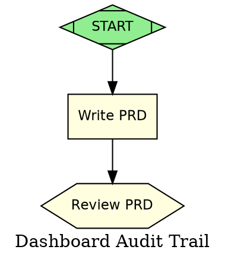
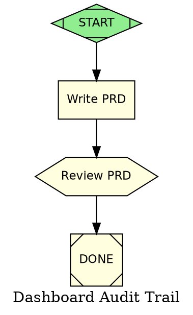

# SD-COBUILDER-WEB-001 Epic 1: Initiative DOT Graph Lifecycle

## 1. Problem Statement

CoBuilder initiatives currently have no programmatic lifecycle management. Creating an initiative requires manually authoring DOT files, knowing the correct node shapes and handler types, wiring edges by hand, and remembering the schema validation rules. Extending a pipeline after a PRD or SD review means editing raw DOT text with full knowledge of the extension conventions.

There is no class that answers: "Given a PRD ID, create a valid initiative graph. Given an approved PRD, extend the graph with SD writer nodes. Given approved SDs, extend with the mandatory research-refine-implement chain." There is also no programmatic phase detection -- determining where an initiative currently stands requires manual inspection of node statuses.

This epic delivers `InitiativeManager`, a Python class that owns the entire DOT graph lifecycle: creation, extension at stage boundaries, phase detection, and pending review enumeration. All graph mutations go through the existing `cobuilder pipeline node-add` and `cobuilder pipeline edge-add` CLI commands, ensuring every mutation is validated and audit-logged.

## 2. Technical Architecture

### 2.1 Class Overview

```python
# cobuilder/web/api/infra/initiative_manager.py

from __future__ import annotations

import os
from dataclasses import dataclass, field
from enum import Enum
from pathlib import Path
from typing import Optional


class InitiativePhase(Enum):
    """Lifecycle phases derived from DOT graph analysis."""
    CREATED = "created"              # Graph exists but start node is pending
    PRD_DRAFTING = "prd_drafting"    # write_prd node is active or pending
    PRD_REVIEW = "prd_review"        # review_prd is active (wait.human)
    SD_WRITING = "sd_writing"        # write_sd_* nodes are active/pending
    SD_REVIEW = "sd_review"          # review_sds is active (wait.human)
    RESEARCHING = "researching"      # research_* nodes are active/pending
    REFINING = "refining"            # refine_* nodes are active/pending
    IMPLEMENTING = "implementing"    # impl_* nodes are active/pending
    VALIDATING = "validating"        # validate_* nodes are active/pending
    FINAL_REVIEW = "final_review"    # review_final is active (wait.human)
    COMPLETE = "complete"            # done (exit) node is validated


@dataclass
class PendingReview:
    """A wait.human node that is dispatchable (active status)."""
    node_id: str
    label: str
    gate_type: str         # "prd_review", "sd_review", "e2e_review", "final_review"
    initiative_id: str     # PRD ID
    dot_path: str


@dataclass
class InitiativeInfo:
    """Summary information about an initiative derived from its DOT graph."""
    prd_id: str
    description: str
    target_repo: str
    dot_path: str
    phase: InitiativePhase
    total_nodes: int
    validated_nodes: int
    pending_reviews: list[PendingReview] = field(default_factory=list)


class InitiativeManager:
    """Manages initiative DOT graphs through their complete lifecycle.

    All graph mutations use `cobuilder pipeline node-add` and
    `cobuilder pipeline edge-add` CLI commands. Never writes raw DOT.

    Args:
        pipelines_dir: Directory where initiative DOT files are stored.
                       Defaults to `.pipelines/pipelines/`.
    """

    def __init__(self, pipelines_dir: str = ".pipelines/pipelines/"):
        self.pipelines_dir = Path(pipelines_dir)
        self.pipelines_dir.mkdir(parents=True, exist_ok=True)

    def create(
        self,
        prd_id: str,
        description: str,
        target_repo: str,
    ) -> str: ...

    def extend_after_prd_review(
        self,
        dot_path: str,
        epics: list[dict[str, str]],
    ) -> str: ...

    def extend_after_sd_review(
        self,
        dot_path: str,
        sd_paths: list[dict[str, str]],
    ) -> str: ...

    def detect_phase(self, dot_path: str) -> InitiativePhase: ...

    def get_pending_reviews(self, dot_path: str) -> list[PendingReview]: ...

    def get_initiative_info(self, dot_path: str) -> InitiativeInfo: ...

    def list_initiatives(self) -> list[InitiativeInfo]: ...
```

### 2.2 Module Dependencies

```
cobuilder/web/api/infra/initiative_manager.py
    imports:
        cobuilder.attractor.parser.parse_file     # Read DOT graph structure
        cobuilder.pipeline.node_ops.add_node       # Programmatic node addition
        cobuilder.pipeline.edge_ops.add_edge       # Programmatic edge addition
        cobuilder.pipeline.validator.validate       # Post-mutation validation
        cobuilder.pipeline.status.build_predecessors  # Topological analysis
        cobuilder.pipeline.status.get_status_table    # Node status extraction
```

The manager uses the Python API from `node_ops` and `edge_ops` directly (calling `add_node()` and `add_edge()` on the DOT content string) rather than shelling out to CLI commands. This is more efficient and avoids subprocess overhead for multi-node extensions. However, the CLI commands `cobuilder pipeline node-add` and `cobuilder pipeline edge-add` remain available as the user-facing interface -- the Python functions are the same ones backing those CLI commands.

### 2.3 File Locking Strategy

All DOT file writes use the existing `_dot_file_lock()` pattern from `cobuilder/pipeline/node_ops.py` (fcntl exclusive file lock on `{dot_file}.lock`). The manager acquires the lock once per extension operation, performs all mutations on the in-memory DOT content string, validates, and writes atomically:

```python
def _atomic_write(self, dot_path: str, content: str) -> None:
    """Write DOT content atomically with validation and locking."""
    # Validate before writing
    from cobuilder.pipeline.validator import validate
    from cobuilder.attractor.parser import parse_dot
    data = parse_dot(content)
    issues = validate(data)
    errors = [i for i in issues if i.level == "error"]
    if errors:
        raise InitiativeGraphError(
            f"Graph extension produced invalid DOT: {errors[0].message}"
        )

    # Atomic write: tmp file + rename
    tmp_path = dot_path + ".tmp"
    with _dot_file_lock(dot_path):
        with open(tmp_path, "w") as f:
            f.write(content)
        os.replace(tmp_path, dot_path)
```

## 3. Graph Extension Algorithms

### 3.1 Stage 1: Initiative Creation (`create`)

**Trigger**: User clicks "New Initiative" in the web UI.

**Input**:
- `prd_id: str` -- e.g. `"PRD-DASHBOARD-AUDIT-001"`
- `description: str` -- e.g. `"Dashboard audit trail feature"`
- `target_repo: str` -- e.g. `"/path/to/project"`

**Output**: A DOT file at `{pipelines_dir}/{prd_id}.dot` containing exactly 3 nodes and 2 edges.

**Method signature**:

```python
def create(
    self,
    prd_id: str,
    description: str,
    target_repo: str,
) -> str:
    """Create a skeleton initiative DOT graph.

    Returns:
        Absolute path to the created DOT file.

    Raises:
        InitiativeExistsError: If a DOT file for this prd_id already exists.
        InitiativeGraphError: If the generated graph fails validation.
    """
```

**Algorithm**:

1. Derive the graph name from the PRD ID: `prd_id.lower().replace("-", "_")` (e.g. `prd_dashboard_audit_001`).
2. Derive the worktree path: `{target_repo}/.claude/worktrees/{prd_id.lower()}/`.
3. Derive the PRD output path: `docs/prds/{slug}/PRD-{prd_id}.md` where slug = kebab-case of the description.
4. Check that no DOT file exists at the target path; raise `InitiativeExistsError` if it does.
5. Build the DOT content string directly (this is the one case where we write raw DOT, since there is no pre-existing file to extend).
6. Validate with `cobuilder.pipeline.validator.validate()`.
7. Write atomically.

**Generated DOT**:



**Validation rules enforced**:
- Exactly one `Mdiamond` (start) node -- Rule 1.
- `start` node has `status="validated"` (already approved to proceed).
- `write_prd` is handler=codergen with `worker_type="prd-writer"`.
- `review_prd` is handler=wait.human (hexagon).
- Graph is connected -- Rules 3/4.

**Note on validator relaxation**: The skeleton graph intentionally has NO exit node (`Msquare`). The exit node is added in Stage 3 (`extend_after_sd_review`). The `create()` method must suppress validator Rule 2 (exactly one exit node) for skeleton graphs. This is achieved by passing the parsed data through a custom validation call that skips Rule 2, or by adding a placeholder exit node that gets replaced later. The recommended approach is a **deferred exit**: add a minimal exit node connected from `review_prd`:

```dot
    done [
        shape=Msquare
        label="DONE"
        handler="exit"
        status="pending"
    ];

    review_prd -> done;
```

This makes the skeleton pass all validation rules. The `done` node is relocated (its inbound edge re-wired) during each extension stage.

**Revised skeleton with deferred exit (4 nodes, 3 edges)**:



### 3.2 Stage 2: Post-PRD-Review Extension (`extend_after_prd_review`)

**Trigger**: Human approves the PRD at the `review_prd` gate (clicks "Approve" in the web UI). The web server calls `extend_after_prd_review` after transitioning `review_prd` to `validated`.

**Input**:
- `dot_path: str` -- path to the initiative DOT file
- `epics: list[dict[str, str]]` -- list of epics extracted from the approved PRD, each with:
  - `epic_id: str` -- e.g. `"E1"`
  - `title: str` -- e.g. `"Backend API"`
  - `sd_output_path: str` -- e.g. `"docs/sds/dashboard-audit-trail/SD-DASHBOARD-AUDIT-001.md"`

**Method signature**:

```python
def extend_after_prd_review(
    self,
    dot_path: str,
    epics: list[dict[str, str]],
) -> str:
    """Extend the initiative graph after PRD approval.

    Adds one SD writer node per epic and a review_sds gate.
    Re-wires the done node.

    Args:
        dot_path: Absolute path to the initiative DOT file.
        epics: List of epic dicts with keys: epic_id, title, sd_output_path.

    Returns:
        Updated DOT file path (same as input).

    Raises:
        InitiativeGraphError: If extension produces invalid DOT.
        InitiativePhaseError: If review_prd is not in 'validated' status.
    """
```

**Algorithm**:

1. Parse the DOT file via `parse_file(dot_path)`.
2. Verify precondition: `review_prd` node has `status="validated"`. Raise `InitiativePhaseError` if not.
3. Read the DOT file content as a string.
4. Remove the existing `review_prd -> done` edge via `edge_ops.remove_edge()`.
5. For each epic in `epics`:
   a. Add a codergen node `write_sd_{epic_id}` with:
      - `handler="codergen"`
      - `worker_type="solution-design-architect"`
      - `label="Write SD: {title}"`
      - `prd_ref=` graph attribute `prd_id` value
      - `output_path="{sd_output_path}"`
      - `epic="{epic_id}"`
      - `status="pending"`
   b. Add edge `review_prd -> write_sd_{epic_id}`.
6. Add a `review_sds` gate node:
   - `handler="wait.human"`
   - `shape=hexagon`
   - `label="Review SDs"`
   - `gate="business"`
   - `mode="business"`
   - `status="pending"`
7. For each epic, add edge `write_sd_{epic_id} -> review_sds`.
8. Re-wire exit: add edge `review_sds -> done`.
9. Validate the full graph.
10. Write atomically.

**Generated DOT fragment** (for a PRD with 2 epics: E1-Backend, E2-Frontend):

```dot
    // --- Added by extend_after_prd_review ---

    write_sd_e1 [
        shape=box
        label="Write SD: Backend API"
        handler="codergen"
        worker_type="solution-design-architect"
        prd_ref="PRD-DASHBOARD-AUDIT-001"
        output_path="docs/sds/dashboard-audit-trail/SD-DASHBOARD-AUDIT-001.md"
        epic="E1"
        status="pending"
        style="filled"
        fillcolor="lightyellow"
    ];

    write_sd_e2 [
        shape=box
        label="Write SD: Frontend"
        handler="codergen"
        worker_type="solution-design-architect"
        prd_ref="PRD-DASHBOARD-AUDIT-001"
        output_path="docs/sds/dashboard-audit-trail/SD-DASHBOARD-AUDIT-FRONTEND-001.md"
        epic="E2"
        status="pending"
        style="filled"
        fillcolor="lightyellow"
    ];

    review_sds [
        shape=hexagon
        label="Review SDs"
        handler="wait.human"
        gate="business"
        mode="business"
        status="pending"
        style="filled"
        fillcolor="lightyellow"
    ];

    // Edges: PRD review fans out to SD writers, SD writers converge at review gate
    review_prd -> write_sd_e1;
    review_prd -> write_sd_e2;
    write_sd_e1 -> review_sds;
    write_sd_e2 -> review_sds;
    review_sds -> done;
```

**Edge re-wiring detail**: The original `review_prd -> done` edge is removed. The new terminal chain is `review_sds -> done`. This ensures the graph remains structurally valid at every extension point.

### 3.3 Stage 3: Post-SD-Review Extension (`extend_after_sd_review`)

**Trigger**: Human approves all SDs at the `review_sds` gate. The web server calls `extend_after_sd_review` after transitioning `review_sds` to `validated`.

This is the most complex extension. Every SD gets a mandatory `research -> refine` chain, plus acceptance test writing, implementation nodes, and validation gates.

**Input**:
- `dot_path: str` -- path to the initiative DOT file
- `sd_paths: list[dict[str, str]]` -- list of SD metadata, each with:
  - `epic_id: str` -- e.g. `"E1"`
  - `sd_path: str` -- e.g. `"docs/sds/dashboard-audit-trail/SD-DASHBOARD-AUDIT-001.md"`
  - `worker_type: str` -- e.g. `"backend-solutions-engineer"`
  - `title: str` -- e.g. `"Backend API"`

**Method signature**:

```python
def extend_after_sd_review(
    self,
    dot_path: str,
    sd_paths: list[dict[str, str]],
) -> str:
    """Extend the initiative graph after SD approval.

    For each SD, adds:
      1. research node (shape=tab, handler="research")
      2. refine node (shape=note, handler="refine")
      3. implementation codergen node (shape=box, handler="codergen")

    Also adds:
      - write_tests node (acceptance-test-writer)
      - validate_e2e gate (wait.cobuilder)
      - review_final gate (wait.human)
      - Re-wires the done exit node

    Args:
        dot_path: Absolute path to the initiative DOT file.
        sd_paths: List of SD dicts with keys: epic_id, sd_path, worker_type, title.

    Returns:
        Updated DOT file path (same as input).

    Raises:
        InitiativeGraphError: If extension produces invalid DOT.
        InitiativePhaseError: If review_sds is not in 'validated' status.
    """
```

**Algorithm**:

1. Parse DOT file, verify `review_sds.status == "validated"`.
2. Remove existing `review_sds -> done` edge.
3. Extract `prd_ref` from graph attributes.
4. **For each SD** in `sd_paths`, add 3 nodes + 2 internal edges:
   a. Research node `research_sd_{epic_id}`:
      - `shape=tab`, `handler="research"`
      - `label="Research: {title} SD"`
      - `solution_design="{sd_path}"` (the SD being researched)
      - `downstream_node="refine_sd_{epic_id}"`
      - `status="pending"`
   b. Refine node `refine_sd_{epic_id}`:
      - `shape=note`, `handler="refine"`
      - `label="Refine: {title} SD"`
      - `sd_path="{sd_path}"`
      - `status="pending"`
   c. Implementation node `impl_{epic_id}`:
      - `shape=box`, `handler="codergen"`
      - `worker_type="{worker_type}"` (from input)
      - `label="Implement: {title}"`
      - `sd_path="{sd_path}"`
      - `prd_ref="{prd_ref}"`
      - `bead_id="{epic_id}-IMPL"` (placeholder)
      - `acceptance="Implement per Solution Design with all acceptance criteria met"`
      - `status="pending"`
   d. Add edges:
      - `review_sds -> research_sd_{epic_id}`
      - `research_sd_{epic_id} -> refine_sd_{epic_id}`
      - `refine_sd_{epic_id} -> impl_{epic_id}`

5. **Acceptance test writer** node `write_tests`:
   - `shape=component`, `handler="acceptance-test-writer"`
   - `label="Write Blind Acceptance Tests"`
   - `prd_ref="{prd_ref}"`
   - `status="pending"`
   - Edge: `review_sds -> write_tests` (runs in parallel with research chains)

6. **Validation gate** `validate_e2e`:
   - `shape=hexagon`, `handler="wait.cobuilder"`
   - `label="E2E Validation"`
   - `gate_type="e2e"`
   - `status="pending"`
   - Edges: `impl_{epic_id} -> validate_e2e` (for each epic)
   - Edge: `write_tests -> validate_e2e` (tests must complete before validation)

7. **Final review gate** `review_final`:
   - `shape=hexagon`, `handler="wait.human"`
   - `label="Final Review"`
   - `gate="business"`, `mode="business"`
   - `status="pending"`
   - Edge: `validate_e2e -> review_final`

8. **Re-wire exit**: `review_final -> done`.

9. Validate the full graph.
10. Write atomically.

**Generated DOT fragment** (for 2 SDs: E1-Backend, E2-Frontend):

```dot
    // --- Added by extend_after_sd_review ---

    // SD Refinement Chain: E1 Backend
    research_sd_e1 [
        shape=tab
        label="Research: Backend API SD"
        handler="research"
        solution_design="docs/sds/dashboard-audit-trail/SD-DASHBOARD-AUDIT-001.md"
        downstream_node="refine_sd_e1"
        prd_ref="PRD-DASHBOARD-AUDIT-001"
        status="pending"
        style="filled"
        fillcolor="lightyellow"
    ];

    refine_sd_e1 [
        shape=note
        label="Refine: Backend API SD"
        handler="refine"
        sd_path="docs/sds/dashboard-audit-trail/SD-DASHBOARD-AUDIT-001.md"
        prd_ref="PRD-DASHBOARD-AUDIT-001"
        status="pending"
        style="filled"
        fillcolor="lightyellow"
    ];

    impl_e1 [
        shape=box
        label="Implement: Backend API"
        handler="codergen"
        worker_type="backend-solutions-engineer"
        sd_path="docs/sds/dashboard-audit-trail/SD-DASHBOARD-AUDIT-001.md"
        prd_ref="PRD-DASHBOARD-AUDIT-001"
        bead_id="E1-IMPL"
        acceptance="Implement per Solution Design with all acceptance criteria met"
        status="pending"
        style="filled"
        fillcolor="lightyellow"
    ];

    // SD Refinement Chain: E2 Frontend
    research_sd_e2 [
        shape=tab
        label="Research: Frontend SD"
        handler="research"
        solution_design="docs/sds/dashboard-audit-trail/SD-DASHBOARD-AUDIT-FRONTEND-001.md"
        downstream_node="refine_sd_e2"
        prd_ref="PRD-DASHBOARD-AUDIT-001"
        status="pending"
        style="filled"
        fillcolor="lightyellow"
    ];

    refine_sd_e2 [
        shape=note
        label="Refine: Frontend SD"
        handler="refine"
        sd_path="docs/sds/dashboard-audit-trail/SD-DASHBOARD-AUDIT-FRONTEND-001.md"
        prd_ref="PRD-DASHBOARD-AUDIT-001"
        status="pending"
        style="filled"
        fillcolor="lightyellow"
    ];

    impl_e2 [
        shape=box
        label="Implement: Frontend"
        handler="codergen"
        worker_type="frontend-dev-expert"
        sd_path="docs/sds/dashboard-audit-trail/SD-DASHBOARD-AUDIT-FRONTEND-001.md"
        prd_ref="PRD-DASHBOARD-AUDIT-001"
        bead_id="E2-IMPL"
        acceptance="Implement per Solution Design with all acceptance criteria met"
        status="pending"
        style="filled"
        fillcolor="lightyellow"
    ];

    // Blind Acceptance Tests (parallel with research chains)
    write_tests [
        shape=component
        label="Write Blind Acceptance Tests"
        handler="acceptance-test-writer"
        prd_ref="PRD-DASHBOARD-AUDIT-001"
        status="pending"
        style="filled"
        fillcolor="lightyellow"
    ];

    // Validation gates
    validate_e2e [
        shape=hexagon
        label="E2E Validation"
        handler="wait.cobuilder"
        gate_type="e2e"
        status="pending"
        style="filled"
        fillcolor="lightyellow"
    ];

    review_final [
        shape=hexagon
        label="Final Review"
        handler="wait.human"
        gate="business"
        mode="business"
        status="pending"
        style="filled"
        fillcolor="lightyellow"
    ];

    // Edges: review_sds fans out to research chains + acceptance tests
    review_sds -> research_sd_e1;
    review_sds -> research_sd_e2;
    review_sds -> write_tests;

    // Research -> Refine -> Implement per SD
    research_sd_e1 -> refine_sd_e1;
    refine_sd_e1 -> impl_e1;
    research_sd_e2 -> refine_sd_e2;
    refine_sd_e2 -> impl_e2;

    // Implementation + tests converge at validation
    impl_e1 -> validate_e2e;
    impl_e2 -> validate_e2e;
    write_tests -> validate_e2e;

    // Validation -> Final Review -> Done
    validate_e2e -> review_final;
    review_final -> done;
```

### 3.4 Node ID Naming Convention

All node IDs follow a deterministic scheme to prevent collisions across extension stages:

| Stage | Pattern | Examples |
|-------|---------|----------|
| Creation | `start`, `write_prd`, `review_prd`, `done` | Fixed names |
| Post-PRD | `write_sd_{epic_id}`, `review_sds` | `write_sd_e1`, `write_sd_e2` |
| Post-SD | `research_sd_{epic_id}`, `refine_sd_{epic_id}`, `impl_{epic_id}` | `research_sd_e1`, `refine_sd_e1`, `impl_e1` |
| Post-SD | `write_tests`, `validate_e2e`, `review_final` | Fixed names |

Epic IDs are lowercased: `E1` becomes `e1` in node IDs. This ensures valid DOT identifiers (no uppercase, no hyphens in identifiers unless quoted).

### 3.5 Edge Re-Wiring Pattern

Every extension stage follows the same re-wiring pattern for the `done` exit node:

1. Remove the existing edge `{current_terminal} -> done`.
2. Add new nodes and internal edges.
3. Add the new terminal edge `{new_terminal} -> done`.

This guarantees:
- The `done` node always exists (validator Rule 2 satisfied).
- The `done` node is always reachable from `start` (validator Rule 3 satisfied).
- No orphan nodes (validator Rule 4 satisfied).

The re-wiring uses `edge_ops.remove_edge(content, src, "done")` followed by `edge_ops.add_edge(content, new_terminal, "done")`.

## 4. Phase Detection Algorithm

### 4.1 Overview

`detect_phase(dot_path)` determines the current initiative lifecycle phase by analyzing the DOT graph's node statuses in topological order.

### 4.2 Algorithm

```python
def detect_phase(self, dot_path: str) -> InitiativePhase:
    """Detect the current lifecycle phase from DOT graph node statuses.

    Algorithm:
    1. Parse DOT file into node list with statuses.
    2. Build predecessor map (ignoring fail-edges).
    3. Compute topological ordering via Kahn's algorithm.
    4. Walk nodes in topological order:
       - The FIRST node whose status is 'active' or 'pending'
         (with all predecessors 'validated') defines the frontier.
       - Map frontier node handler/ID to InitiativePhase.
    5. If all nodes are 'validated' -> COMPLETE.
    6. If no frontier found -> CREATED (graph exists but nothing started).

    Returns:
        InitiativePhase enum value.
    """
```

### 4.3 Frontier-to-Phase Mapping

The frontier node (first actionable node in topological order) maps to a phase:

| Frontier Node Pattern | Phase |
|----------------------|-------|
| `write_prd` (codergen, worker_type=prd-writer) | `PRD_DRAFTING` |
| `review_prd` (wait.human) | `PRD_REVIEW` |
| `write_sd_*` (codergen, worker_type=solution-design-architect) | `SD_WRITING` |
| `review_sds` (wait.human) | `SD_REVIEW` |
| `research_sd_*` (research) | `RESEARCHING` |
| `refine_sd_*` (refine) | `REFINING` |
| `impl_*` (codergen, worker_type != prd-writer, != solution-design-architect) | `IMPLEMENTING` |
| `validate_e2e` (wait.cobuilder) | `VALIDATING` |
| `review_final` (wait.human) | `FINAL_REVIEW` |
| `done` (exit) with all predecessors validated | `COMPLETE` |

### 4.4 Topological Sort Implementation

Uses Kahn's algorithm on the forward-edge graph (fail-edges excluded, same as `status.build_predecessors`):

```python
def _topological_sort(self, data: dict) -> list[str]:
    """Kahn's algorithm for topological ordering.

    Excludes fail-edges (condition=fail) and dashed edges
    to avoid cycle interference from retry paths.

    Returns:
        List of node IDs in topological order.

    Raises:
        InitiativeGraphError: If the graph contains
        an unguarded cycle (should not happen if validated).
    """
    from cobuilder.pipeline.status import build_predecessors

    predecessors = build_predecessors(data)
    node_ids = [n["id"] for n in data["nodes"]]

    # In-degree calculation
    in_degree: dict[str, int] = {nid: len(preds) for nid, preds in predecessors.items()}

    # Seed queue with zero in-degree nodes
    queue = [nid for nid in node_ids if in_degree.get(nid, 0) == 0]
    result: list[str] = []

    # Build forward adjacency (excluding fail-edges)
    adj: dict[str, list[str]] = {nid: [] for nid in node_ids}
    for edge in data["edges"]:
        if edge.get("attrs", {}).get("condition") == "fail":
            continue
        if "dashed" in edge.get("attrs", {}).get("style", ""):
            continue
        adj[edge["src"]].append(edge["dst"])

    while queue:
        queue.sort()  # Deterministic ordering
        node = queue.pop(0)
        result.append(node)
        for neighbor in adj.get(node, []):
            in_degree[neighbor] -= 1
            if in_degree[neighbor] == 0:
                queue.append(neighbor)

    if len(result) != len(node_ids):
        raise InitiativeGraphError("Graph contains an unguarded cycle")

    return result
```

### 4.5 Pending Review Enumeration

```python
def get_pending_reviews(self, dot_path: str) -> list[PendingReview]:
    """Return wait.human nodes that are dispatchable.

    A wait.human node is dispatchable when:
    1. Its status is 'active' (runner has activated it), OR
    2. Its status is 'pending' AND all predecessors have status 'validated'.

    Condition 2 handles the case where the runner has not yet
    activated the gate but the graph state shows it is ready.
    """
```

The gate type is inferred from the node ID:

| Node ID | Gate Type |
|---------|-----------|
| `review_prd` | `prd_review` |
| `review_sds` | `sd_review` |
| `review_final` | `final_review` |
| Other `wait.human` nodes | `technical_review` |

## 5. Files Changed

### New Files

| File | Purpose |
|------|---------|
| `cobuilder/web/__init__.py` | Package init |
| `cobuilder/web/api/__init__.py` | Package init |
| `cobuilder/web/api/infra/__init__.py` | Package init |
| `cobuilder/web/api/infra/initiative_manager.py` | `InitiativeManager` class -- all logic described in this SD |
| `cobuilder/web/api/infra/exceptions.py` | `InitiativeExistsError`, `InitiativeGraphError`, `InitiativePhaseError` |
| `tests/web/test_initiative_manager.py` | Unit tests for all 3 extension stages + phase detection |

### Modified Files

| File | Change | Rationale |
|------|--------|-----------|
| `cobuilder/pipeline/validator.py` | Add `"refine"` to `VALID_HANDLERS` and `HANDLER_SHAPE_MAP` (shape=note) | The `refine` handler is used in DOT graphs but is not yet registered in the validator's allowlist. Without this, `extend_after_sd_review` output fails validation. |
| `cobuilder/pipeline/validator.py` | Add `"prd-writer"` to `VALID_WORKER_TYPES` | The `prd-writer` worker type is new (introduced by this PRD). |
| `cobuilder/pipeline/validator.py` | Add `"solution-design-architect"` to `VALID_WORKER_TYPES` (if not already present) | SD writer nodes use this worker type. |
| `cobuilder/pipeline/validator.py` | Add required attributes for `refine` handler to `REQUIRED_ATTRS`: `["label", "handler", "sd_path"]` | Ensures refine nodes have the minimum required attributes. |

### Unchanged Files (Integration Points)

| File | Role |
|------|------|
| `cobuilder/attractor/parser.py` | DOT parsing (read-only usage) |
| `cobuilder/attractor/transition.py` | Node status transitions (used by web server, not by InitiativeManager directly) |
| `cobuilder/pipeline/node_ops.py` | `add_node()` function used for programmatic node addition |
| `cobuilder/pipeline/edge_ops.py` | `add_edge()`, `remove_edge()` functions used for edge manipulation |
| `cobuilder/pipeline/status.py` | `build_predecessors()` used by phase detection |

## 6. Implementation Priority

| Priority | Component | Rationale |
|----------|-----------|-----------|
| P0 | `create()` method + skeleton DOT generation | Foundation: nothing works without initiative creation |
| P0 | `_atomic_write()` with validation | Safety: prevents corrupt DOT files from being persisted |
| P0 | Validator updates (refine handler, prd-writer worker type) | Blocker: extension output cannot validate without these |
| P1 | `extend_after_prd_review()` | Required for the PRD-writing -> SD-writing transition |
| P1 | `extend_after_sd_review()` | Required for the SD-review -> implementation transition |
| P1 | `detect_phase()` with topological sort | Required by the web UI to show initiative cards with phase progress |
| P2 | `get_pending_reviews()` | Required for the review inbox (Epic 9) |
| P2 | `list_initiatives()` | Required for the initiative list view (Epic 7) |
| P3 | `get_initiative_info()` | Convenience method combining phase detection + node counts |

## 7. Acceptance Criteria

### AC-E1.1: Skeleton Creation

- `create("PRD-TEST-001", "Test initiative", "/tmp/target")` produces a DOT file at `{pipelines_dir}/PRD-TEST-001.dot`.
- The DOT file passes `cobuilder pipeline validate` with zero errors.
- The DOT file contains exactly 4 nodes (start, write_prd, review_prd, done) and 3 edges.
- `start` node has `status="validated"`.
- `write_prd` node has `worker_type="prd-writer"`.
- Calling `create()` again with the same `prd_id` raises `InitiativeExistsError`.
- Graph attributes include `prd_id`, `target_repo`, and `worktree_path`.

### AC-E1.2: Post-PRD Extension

- Given a DOT file where `review_prd.status == "validated"`, calling `extend_after_prd_review(dot_path, [{"epic_id": "E1", "title": "Backend", "sd_output_path": "docs/sds/.../SD-001.md"}, {"epic_id": "E2", "title": "Frontend", "sd_output_path": "docs/sds/.../SD-002.md"}])` adds exactly 3 new nodes (`write_sd_e1`, `write_sd_e2`, `review_sds`).
- The original `review_prd -> done` edge is removed; `review_sds -> done` edge exists.
- Each `write_sd_*` node has `handler="codergen"` and `worker_type="solution-design-architect"`.
- Existing node statuses are preserved (no regression).
- The extended DOT file passes `cobuilder pipeline validate`.

### AC-E1.3: Post-SD Extension

- Given a DOT file where `review_sds.status == "validated"`, calling `extend_after_sd_review(dot_path, [...])` adds research, refine, and implementation nodes per SD.
- Every SD gets exactly one `research` node and one `refine` node (mandatory chain).
- A `write_tests` node with `handler="acceptance-test-writer"` is added.
- A `validate_e2e` node with `handler="wait.cobuilder"` is added.
- A `review_final` node with `handler="wait.human"` is added.
- The research-refine chain is: `review_sds -> research_sd_{eid} -> refine_sd_{eid} -> impl_{eid}`.
- All implementation nodes converge at `validate_e2e`.
- The extended DOT file passes `cobuilder pipeline validate`.

### AC-E1.4: Phase Detection

- `detect_phase()` returns `PRD_DRAFTING` when `write_prd.status == "pending"` and `start.status == "validated"`.
- `detect_phase()` returns `PRD_REVIEW` when `review_prd.status == "active"`.
- `detect_phase()` returns `SD_WRITING` when any `write_sd_*.status == "pending"` and `review_prd.status == "validated"`.
- `detect_phase()` returns `RESEARCHING` when any `research_sd_*.status == "active"`.
- `detect_phase()` returns `IMPLEMENTING` when any `impl_*.status == "active"`.
- `detect_phase()` returns `COMPLETE` when `done.status == "validated"`.

### AC-E1.5: Pending Reviews

- `get_pending_reviews()` returns an empty list when no `wait.human` nodes are active or dispatchable.
- `get_pending_reviews()` returns the `review_prd` node when `write_prd.status == "validated"` (predecessors all done, gate is dispatchable).
- Each `PendingReview` includes `node_id`, `label`, `gate_type`, and `dot_path`.

### AC-E1.6: Graph Integrity

- All extension operations are atomic: if validation fails, the DOT file is unchanged.
- Concurrent extension attempts on the same DOT file are serialized by file lock (no corruption).
- The `done` exit node is always reachable from `start` at every lifecycle stage.

## 8. Risks

### R1: Graph Corruption During Extension

**Likelihood**: Low. **Impact**: High -- a corrupt DOT file halts the entire initiative.

**Mitigation**: The `_atomic_write()` method validates the complete graph BEFORE writing. Writes use a tmp-file + `os.replace()` pattern for atomicity. File locking prevents concurrent writes. If validation fails, the original file is untouched.

### R2: Concurrent Extension Attempts

**Likelihood**: Low (web server is single-threaded per request, and extensions happen at human-gated boundaries). **Impact**: Medium.

**Mitigation**: `fcntl.LOCK_EX` file lock on `{dot_file}.lock`, consistent with the existing locking pattern in `node_ops.py` and `transition.py`. The lock is held for the entire read-modify-validate-write cycle.

### R3: Invalid Topologies from Incorrect Epic/SD Input

**Likelihood**: Medium -- the web server must correctly extract epics from the PRD and SDs from the approved output. **Impact**: Medium -- invalid input produces a graph that fails validation, blocking extension.

**Mitigation**: The `extend_*` methods validate their input (non-empty lists, required dict keys present) before attempting graph mutation. Post-mutation validation catches any structural issues. The error message includes the specific validation rule that failed.

### R4: Validator Missing Handler Registration

**Likelihood**: Certain without the validator updates described in Section 5. **Impact**: High -- every `extend_after_sd_review` call fails validation because `refine` is not in `VALID_HANDLERS`.

**Mitigation**: The validator updates (adding `refine` handler, `prd-writer` worker type) are P0 priority and must be implemented before any extension method. These are small, well-scoped changes to `cobuilder/pipeline/validator.py`.

### R5: Node ID Collisions Across Extensions

**Likelihood**: Low -- naming convention uses deterministic prefixes. **Impact**: High -- `add_node()` raises `ValueError` if a node ID already exists.

**Mitigation**: Node IDs follow the naming convention in Section 3.4. The `epic_id` component comes from the PRD epic list (which the human authored). If two epics somehow have the same ID, the second `add_node()` call will raise `ValueError`, and the atomic write ensures the original file is preserved.

### R6: Runner Reads Graph During Extension

**Likelihood**: Very low -- extensions happen only when the runner is paused at a `wait.human` gate (the gate that just got approved). **Impact**: Medium -- runner could read a partially-written file.

**Mitigation**: File locking prevents concurrent reads during write. The atomic write pattern (`tmp + rename`) ensures the runner always reads a complete file. The runner already re-reads the DOT file after each `wait.human` resolution, which is when the extension has already completed.

## Implementation Status

| Epic | Status | Date | Commit |
|------|--------|------|--------|
| - | Remaining | - | - |
